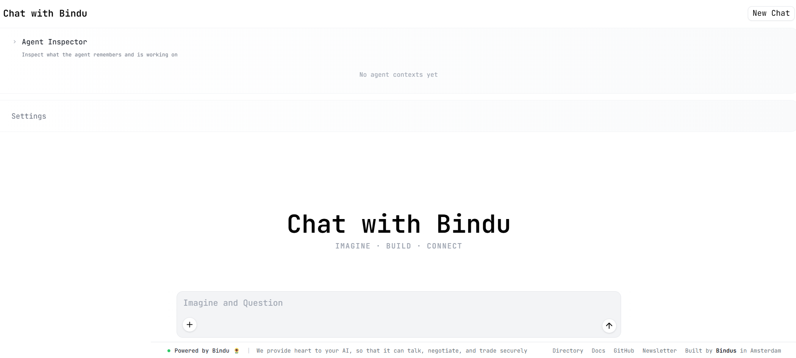

<div align="center" id="top">
<a href="[https://getbindu.com](https://getbindu.com)">
<picture>

</picture>
</a>
</div>

<p align="center">
<em>La couche d'identité, de communication et de paiement pour les agents d'IA</em>
</p>

<p align="center">
<a href="README.md">🇬🇧 English</a> •
<a href="README.de.md">🇩🇪 Deutsch</a> •
<a href="README.es.md">🇪🇸 Español</a> •
<a href="README.fr.md">🇫🇷 Français</a> •
<a href="README.hi.md">🇮🇳 हिंदी</a> •
<a href="README.bn.md">🇮🇳 বাংলা</a> •
<a href="README.zh.md">🇨🇳 中文</a> •
<a href="README.nl.md">🇳🇱 Nederlands</a> •
<a href="README.ta.md">🇮🇳 தமிழ்</a>
</p>

<p align="center">
<a href="[https://opensource.org/licenses/Apache-2.0](https://opensource.org/licenses/Apache-2.0)"></a>
<a href="[https://hits.sh/github.com/Saptha-me/Bindu.svg](https://hits.sh/github.com/Saptha-me/Bindu.svg)"></a>
<a href="[https://www.python.org/downloads/](https://www.python.org/downloads/)"></a>
<a href="[https://pepy.tech/projects/bindu](https://pepy.tech/projects/bindu)"></a>
<a href="[https://pypi.org/project/bindu/](https://pypi.org/project/bindu/)"></a>
<a href="[https://pypi.org/project/bindu/](https://pypi.org/project/bindu/)"></a>
<a href="[https://coveralls.io/github/Saptha-me/Bindu?branch=v0.3.18](https://coveralls.io/github/Saptha-me/Bindu?branch=v0.3.18)"></a>
<a href="[https://github.com/getbindu/Bindu/actions/workflows/release.yml](https://github.com/getbindu/Bindu/actions/workflows/release.yml)"></a>
<a href="[https://discord.gg/3w5zuYUuwt](https://discord.gg/3w5zuYUuwt)"></a>
<a href="[https://github.com/getbindu/Bindu/graphs/contributors](https://github.com/getbindu/Bindu/graphs/contributors)"></a>
</p>

<br>

<p align="center">

</p>

<p align="center">
  <strong>🌟 <a href="https://getbindu.com">Enregistrez votre agent</a> • 🌻 <a href="https://docs.getbindu.com">Documentation</a> • 💬 <a href="https://discord.gg/3w5zuYUuwt">Communauté Discord</a></strong>
</p>

<br>

<div align="center">
  <h3>Intégrez votre agent en une seule ligne</h3>
</div>

<div align="center">
  <pre><code>curl -fsSL https://getbindu.com/install-bindu.sh | bash</code></pre>
</div>

-----

**Bindu** (se lit : *binduu*) est une couche opérationnelle pour les agents d'IA qui fournit des capacités d'identité, de communication et de paiement. Il offre un service prêt pour la production avec une API pratique pour connecter, authentifier et orchestrer des agents à travers des systèmes distribués en utilisant des protocoles ouverts : **A2A**, **AP2**, et **X402**.

Conçu avec une architecture distribuée (Task Manager, scheduler, storage), Bindu permet un développement rapide et une intégration facile avec n'importe quel framework d'IA. Transformez n'importe quel framework d'agent en un service entièrement interopérable pour la communication, la collaboration et le commerce dans l'Internet of Agents.

<p align="center">
<strong>🌟 <a href="[https://bindus.directory](https://bindus.directory)">Enregistrez votre agent</a> • 🌻 <a href="[https://docs.getbindu.com](https://docs.getbindu.com)">Documentation</a> • 💬 <a href="[https://discord.gg/3w5zuYUuwt](https://discord.gg/3w5zuYUuwt)">Communauté Discord</a></strong>
</p>

-----

<br>

## 🎥 Regardez Bindu en action

<div align="center">
<a href="[https://www.youtube.com/watch?v=qppafMuw_KI](https://www.youtube.com/watch?v=qppafMuw_KI)" target="_blank">

</a>
</div>

<br>

## 📋 Prérequis

Avant d'installer Bindu, assurez-vous d'avoir :

  - **Python 3.12 ou supérieur** - [Télécharger ici](https://www.python.org/downloads/)
  - **Gestionnaire de paquets uv** - [Guide d'installation](https://github.com/astral-sh/uv)
  - **Clé API requise** : Définissez `OPENROUTER_API_KEY` ou `OPENAI_API_KEY` dans vos variables d'environnement. Des modèles OpenRouter gratuits sont disponibles pour les tests.

### Vérifiez votre configuration

```bash
# Vérifier la version de Python
uv run python --version  # Devrait afficher 3.12 ou plus

# Vérifier l'installation de uv
uv --version
```

-----

<br>

## 📦 Installation

<details>
<summary><b>Note aux utilisateurs (Git & GitHub Desktop)</b></summary>

Sur certains systèmes Windows, git peut ne pas être reconnu dans l'invite de commande même après l'installation en raison de problèmes de configuration du PATH.

Si vous rencontrez ce problème, vous pouvez utiliser *GitHub Desktop* comme alternative :

1.  Installez GitHub Desktop depuis [https://desktop.github.com/](https://desktop.github.com/)
2.  Connectez-vous avec votre compte GitHub
3.  Clonez le dépôt en utilisant l'URL du dépôt :
    [https://github.com/getbindu/Bindu.git](https://github.com/getbindu/Bindu.git)

GitHub Desktop vous permet de cloner, gérer les branches, commiter les changements et ouvrir des pull requests sans utiliser la ligne de commande.

</details>

```bash
# Installer Bindu
uv add bindu

# Pour le développement (si vous contribuez à Bindu)
# Créer et activer l'environnement virtuel
uv venv --python 3.12.9
source .venv/bin/activate  # Sur macOS/Linux
# .venv\Scripts\activate  # Sur Windows

uv sync --dev
```

<details>
<summary><b>Problèmes d'installation courants</b> (cliquez pour agrandir)</summary>

<br>

| Problème | Solution |
|-------|----------|
| `uv: command not found` | Redémarrez votre terminal après avoir installé uv. Sur Windows, utilisez PowerShell |
| `Python version not supported` | Installez Python 3.12+ depuis [python.org](https://www.python.org/downloads/) |
| L'environnement virtuel ne s'active pas (Windows) | Utilisez PowerShell et exécutez `.venv\Scripts\activate` |
| `Microsoft Visual C++ required` | Téléchargez [Visual C++ Build Tools](https://visualstudio.microsoft.com/visual-cpp-build-tools/) |
| `ModuleNotFoundError` | Activez le venv et exécutez `uv sync --dev` |

</details>

-----

<br>

## 🚀 Démarrage rapide

### Option 1 : Configuration manuelle

Créez votre script d'agent `my_agent.py` :

```python
import os

from bindu.penguin.bindufy import bindufy
from agno.agent import Agent
from agno.tools.duckduckgo import DuckDuckGoTools
from agno.models.openai import OpenAIChat

# Définissez votre agent
agent = Agent(
    instructions="You are a research assistant that finds and summarizes information.",
    model=OpenAIChat(id="gpt-4o"),
    tools=[DuckDuckGoTools()],
)

# Configuration
config = {
    "author": "your.email@example.com",
    "name": "research_agent",
    "description": "A research assistant agent",
    "deployment": {
        "url": os.getenv("BINDU_DEPLOYMENT_URL", "http://localhost:3773"),
        "expose": True,
    },
    "skills": ["skills/question-answering", "skills/pdf-processing"]
}

# Fonction handler
def handler(messages: list[dict[str, str]]):
    """Traiter les messages et retourner la réponse de l'agent.

    Args:
        messages: Liste de dictionnaires de messages contenant l'historique de la conversation

    Returns:
        Résultat de la réponse de l'agent
    """
    result = agent.run(input=messages)
    return result

# Bindu-fy l'agent
bindufy(config, handler)

# Utilisez un tunnel pour exposer votre agent sur Internet
# bindufy(config, handler, launch=True)
```

Votre agent est maintenant en direct à l'URL configurée dans `deployment.url`.

Définissez un port personnalisé sans modification de code :

```bash
# Linux/macOS
export BINDU_PORT=4000

# Windows PowerShell
$env:BINDU_PORT="4000"
```

Les exemples existants qui utilisent `http://localhost:3773` sont automatiquement remplacés lorsque `BINDU_PORT` est défini.

### Option 2 : Agent local Zero-Config

Essayez Bindu sans configurer PostgreSQL, Redis ou tout autre service cloud. Fonctionne entièrement localement en utilisant le stockage et le scheduler en mémoire.

```bash
python examples/beginner_zero_config_agent.py
```

### Option 3 : Agent Echo minimal (Test)

<details>
<summary><b>Voir l'exemple minimal</b> (cliquez pour agrandir)</summary>

Le plus petit agent fonctionnel possible :

```python
import os

from bindu.penguin.bindufy import bindufy

def handler(messages):
    return [{"role": "assistant", "content": messages[-1]["content"]}]

config = {
    "author": "your.email@example.com",
    "name": "echo_agent",
    "description": "A basic echo agent for quick testing.",
    "deployment": {
        "url": os.getenv("BINDU_DEPLOYMENT_URL", "http://localhost:3773"),
        "expose": True,
    },
    "skills": []
}

bindufy(config, handler)

# Utilisez un tunnel pour exposer votre agent sur Internet
# bindufy(config, handler, launch=True)
```

**Lancer l'agent :**

```bash
# Démarrer l'agent
python examples/echo_agent.py
```

</details>

<details>
<summary><b>Tester l'agent avec curl</b> (cliquez pour agrandir)</summary>

<br>

Entrée :

```bash
curl --location 'http://localhost:3773/' \
--header 'Content-Type: application/json' \
--data '{
    "jsonrpc": "2.0",
    "method": "message/send",
    "params": {
        "message": {
            "role": "user",
            "parts": [
                {
                    "kind": "text",
                    "text": "Quote"
                }
            ],
            "kind": "message",
            "messageId": "550e8400-e29b-41d4-a716-446655440038",
            "contextId": "550e8400-e29b-41d4-a716-446655440038",
            "taskId": "550e8400-e29b-41d4-a716-446655440300"
        },
        "configuration": {
            "acceptedOutputModes": [
                "application/json"
            ]
        }
    },
    "id": "550e8400-e29b-41d4-a716-446655440024"
}'
```

Sortie :

```bash
{
    "jsonrpc": "2.0",
    "id": "550e8400-e29b-41d4-a716-446655440024",
    "result": {
        "id": "550e8400-e29b-41d4-a716-446655440301",
        "context_id": "550e8400-e29b-41d4-a716-446655440038",
        "kind": "task",
        "status": {
            "state": "submitted",
            "timestamp": "2025-12-16T17:10:32.116980+00:00"
        },
        "history": [
            {
                "message_id": "550e8400-e29b-41d4-a716-446655440038",
                "context_id": "550e8400-e29b-41d4-a716-446655440038",
                "task_id": "550e8400-e29b-41d4-a716-446655440301",
                "kind": "message",
                "parts": [
                    {
                        "kind": "text",
                        "text": "Quote"
                    }
                ],
                "role": "user"
            }
        ]
    }
}
```

Vérifier le statut de la tâche :

```bash
curl --location 'http://localhost:3773/' \
--header 'Content-Type: application/json' \
--data '{
    "jsonrpc": "2.0",
    "method": "tasks/get",
    "params": {
        "taskId": "550e8400-e29b-41d4-a716-446655440301"
    },
    "id": "550e8400-e29b-41d4-a716-446655440025"
}'
```

Sortie :

```bash
{
    "jsonrpc": "2.0",
    "id": "550e8400-e29b-41d4-a716-446655440025",
    "result": {
        "id": "550e8400-e29b-41d4-a716-446655440301",
        "context_id": "550e8400-e29b-41d4-a716-446655440038",
        "kind": "task",
        "status": {
            "state": "completed",
            "timestamp": "2025-12-16T17:10:32.122360+00:00"
        },
        "history": [
            {
                "message_id": "550e8400-e29b-41d4-a716-446655440038",
                "context_id": "550e8400-e29b-41d4-a716-446655440038",
                "task_id": "550e8400-e29b-41d4-a716-446655440301",
                "kind": "message",
                "parts": [
                    {
                        "kind": "text",
                        "text": "Quote"
                    }
                ],
                "role": "user"
            },
            {
                "role": "assistant",
                "parts": [
                    {
                        "kind": "text",
                        "text": "Quote"
                    }
                ],
                "kind": "message",
                "message_id": "2f2c1a8e-68fa-4bb7-91c2-eac223e6650b",
                "task_id": "550e8400-e29b-41d4-a716-446655440301",
                "context_id": "550e8400-e29b-41d4-a716-446655440038"
            }
        ],
        "artifacts": [
            {
                "artifact_id": "22ac0080-804e-4ff6-b01c-77e6b5aea7e8",
                "name": "result",
                "parts": [
                    {
                        "kind": "text",
                        "text": "Quote",
                        "metadata": {
                            "did.message.signature": "5opJuKrBDW4woezujm88FzTqRDWAB62qD3wxKz96Bt2izfuzsneo3zY7yqHnV77cq3BDKepdcro2puiGTVAB52qf"  # pragma: allowlist secret
                        }
                    }
                ]
            }
        ]
    }
}
```

</details>

-----

## 🚀 Fonctionnalités principales

| Fonctionnalité | Description | Documentation |
|---------|-------------|---------------|
|  **Authentification** | Accès API sécurisé avec Ory Hydra OAuth2 (optionnel pour le développement) | [Guide →](https://www.google.com/search?q=docs/AUTHENTICATION.md) |
| 💰 **Intégration des paiements (X402)** | Acceptez des paiements USDC sur la blockchain Base avant d'exécuter des méthodes protégées | [Guide →](https://www.google.com/search?q=docs/PAYMENT.md) |
| 💾 **Stockage PostgreSQL** | Stockage persistant pour les déploiements en production (optionnel - InMemoryStorage par défaut) | [Guide →](https://www.google.com/search?q=docs/STORAGE.md) |
| 📋 **Redis Scheduler** | Planification de tâches distribuée pour les déploiements multi-workers (optionnel - InMemoryScheduler par défaut) | [Guide →](https://www.google.com/search?q=docs/SCHEDULER.md) |
| 🎯 **Système de Skills** | Capacités réutilisables que les agents annoncent et exécutent pour un routage intelligent des tâches | [Guide →](https://www.google.com/search?q=docs/SKILLS.md) |
| 🤝 **Négociation d'agents** | Sélection d'agents basée sur les capacités pour une orchestration intelligente | [Guide →](https://www.google.com/search?q=docs/NEGOTIATION.md) |
| 🌐 **Tunneling** | Exposer les agents locaux sur Internet pour les tests (**développement local uniquement, pas pour la production**) | [Guide →](https://www.google.com/search?q=docs/TUNNELING.md) |
| 📬 **Notifications Push** | Notifications webhook en temps réel pour les mises à jour de tâches - pas de polling requis | [Guide →](https://www.google.com/search?q=docs/NOTIFICATIONS.md) |
| 📊 **Observabilité et surveillance** | Suivez les performances et déboguez les problèmes avec OpenTelemetry et Sentry | [Guide →](https://www.google.com/search?q=docs/OBSERVABILITY.md) |
| 🔄 **Mécanisme de Retry** | Retry automatique avec backoff exponentiel pour des agents résilients | [Guide →](https://docs.getbindu.com/bindu/learn/retry/overview) |
| 🔑 **Identifiants décentralisés (DIDs)** | Identité cryptographique pour des interactions d'agents vérifiables et sécurisées et l'intégration des paiements | [Guide →](https://www.google.com/search?q=docs/DID.md) |
| 🏥 **Health Check et Métriques** | Surveillez la santé et les performances des agents avec des points de terminaison intégrés | [Guide →](https://www.google.com/search?q=docs/HEALTH_METRICS.md) |

-----

<br>

## 🎨 UI de Chat

Bindu inclut une magnifique interface de chat sur `http://localhost:5173`. Naviguez vers le dossier `frontend` et exécutez `npm run dev` pour démarrer le serveur.

<p align="center">
  
</p>

-----

<br>

## 🌐 GetBindu.com

Le [**GetBindu.com**](https://getbindu.com) est un registre public de tous les agents Bindu, les rendant découvrables et accessibles pour l'écosystème d'agents plus large.

### 📝 Enregistrement manuel

Le processus d'enregistrement manuel est actuellement en cours de développement.

-----

<br>

## 🌌 La Vision

```
un aperçu du ciel nocturne
}}}}}}}}}}}}}}}}}}}}}}}}}}}}}}}}}}}}}}}}}}}}}}}}}}}}}}}}}}}}}}}}
{{            +             +                   +   @          {{
}}   |                 * o     +                 .    }}
{{  -O-    o                .               .           +       {{
}}   |                     _,.-----.,_         o    |          }}
{{           +    * .-'.         .'-.          -O-          {{
}}      * .'.-'   .---.   `'.'.          |     * }}
{{ .                 /_.-'   /     \   .'-.\.                   {{
}}          ' -=*<  |-._.-  |   @   |   '-._|  >*=-    .     + }}
{{ -- )--            \`-.    \     /    .-'/                   }}
}}       * +      `.'.    '---'    .'.'    +        o       }}
{{                   .  '-._         _.-'  .                   }}
}}         |                `~~~~~~~`        - --===D       @   }}
{{   o    -O-      * .                   * +          {{
}}         |                       +         .             +    }}
{{ jgs           .     @      o                         * {{
}}       o                           * o            .  }}
{{{{{{{{{{{{{{{{{{{{{{{{{{{{{{{{{{{{{{{{{{{{{{{{{{{{{{{{{{{{{{{{
```

*Chaque symbole est un agent — une étincelle d'intelligence. Le minuscule point est Bindu, le point d'origine dans l'Internet of Agents.*

### Connexion NightSky (En cours)

NightSky permet des essaims d'agents. Chaque Bindu est un point annotant les agents avec le langage partagé de A2A, AP2, et X402. Les agents peuvent être hébergés n'importe où — ordinateurs portables, clouds ou clusters — tout en parlant le même protocole, en se faisant confiance par conception, et en travaillant ensemble comme un esprit unique et distribué.

> **💭 Un objectif sans plan n'est qu'un souhait.**

-----

<br>

## 🛠️ Frameworks d'agents supportés

Bindu est **framework-agnostic** et testé avec :

- **AG2** (anciennement AutoGen)
- **Agno**
- **CrewAI**
- **LangChain**
- **LlamaIndex**
- **FastAgent**

Vous voulez une intégration avec votre framework préféré ? [Faites-le nous savoir sur Discord](https://discord.gg/3w5zuYUuwt) \!

-----

<br>

## 🧪 Tests

Bindu maintient une **couverture de test de 70 %+** (cible : 80 %+) :

```bash
uv run pytest -n auto --cov=bindu --cov-report=term-missing
uv run coverage report --skip-covered --fail-under=70
```

-----

<br>

## 🔧 Dépannage

<details>
<summary>Problèmes courants</summary>

<br>

| Problème | Solution |
|-------|----------|
| `Python 3.12 not found` | Installez Python 3.12+ et configurez le PATH, ou utilisez `pyenv` |
| `bindu: command not found` | Activez l'environnement virtuel : `source .venv/bin/activate` |
| `Port 3773 already in use` | Définissez `BINDU_PORT=4000` ou remplacez l'URL avec `BINDU_DEPLOYMENT_URL=http://localhost:4000` |
| Échec de Pre-commit | Exécutez `pre-commit run --all-files` |
| Échec des tests | Installez les dépendences de dév : `uv sync --dev` |
| `Permission denied` (macOS) | Exécutez `xattr -cr .` pour effacer les attributs étendus |

**Réinitialiser l'environnement :**

```bash
rm -rf .venv
uv venv --python 3.12.9
uv sync --dev
```

**Windows PowerShell :**

```bash
Set-ExecutionPolicy RemoteSigned -Scope CurrentUser
```

</details>

-----

<br>

## 🤝 Contribution

Nous accueillons les contributions \! Rejoignez-nous sur [Discord](https://discord.gg/3w5zuYUuwt). Choisissez le canal qui correspond le mieux à votre contribution.

```bash
git clone https://github.com/getbindu/Bindu.git
cd Bindu
uv venv --python 3.12.9
source .venv/bin/activate
uv sync --dev
pre-commit run --all-files
```

> 📖 [Directives de contribution](https://www.google.com/search?q=.github/contributing.md)

-----

<br>

## 📜 Licence

Bindu est open-source sous la [Licence Apache 2.0](https://choosealicense.com/licenses/apache-2.0/).

-----

<br>

## 💬 Communauté

Nous 💛 les contributions \! Que vous corrigiez des bugs, amélioriez la documentation ou construisiez des démos — vos contributions rendent Bindu meilleur.

  - 💬 [Rejoignez Discord](https://discord.gg/3w5zuYUuwt) pour les discussions et le support
  - ⭐ [Starisez le dépôt](https://github.com/getbindu/Bindu) si vous le trouvez utile \!

-----

<br>

## 👥 Modérateurs actifs

Nos modérateurs dévoués aident à maintenir une communauté accueillante et productive :

<table>
<tr>
<td align="center">
<a href="https://github.com/raahulrahl">

<br />
<sub><b>Raahul Dutta</b></sub>
</a>
<br />
</td>
<td align="center">
<a href="https://github.com/Paraschamoli">

<br />
<sub><b>Paras Chamoli</b></sub>
</a>
<br />
</td>
</tr>
</table>

> Vous voulez devenir modérateur ? Contactez-nous sur [Discord](https://discord.gg/3w5zuYUuwt) \!

-----

<br>

## 🙏 Remerciements

Reconnaissant envers ces projets :

  - [FastA2A](https://github.com/pydantic/fasta2a)
  - [12 Factor Agents](https://github.com/humanlayer/12-factor-agents/blob/main/content/factor-11-trigger-from-anywhere.md)
  - [A2A](https://github.com/a2aproject/A2A)
  - [AP2](https://github.com/google-agentic-commerce/AP2)
  - [Huggingface chatui](https://github.com/huggingface/chat-ui)
  - [X402](https://github.com/coinbase/x402)
  - [Logo Bindu](https://openmoji.org/library/emoji-1F33B/)
  - [ASCII Space Art](https://www.asciiart.eu/space/other)

-----

<br>

## 🗺️ Feuille de route

  - [ ] Support du transport GRPC
  - [ ] Augmenter la couverture de test à 80 % (en cours)
  - [ ] Support AP2 de bout en bout
  - [ ] Intégration DSPy (en cours)
  - [ ] Support MLTS
  - [ ] Support X402 avec d'autres facilitateurs

> 💡 [Suggérez des fonctionnalités sur Discord](https://discord.gg/3w5zuYUuwt) \!

-----

<br>

## [Nous rendrons ces agents "bindufied" et nous avons besoin de votre aide.](https://www.notion.so/getbindu/305d3bb65095808eac2bf720368e9804?v=305d3bb6509580189941000cfad83ae7&source=copy_link)

-----

<br>

## 🎓 Ateliers

- [AI Native in Action: Agent Symphony](https://www.meetup.com/ai-native-Amsterdam && India/events/311066899/) - [Slides](https://docs.google.com/presentation/d/1SqGXI0Gv_KCWZ1Mw2SOx_kI0u-LLxwZq7lMSONdl8oQ/edit)

-----

<br>

## ⭐ Star History

[](https://www.star-history.com/#getbindu/Bindu&Date)

-----

<p align="center">
  <strong>Construit avec 💛 par l'équipe d'Amsterdam && India</strong><br/>
  <em>Happy Bindu! 🌻🚀✨</em>
</p>

<p align="center">
<strong>De l'idée à l'Internet of Agents en 2 minutes.</strong><br>
<em>Votre agent. Votre framework. Protocoles universels.</em>
</p>

<p align="center">
<a href="[https://github.com/getbindu/Bindu](https://github.com/getbindu/Bindu)">⭐ Starisez-nous sur GitHub</a> •
<a href="[https://discord.gg/3w5zuYUuwt](https://discord.gg/3w5zuYUuwt)">💬 Rejoignez Discord</a> •
<a href="[https://docs.getbindu.com](https://docs.getbindu.com)">🌻 Lire les Docs</a>
</p>

<br>

<p align="center">

</p>

<p align="center">
<em>"Nous croyons en la théorie du tournesol - se tenir debout ensemble, apporter de l'espoir et de la lumière à l'Internet of Agents."</em>
</p>
