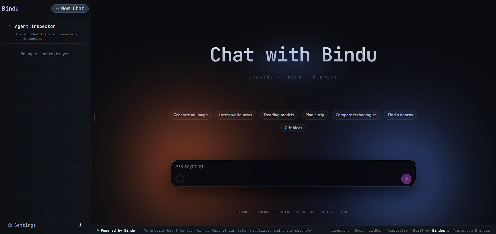

<p align="center">
  
</p>

<div align="center">


# Bindu

**The identity, communication, and payments layer for AI agents.**

</div>

Bindu turns any AI agent into a production microservice. Write the agent in any framework — Agno, LangChain, OpenAI SDK, CrewAI, LangGraph, plain TypeScript — wrap it with one `bindufy()` call, and get an HTTP service with a cryptographic DID, the A2A protocol, OAuth2 auth, and on-chain payments. No infrastructure code. No rewriting.

Works from Python, TypeScript, and Kotlin. Built on three open protocols: [A2A](https://github.com/a2aproject/A2A), [AP2](https://github.com/google-agentic-commerce/AP2), and [x402](https://github.com/coinbase/x402).

<div align="center">

  <p>
    <a href="README.md">English</a> ·
    <a href="README.de.md">Deutsch</a> ·
    <a href="README.es.md">Español</a> ·
    <a href="README.fr.md">Français</a> ·
    <a href="README.hi.md">हिंदी</a> ·
    <a href="README.bn.md">বাংলা</a> ·
    <a href="README.zh.md">中文</a> ·
    <a href="README.nl.md">Nederlands</a> ·
    <a href="README.ta.md">தமிழ்</a>
  </p>

  <p>
    <a href="https://opensource.org/licenses/Apache-2.0"></a>
    <a href="https://www.python.org/downloads/"></a>
    <a href="https://pypi.org/project/bindu/"></a>
    <a href="https://coveralls.io/github/Saptha-me/Bindu?branch=v0.3.18"></a>
    <a href="https://github.com/getbindu/Bindu/actions/workflows/release.yml"></a>
    <a href="https://discord.gg/3w5zuYUuwt"></a>
    <a href="https://github.com/getbindu/Bindu/graphs/contributors"></a>
    <a href="https://hits.sh/github.com/Saptha-me/Bindu.svg"></a>
  </p>

  <p>
    <a href="https://getbindu.com"><strong>Register your agent</strong></a> ·
    <a href="https://docs.getbindu.com"><strong>Documentation</strong></a> ·
    <a href="https://discord.gg/3w5zuYUuwt"><strong>Discord</strong></a>
  </p>
</div>

---

## What you get

When you wrap an agent with `bindufy(config, handler)`, the process comes up with:

| Capability | What it means in practice |
|---|---|
| A2A JSON-RPC endpoint | Standard protocol other agents already speak. `message/send`, `tasks/get`, `message/stream` on port 3773. |
| DID identity (Ed25519) | Every returned artifact is signed. Callers verify authenticity with a W3C-standard DID — no shared secrets. |
| OAuth2 via Ory Hydra | Scoped tokens (`agent:read`, `agent:write`, `agent:execute`) instead of one all-or-nothing bearer. |
| x402 payments | One flag and the agent charges USDC on Base before processing a request. Payment check runs before the handler. |
| Push notifications | Webhook callbacks on task state change. No polling required. |
| Language-agnostic | Python, TypeScript, and Kotlin SDKs share one gRPC core. Same protocol, same DID, same auth. |
| Public tunnel | `expose: true` opens an FRP tunnel so your local agent is reachable from the public internet. |

---

## Install

```bash
uv add bindu
```

For a development checkout with tests:

```bash
git clone https://github.com/getbindu/Bindu.git
cd Bindu
uv sync --dev
```

Requires Python 3.12+ and [uv](https://github.com/astral-sh/uv). An API key for at least one LLM provider (`OPENROUTER_API_KEY`, `OPENAI_API_KEY`, or `MINIMAX_API_KEY`) is needed to run the examples.

---

## Hello agent

A complete working agent, built with Agno, exposed as an A2A microservice:

```python
import os
from bindu.penguin.bindufy import bindufy
from agno.agent import Agent
from agno.models.openai import OpenAIChat
from agno.tools.duckduckgo import DuckDuckGoTools

agent = Agent(
    instructions="You are a research assistant that finds and summarizes information.",
    model=OpenAIChat(id="gpt-4o"),
    tools=[DuckDuckGoTools()],
)

config = {
    "author": "you@example.com",
    "name": "research_agent",
    "description": "Research assistant with web search.",
    "deployment": {
        "url": os.getenv("BINDU_DEPLOYMENT_URL", "http://localhost:3773"),
        "expose": True,
    },
    "skills": ["skills/question-answering"],
}

def handler(messages: list[dict[str, str]]):
    return agent.run(input=messages)

bindufy(config, handler)
```

Run it, and your agent is live at the configured URL. Override the port without editing code with `BINDU_PORT=4000`.

<p align="center">
  
</p>

<details>
<summary>TypeScript equivalent</summary>

```typescript
import { bindufy } from "@bindu/sdk";
import OpenAI from "openai";

const openai = new OpenAI();

bindufy({
  author: "you@example.com",
  name: "research_agent",
  description: "Research assistant.",
  deployment: { url: "http://localhost:3773", expose: true },
  skills: ["skills/question-answering"],
}, async (messages) => {
  const response = await openai.chat.completions.create({
    model: "gpt-4o",
    messages: messages.map(m => ({ role: m.role as "user" | "assistant" | "system", content: m.content })),
  });
  return response.choices[0].message.content || "";
});
```

The TypeScript SDK launches the Python core automatically. Same protocol, same DID. Full example in [`examples/typescript-openai-agent/`](examples/typescript-openai-agent/).

</details>

<details>
<summary>Calling the agent with curl</summary>

```bash
curl -X POST http://localhost:3773/ \
  -H 'Content-Type: application/json' \
  -d '{
    "jsonrpc": "2.0",
    "method": "message/send",
    "id": "<uuid>",
    "params": {
      "message": {
        "role": "user",
        "kind": "message",
        "parts": [{"kind": "text", "text": "Hello"}],
        "messageId": "<uuid>",
        "contextId": "<uuid>",
        "taskId": "<uuid>"
      }
    }
  }'
```

Poll `tasks/get` with the same `taskId` until state is `completed`. The returned artifact carries a DID signature under `metadata["did.message.signature"]`.

</details>

---

## How it fits

```
your handler  ──►  bindufy(config, handler)
                          │
                          ▼
                 ┌────────────────────────────────────┐
                 │  Bindu core (HTTP :3773)           │
                 │    OAuth2 (Hydra)                  │
                 │    DID verification                │
                 │    x402 payment check (optional)   │
                 │    Task manager + scheduler        │
                 └────────────────────────────────────┘
                          │
                          ▼
                 A2A-signed artifact returned to caller
```

`bindufy()` is a thin wrapper. Your handler stays pure — `(messages) -> response`. Bindu owns identity, protocol, auth, payment, storage, and scheduling.

---

## Supported frameworks and examples

Bindu is framework-agnostic. Every framework below is tested end-to-end with a runnable agent in this repo.

| Language | Framework | What it is | Examples |
|---|---|---|---|
| Python | **[AG2](https://github.com/ag2ai/ag2)**  | Multi-agent collaboration | [AG2 Research Team](examples/ag2_research_team/) |
| Python | **[Agno](https://github.com/agno-agi/agno)**  | Production-ready agent framework | [Agent Swarm](examples/agent_swarm/) · [AI Data Analysis](examples/ai-data-analysis-agent/) · [Beginner examples](examples/beginner/) · [Cybersecurity Newsletter](examples/cybersecurity-newsletter/) · [Medical Agent](examples/medical_agent/) · [News Summarizer](examples/news-summarizer/) · [Premium Advisor (x402)](examples/premium-advisor/) · [Speech-to-Text](examples/speech-to-text/) · [Summarizer](examples/summarizer/) · [Weather Research](examples/weather-research/) · [Web Scraping](examples/web-scraping-agent/) · [Multilingual Collab](examples/multilingual-collab-agent/) · [Gateway Test Fleet](examples/gateway_test_fleet/) |
| Python | **[CrewAI](https://github.com/joaomdmoura/crewAI)**  | Role-based multi-agent orchestration | [Cerina CBT Agent](examples/cerina_bindu/) |
| Python | **[Hermes Agent](https://github.com/NousResearch/hermes-agent)**  | Nous Research's tool-using coding and research agent | [Hermes via Bindu](examples/hermes_agent/) |
| Python | **[LangChain](https://github.com/langchain-ai/langchain)**  | Build applications with LLMs | [Document Analyzer](examples/document-analyzer/) · [PDF Research Agent](examples/pdf_research_agent/) |
| Python | **[LangGraph](https://github.com/langchain-ai/langgraph)**  | Stateful multi-agent workflows | [Blog Writing Agent](examples/langgraph_blog_writing_agent/) |
| Python | **[Notte](https://github.com/nottelabs/notte)**  | Real browser automation for agents | [Notte Browser Agent](examples/notte-browser-agent/) |
| TypeScript | **[OpenAI SDK](https://github.com/openai/openai-node)**  | Official OpenAI Node.js library | [TypeScript OpenAI Agent](examples/typescript-openai-agent/) |
| TypeScript | **[LangChain.js](https://github.com/langchain-ai/langchainjs)**  | LangChain for JS/TS | [TypeScript LangChain Agent](examples/typescript-langchain-agent/) · [Quiz Agent](examples/typescript-langchain-quiz-agent/) |
| Kotlin | **[OpenAI Kotlin SDK](https://github.com/aallam/openai-kotlin)**  | OpenAI API client for Kotlin | [Kotlin OpenAI Agent](examples/kotlin-openai-agent/) |
| Any | gRPC core | Language-agnostic handler over gRPC — see [`docs/grpc/`](docs/grpc/) for how to add a new SDK | — |

### Compatible LLM providers

- **[OpenRouter](https://openrouter.ai/)** — 100+ models through one API
- **[OpenAI](https://platform.openai.com/)** — GPT-4o, GPT-5, and friends
- **[MiniMax AI](https://platform.minimaxi.com)** — M2.7 (1M context), M2.5, M2.5-highspeed (204K context)
- Anything that speaks the OpenAI or Anthropic APIs

Missing a framework you use? Open an issue or ask on [Discord](https://discord.gg/3w5zuYUuwt).

---

## Demo

<div align="center">
  <a href="https://www.youtube.com/watch?v=qppafMuw_KI">
    
  </a>
</div>

A built-in chat UI is available at `http://localhost:5173` after running `cd frontend && npm run dev`.

<p align="center">
  
</p>

---

## Core features

Each of these has a dedicated guide in [`docs/`](docs/). They're optional and modular — the minimal install is just the A2A server.

| Feature | Guide |
|---|---|
| Authentication (Ory Hydra OAuth2) | [AUTHENTICATION.md](docs/AUTHENTICATION.md) |
| x402 payments (USDC on Base) | [PAYMENT.md](docs/PAYMENT.md) |
| PostgreSQL storage | [STORAGE.md](docs/STORAGE.md) |
| Redis scheduler | [SCHEDULER.md](docs/SCHEDULER.md) |
| Skills system | [SKILLS.md](docs/SKILLS.md) |
| Agent negotiation | [NEGOTIATION.md](docs/NEGOTIATION.md) |
| Tunneling (local dev only) | [TUNNELING.md](docs/TUNNELING.md) |
| Push notifications | [NOTIFICATIONS.md](docs/NOTIFICATIONS.md) |
| Observability (OpenTelemetry, Sentry) | [OBSERVABILITY.md](docs/OBSERVABILITY.md) |
| Retry with exponential backoff | [Retry docs](https://docs.getbindu.com/bindu/learn/retry/overview) |
| Decentralized Identifiers (DIDs) | [DID.md](docs/DID.md) |
| Health check and metrics | [HEALTH_METRICS.md](docs/HEALTH_METRICS.md) |
| Language-agnostic via gRPC | [GRPC_LANGUAGE_AGNOSTIC.md](docs/GRPC_LANGUAGE_AGNOSTIC.md) |

---

## Testing

Bindu targets 70% test coverage (goal: 80%+):

```bash
uv run pytest tests/unit/ -v                                    # fast unit tests
uv run pytest tests/integration/grpc/ -v -m e2e                 # gRPC E2E
uv run pytest -n auto --cov=bindu --cov-report=term-missing    # full suite
```

CI runs unit tests, gRPC E2E, and TypeScript SDK build on every PR. See [`.github/workflows/ci.yml`](.github/workflows/ci.yml).

---

## Known issues

If you're running Bindu in production, read [`bugs/known-issues.md`](bugs/known-issues.md) first. It's a per-subsystem catalog with workarounds. Postmortems for fixed bugs live under [`bugs/core/`](bugs/core/), [`bugs/gateway/`](bugs/gateway/), [`bugs/sdk/`](bugs/sdk/), and [`bugs/frontend/`](bugs/frontend/).

Current high-severity items:

| Subsystem | Slug | Symptom |
|---|---|---|
| Core | [`x402-middleware-fails-open-on-body-parse`](bugs/known-issues.md#x402-middleware-fails-open-on-body-parse) | Malformed JSON body bypasses payment check |
| Core | [`x402-no-replay-prevention`](bugs/known-issues.md#x402-no-replay-prevention) | One payment buys unlimited work until `validBefore` |
| Core | [`x402-no-signature-verification`](bugs/known-issues.md#x402-no-signature-verification) | EIP-3009 signature is never verified |
| Core | [`x402-balance-check-skipped-on-missing-contract-code`](bugs/known-issues.md#x402-balance-check-skipped-on-missing-contract-code) | Misconfigured RPC silently skips balance check |
| Gateway | [`context-window-hardcoded`](bugs/known-issues.md#context-window-hardcoded) | Compaction threshold assumes a 200k-token window |
| Gateway | [`poll-budget-unbounded-wall-clock`](bugs/known-issues.md#poll-budget-unbounded-wall-clock) | `sendAndPoll` can stall 5 minutes per tool call |
| Gateway | [`no-session-concurrency-guard`](bugs/known-issues.md#no-session-concurrency-guard) | Two `/plan` calls on the same session tangle histories |

Found a new issue? Open a GitHub Issue referencing the slug (e.g. *"Fixes `context-window-hardcoded`"*). Fixed one? Remove its entry from `known-issues.md` and add a dated postmortem — see [`bugs/README.md`](bugs/README.md) for the template.

---

## Troubleshooting

<details>
<summary>Common issues</summary>

| Issue | Fix |
|---|---|
| `uv: command not found` | Restart your shell after installing uv. |
| `Python version not supported` | Install Python 3.12+ from [python.org](https://www.python.org/downloads/) or via `pyenv`. |
| `bindu: command not found` | Activate your virtualenv: `source .venv/bin/activate`. |
| `Port 3773 already in use` | Set `BINDU_PORT=4000`, or override with `BINDU_DEPLOYMENT_URL=http://localhost:4000`. |
| `ModuleNotFoundError` | Run `uv sync --dev`. |
| Pre-commit fails | Run `pre-commit run --all-files`. |
| `Permission denied` (macOS) | `xattr -cr .` to clear extended attributes. |

Reset the environment:

```bash
rm -rf .venv && uv venv --python 3.12.9 && uv sync --dev
```

On Windows PowerShell you may need `Set-ExecutionPolicy RemoteSigned -Scope CurrentUser`.

</details>

---

## Contributing

Clone, set up, and run the pre-commit hooks:

```bash
git clone https://github.com/getbindu/Bindu.git
cd Bindu
uv venv --python 3.12.9 && source .venv/bin/activate
uv sync --dev
pre-commit run --all-files
```

Discussion and help happen on [Discord](https://discord.gg/3w5zuYUuwt). See [`.github/contributing.md`](.github/contributing.md) for the full guide. There's an open list of agents we'd like to see bindufied — [contribute one](https://www.notion.so/getbindu/305d3bb65095808eac2bf720368e9804?v=305d3bb6509580189941000cfad83ae7&source=copy_link).

---

## Maintainers

<table>
  <tr>
    <td align="center"><a href="https://github.com/raahulrahl"><br /><sub><b>Raahul Dutta</b></sub></a></td>
    <td align="center"><a href="https://github.com/Paraschamoli"><br /><sub><b>Paras Chamoli</b></sub></a></td>
    <td align="center"><a href="https://github.com/chandan-1427"><br /><sub><b>Chandan</b></sub></a></td>
  </tr>
</table>

---

## Acknowledgements

Bindu stands on the shoulders of:

[FastA2A](https://github.com/pydantic/fasta2a) · [A2A](https://github.com/a2aproject/A2A) · [AP2](https://github.com/google-agentic-commerce/AP2) · [x402](https://github.com/coinbase/x402) · [Hugging Face chat-ui](https://github.com/huggingface/chat-ui) · [12 Factor Agents](https://github.com/humanlayer/12-factor-agents/blob/main/content/factor-11-trigger-from-anywhere.md) · [OpenCode](https://github.com/anomalyco/opencode) · [OpenMoji](https://openmoji.org/library/emoji-1F33B/) · [ASCII Space Art](https://www.asciiart.eu/space/other)

---

## License

Apache 2.0. See [LICENSE.md](LICENSE.md).

<p align="center">
  <a href="https://api.star-history.com/svg?repos=getbindu/Bindu&type=Date">
    
  </a>
</p>

<p align="center">
  <sub>Built in Amsterdam and India.</sub>
</p>
