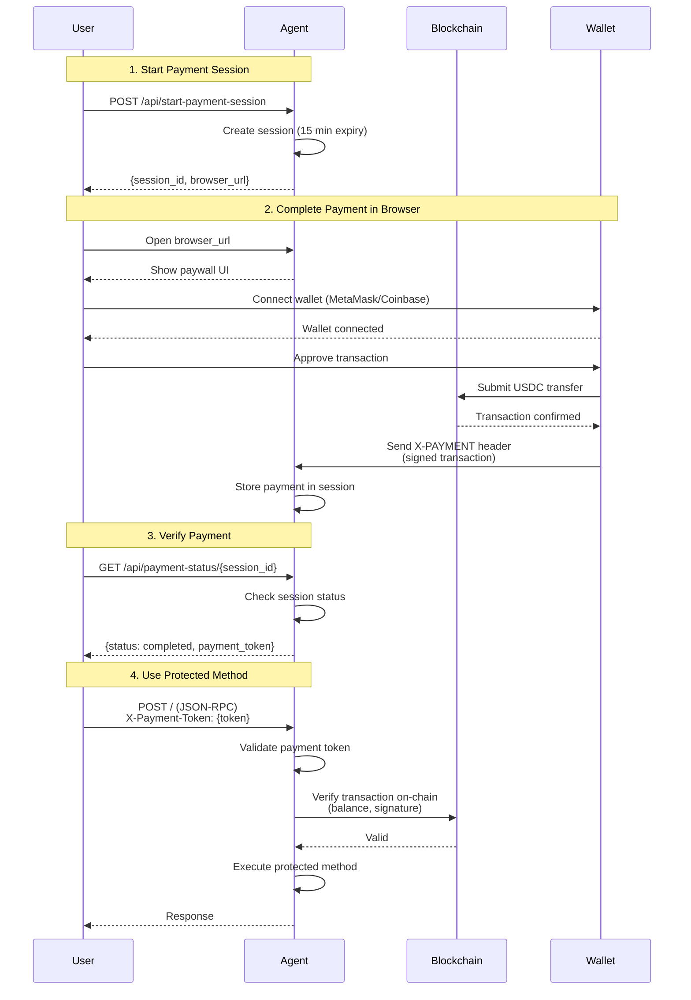

# Payment Integration (X402)

Bindu supports the **X402 payment protocol**, enabling you to monetize your AI agents by requiring cryptocurrency payments before executing specific methods. This allows you to build paid AI services with native blockchain payment integration.

## How It Works



## Configuration

Add the `execution_cost` configuration to your agent config to enable payment gating.

### Single payment option (existing behavior)

```python
config = {
    "author": "your.email@example.com",
    "name": "paid_agent",
    "description": "An agent that requires payment",
    "deployment": {"url": "http://localhost:3773", "expose": True},
    "execution_cost": {
        "amount": "$0.0001",           # Amount in USD (will be converted to USDC)
        "token": "USDC",                # Token type (USDC supported)
        "network": "base-sepolia",      # Network (base-sepolia for testing, base for production)
        "pay_to_address": "0x265<your-wallet-address>",  # Your wallet address
        "protected_methods": [
            "message/send"              # Methods that require payment
        ]
    }
}
```

### Multiple payment options (new behavior)

You can now provide **multiple** payment options. The agent will advertise all options
to the client, and any one of them can satisfy the requirement. For example:

```python
config = {
    "author": "your.email@example.com",
    "name": "paid_agent",
    "description": "An agent that requires payment",
    "deployment": {"url": "http://localhost:3773", "expose": True},
    "execution_cost": [
        {
            "amount": "0.1",              # 0.1 USDC on Base
            "token": "USDC",
            "network": "base",
            "pay_to_address": "0xYourWalletAddressHere",
        },
        {
            "amount": "0.0001",           # 0.0001 ETH on Ethereum mainnet
            "token": "ETH",
            "network": "ethereum",
            "pay_to_address": "0xYourWalletAddressHere",
        },
    ],
}
```

In this configuration, callers can pay **either** 0.1 USDC on Base **or** 0.0001 ETH
on Ethereum to access the protected methods.

### Reaching networks beyond Base — SKALE as the worked example

The x402 v2 SDK ships built-in pricing for Base mainnet and Base Sepolia only.
For any other EVM chain — SKALE, Polygon, Avalanche, Ethereum mainnet, etc. —
two pieces have to line up:

1. **A facilitator that supports the chain.** The facilitator runs the
   on-chain verification and settlement step. Coinbase's default
   facilitator (`https://x402.org/facilitator`) supports Base and a handful
   of non-EVM chains only — it does **not** know SKALE today. To reach
   SKALE you must point Bindu at a facilitator that does (see [Live
   facilitator support](#live-facilitator-support) below).

2. **An entry in `extra_networks`.** Bindu's `X402Settings.extra_networks`
   lets you register the asset metadata for any EVM chain the facilitator
   you chose advertises. Each entry teaches Bindu how to convert a price
   like `"0.01"` into atomic units of the right ERC-20 contract on that
   chain.

The default config already ships one example so the shape is visible:

```python
# bindu/settings.py
extra_networks = {
    "skale-europa": ExtraNetwork(
        caip2="eip155:1187947933",
        asset="0x85889c8c714505E0c94b30fcfcF64fE3Ac8FCb20",
        asset_name="Bridged USDC (SKALE Bridge)",
        asset_decimals=6,
        asset_eip712_version="2",
    ),
}
```

With that registered, your agent can use the friendly slug in
`execution_cost`:

```python
config = {
    "execution_cost": [
        {
            "amount": "0.01",
            "token": "USDC",
            "network": "skale-europa",   # → eip155:1187947933 downstream
            "pay_to_address": "0xYourSKALEAddress",
        }
    ],
    ...
}
```

The same pattern adds Polygon, Avalanche, Ethereum mainnet, or any other
EVM chain — copy the `ExtraNetwork` block and fill in the chain's CAIP-2
+ USDC contract.

#### Live facilitator support

| Facilitator | Networks | Notes |
|---|---|---|
| `https://x402.org/facilitator` (default) | Base, Solana, Algorand, Aptos, Stellar | Coinbase-operated. **No SKALE.** |
| `https://facilitator.x402.fi` | Base, Polygon, Ethereum, Avalanche, **5 SKALE chains** (Europa, Calypso, Nebula variants), Solana | Multi-chain; cert is currently expired (see [`bugs/known-issues.md`](../bugs/known-issues.md)). |

To switch your agent to a SKALE-aware facilitator, set
`X402__FACILITATOR_URL=https://facilitator.x402.fi` in your environment
(or override `app_settings.x402.facilitator_url` in code).

> **Production caveat.** The only SKALE-aware facilitator we've verified
> at the time of writing has an expired TLS certificate. Production
> deployments should not silently accept that — either wait for the
> operator to rotate the cert, or run your own facilitator instance.
> The shipped configuration assumes Base (the validated default).

## End-to-end walkthrough with a local mock facilitator

The fastest way to see the full paywall flow — including the **success
path** with handler execution and settlement receipts — is to run a
local mock facilitator. The mock returns `isValid: true` for every
verify call and a fake transaction hash for every settle call, so you
can exercise the Bindu side without a wallet, an RPC node, or any real
on-chain activity. Use only for dev / smoke / CI.

This walkthrough is what produced the recorded smoke in
`tests/integration/x402/test_skale_facilitator_supported.py` plus the
manual demo against a configurable network.

### Step 1 — write the mock facilitator (`mock_facilitator.py`)

```python
"""Local mock x402 facilitator. Always says yes."""
import uvicorn
from starlette.applications import Starlette
from starlette.requests import Request
from starlette.responses import JSONResponse
from starlette.routing import Route


async def supported(request: Request) -> JSONResponse:
    return JSONResponse({
        "kinds": [
            {"x402Version": 2, "scheme": "exact", "network": "eip155:1187947933"},  # SKALE
            {"x402Version": 2, "scheme": "exact", "network": "eip155:84532"},       # Base Sepolia
        ],
        "extensions": [],
        "signers": {"eip155:*": ["0xf00df00df00df00df00df00df00df00df00df00d"]},
    })


async def verify(request: Request) -> JSONResponse:
    body = await request.json()
    payer = body["paymentPayload"]["payload"]["authorization"]["from"]
    return JSONResponse({"isValid": True, "invalidReason": None, "payer": payer})


async def settle(request: Request) -> JSONResponse:
    body = await request.json()
    payer = body["paymentPayload"]["payload"]["authorization"]["from"]
    return JSONResponse({
        "success": True,
        "errorReason": None,
        "payer": payer,
        "transaction": "0x" + "ab" * 32,
        "network": body["paymentRequirements"]["network"],
    })


app = Starlette(routes=[
    Route("/supported", supported, methods=["GET"]),
    Route("/verify", verify, methods=["POST"]),
    Route("/settle", settle, methods=["POST"]),
])


if __name__ == "__main__":
    uvicorn.run(app, host="127.0.0.1", port=3775, log_level="warning")
```

Start it: `python mock_facilitator.py`.

### Step 2 — write a Bindu agent pointed at it (`success_agent.py`)

```python
import os
os.environ["X402__FACILITATOR_URL"] = "http://127.0.0.1:3775"

from bindu.penguin.bindufy import bindufy


def handler(messages):
    last = messages[-1].get("content", "") if messages else ""
    return f"PAID JOB DONE — agent received: '{last}'"


bindufy(
    {
        "author": "demo@example.com",
        "name": "success_agent",
        "description": "Agent for the SKALE success-path demo.",
        "deployment": {"url": "http://localhost:3773", "expose": False},
        "execution_cost": {
            "amount": "0.01",
            "token": "USDC",
            "network": "skale-europa",   # → eip155:1187947933 via extra_networks
            "pay_to_address": "0x742d35Cc6634C0532925a3b844Bc454e4438f44e",
        },
        "skills": [],
        "storage": {"type": "memory"},
        "scheduler": {"type": "memory"},
    },
    handler,
)
```

Start it: `python success_agent.py`. The agent will call the mock
facilitator's `/supported` during boot, register the SKALE scheme, and
come up listening on `http://localhost:3773`.

### Step 3 — exercise every paywall path

The five subsections below correspond to the five branches in
`X402Middleware.dispatch`. Run each `curl` against the live agent to
see exactly the JSON it returns.

#### 3a. Unpaid request → 402 with PaymentRequirements

```bash
curl -s -X POST http://localhost:3773/ -H 'Content-Type: application/json' \
  -d '{"jsonrpc":"2.0","method":"message/send","id":"'"$(uuidgen)"'","params":{
    "configuration":{"accepted_output_modes":["text"]},
    "message":{"role":"user","kind":"message",
      "parts":[{"kind":"text","text":"hi"}],
      "messageId":"'"$(uuidgen)"'",
      "contextId":"'"$(uuidgen)"'",
      "taskId":"'"$(uuidgen)"'"}}}'
```

Returns **HTTP 402** with a v2 `PaymentRequired` envelope:

```json
{
  "x402Version": 2,
  "error": "X-PAYMENT header required",
  "accepts": [
    {
      "scheme": "exact",
      "network": "eip155:1187947933",
      "asset": "0x85889c8c714505E0c94b30fcfcF64fE3Ac8FCb20",
      "amount": "10000",
      "payTo": "0x742d35Cc6634C0532925a3b844Bc454e4438f44e",
      "maxTimeoutSeconds": 60,
      "extra": {"name": "Bridged USDC (SKALE Bridge)", "version": "2"}
    }
  ],
  "agent": {"name": "success_agent", "did": "did:bindu:..."}
}
```

Notice: the agent's friendly config (`network: "skale-europa"`,
`amount: "0.01"`) is published over the wire as the CAIP-2 string,
atomic amount (`0.01 × 10^6` = `10000`), and the right EIP-712 domain.

#### 3b. Malformed body → 402, request never reaches the agent

```bash
printf '\xff\xfe garbage' | curl -s -X POST http://localhost:3773/ \
  -H 'Content-Type: application/json' --data-binary @-
```

Returns `{"error": "Malformed JSON-RPC body"}` at HTTP 402. The
historical `x402-middleware-fails-open-on-body-parse` bug (where a
bad body skipped the payment check) is closed; the agent never sees
the request.

#### 3c. Replay → 402, no facilitator round-trip

Build a syntactically-valid payment payload, send it twice with the
same nonce:

```bash
NONCE="0x$(uuidgen | tr -d '-')$(uuidgen | tr -d '-')"
PAYMENT=$(python3 -c "
import base64, json
print(base64.b64encode(json.dumps({
    'x402Version': 2,
    'payload': {
        'signature': '0x' + '00'*65,
        'authorization': {
            'from': '0x000000000000000000000000000000000000beef',
            'to':   '0x742d35Cc6634C0532925a3b844Bc454e4438f44e',
            'value': '10000', 'validAfter': '0', 'validBefore': '9999999999',
            'nonce': '$NONCE',
        },
    },
    'accepted': {
        'scheme': 'exact', 'network': 'eip155:1187947933',
        'asset': '0x85889c8c714505E0c94b30fcfcF64fE3Ac8FCb20',
        'amount': '10000', 'payTo': '0x742d35Cc6634C0532925a3b844Bc454e4438f44e',
        'maxTimeoutSeconds': 60,
        'extra': {'name': 'Bridged USDC (SKALE Bridge)', 'version': '2'},
    },
}).encode()).decode())
")
# First call — success (mock facilitator says isValid=true)
curl -s -X POST http://localhost:3773/ -H "X-PAYMENT: $PAYMENT" ...
# Second call with same NONCE — replay rejected before facilitator is touched
curl -s -X POST http://localhost:3773/ -H "X-PAYMENT: $PAYMENT" ...
```

Second call returns:

```json
{"error": "Payment nonce already used (replay)"}
```

The nonce store catches it; the facilitator's `/verify` is not called
a second time. This is the fix for `x402-no-replay-prevention`.

#### 3d. Forged signature, facilitator rejects → 402, agent does not run

Point the agent at the real Coinbase facilitator
(`X402__FACILITATOR_URL=https://x402.org/facilitator`) and send the
same payload as in 3c. Coinbase doesn't support SKALE, so verification
raises `SchemeNotFoundError` and the middleware returns 402 with
`error: "Payment verification failed"`. The handler does not execute
(this is `x402-no-signature-verification` and
`x402-balance-check-skipped-on-missing-contract-code` working
together — the v2 facilitator is the trust boundary, and when it
can't verify, we fail closed).

#### 3e. Paid request → success, handler runs, receipt attached

Same payload shape as 3c, fresh nonce, against the mock facilitator
that always says yes:

```bash
TASK_ID=$(uuidgen)
curl -s -X POST http://localhost:3773/ \
  -H 'Content-Type: application/json' \
  -H "X-PAYMENT: $PAYMENT" \
  -d '{"jsonrpc":"2.0","method":"message/send","id":"'"$(uuidgen)"'","params":{
    "configuration":{"accepted_output_modes":["text"]},
    "message":{"role":"user","kind":"message",
      "parts":[{"kind":"text","text":"summarize bridged USDC in one line"}],
      "messageId":"'"$(uuidgen)"'",
      "contextId":"'"$(uuidgen)"'",
      "taskId":"'"$TASK_ID"'"}}}'
```

Returns **HTTP 200** with `state: submitted`. The handler runs
asynchronously. Poll for completion:

```bash
curl -s -X POST http://localhost:3773/ -H 'Content-Type: application/json' \
  -d '{"jsonrpc":"2.0","method":"tasks/get","id":"'"$(uuidgen)"'","params":{"taskId":"'"$TASK_ID"'"}}'
```

After a moment, the task transitions to `completed` and the response
carries:

```json
{
  "result": {
    "status": {"state": "completed"},
    "artifacts": [
      {
        "parts": [
          {"kind": "text", "text": "PAID JOB DONE — agent received: 'summarize bridged USDC in one line'"}
        ]
      }
    ],
    "metadata": {
      "x402.payment.status": "payment-completed",
      "x402.payment.receipts": [
        {
          "success": true,
          "payer": "0x000000000000000000000000000000000000beef",
          "transaction": "0xabababababababababababababababababababababababababababababababab",
          "network": "eip155:1187947933"
        }
      ]
    }
  }
}
```

What this proves end-to-end:

1. `X-PAYMENT` accepted (facilitator returned `isValid: true`)
2. Nonce was claimed (would reject a replay; see 3c)
3. Handler ran and emitted its artifact
4. Worker called `/settle` on the facilitator; the success receipt is
   attached under `metadata["x402.payment.receipts"]`
5. Status flag `x402.payment.status: "payment-completed"` is set, so
   downstream consumers can audit "did this task actually settle?"
   without re-verifying signatures

### Step 4 — what the mock did NOT prove

The mock facilitator returns `isValid: true` for any payload. It does
not run EIP-712 signature recovery, it does not check on-chain
balances, and it does not broadcast the transfer. Those steps live in
a real facilitator. Two things you should also test against a real
facilitator before shipping:

* **Forged signature is rejected.** With a real facilitator (e.g.
  `https://x402.org/facilitator` for Base, or
  `https://facilitator.x402.fi` for SKALE), an `X-PAYMENT` with a
  random signature should come back from `/verify` as
  `isValid: false, invalidReason: "invalid_exact_evm_signature"`.
  Bindu's middleware then returns 402 — but the *signature recovery*
  is the facilitator's job, not Bindu's.
* **`validBefore` is honored.** Past the EIP-3009 window, a real
  facilitator's `/verify` rejects the authorization. Bindu's nonce
  store TTL is `requirement.max_timeout_seconds + 60`, which is
  intentionally a little wider so that clock skew doesn't free the
  slot before the facilitator gives up.

For a paid-flow smoke against a real network you need a wallet with
balance on the target chain and a signing helper that produces a
real EIP-3009 `TransferWithAuthorization` payload. See
`examples/hermes_agent/call.py` for a Python signing reference (it
targets Base Sepolia, but the EIP-3009 flow is identical on any
EVM chain — only the EIP-712 domain in `extra` differs).

## Setup for Testing

### 1. Create a Crypto Wallet

Choose one of these wallet options:

**MetaMask (Recommended):**
1. Install the [MetaMask browser extension](https://metamask.io/)
2. Create a new wallet or import an existing one
3. Copy your wallet address (starts with `0x...`)

**Coinbase Wallet:**
1. Install the [Coinbase Wallet extension](https://www.coinbase.com/wallet)
2. Set up your wallet
3. Copy your wallet address

### 2. Get Test USDC

For testing on Base Sepolia testnet:

1. **Get Base Sepolia ETH** (for gas fees):
   - Visit [Chainlink Faucet](https://faucets.chain.link/base-sepolia)
   - Connect your wallet
   - Request test ETH

2. **Get Base Sepolia USDC**:
   - The payment system will guide you through obtaining test USDC
   - Alternatively, use a Base Sepolia faucet that provides USDC

### 3. Update Agent Configuration

Add your wallet address to the agent config:

```python
"pay_to_address": "0xYourWalletAddressHere"  # Replace with your actual address
```

## Payment Flow

### Step 1: Start a Payment Session

When a user tries to access a protected method, they must first initiate a payment session:

```bash
curl --location --request POST 'http://localhost:3773/api/start-payment-session' \
--header 'Content-Type: application/json' \
--header 'Authorization: Bearer <your-access-token>'
```

**Response:**
```json
{
    "session_id": "<session-id>",
    "browser_url": "http://localhost:3773/payment-capture?session_id=<session-id>",
    "expires_at": "<expires-at>",
    "status": "pending"
}
```

### Step 2: Complete Payment in Browser

1. Open the `browser_url` in your web browser
2. Connect your wallet (MetaMask or Coinbase Wallet)
3. Review the payment details:
   - Amount in USDC
   - Recipient address
   - Network (Base Sepolia)
4. Approve and sign the transaction
5. Wait for blockchain confirmation


### Step 3: Verify Payment Status

After completing the payment, check the session status:

```bash
curl --location 'http://localhost:3773/api/payment-status/<session_id>' \
--header 'Authorization: Bearer <your-access-token>'
```

**Successful Payment Response:**
```json
{
    "session_id": "<session-id>",
    "status": "completed",
    "payment_token": "eyJhbGciOiJIUzI1NiIsInR5cCI6IkpXVCJ9..."
}
```


**Response Fields:**
- `session_id`: The payment session identifier
- `status`: Payment status (`completed` means payment verified)
- `payment_token`: JWT token to include in subsequent API calls

### Step 4: Use the Agent with Payment Token

Include the `payment_token` in your agent requests:

```bash
curl --location 'http://localhost:3773/' \
--header 'Content-Type: application/json' \
--header 'Authorization: Bearer <your-access-token>' \
--header 'X-Payment-Token: <payment-token>' \
--data '{
    "jsonrpc": "2.0",
    "method": "message/send",
    "params": {
        "message": {
            "role": "user",
            "content": "Hello, paid agent!"
        }
    },
    "id": 1
}'
```

## Example Implementation

See the complete example at:
```
examples/beginner/echo_agent_behind_paywall.py
```

## UI Integration

From the UI, you can obtain the access token and use it to initiate payment sessions.

**Important Payment Behavior:**
- Each new task requires payment when the agent is behind a paywall
- If a task returns `input_required` status, no payment is needed for that interaction
- Once a task completes successfully, a new payment is required for the next task, even within the same conversation/context
- Payment tokens are task-specific and cannot be reused across multiple completed tasks

## Security Considerations

- **Wallet Security**: Never share your private keys or seed phrases
- **Test Networks**: Always test on Base Sepolia before deploying to mainnet
- **Payment Verification**: Payments are verified on-chain via blockchain signatures
- **Session Expiration**: Payment sessions expire after 60 seconds by default
- **Token Storage**: Payment tokens are JWTs with expiration times

## Production Deployment

When ready for production:

1. **Switch to Base Mainnet**:
   ```python
   "network": "base"  # Change from "base-sepolia"
   ```

2. **Use Real USDC**: Ensure users have actual USDC on Base mainnet

3. **Update Wallet Address**: Use your production wallet address

4. **Monitor Payments**: Track incoming payments to your wallet address

5. **Set Appropriate Pricing**: Adjust `amount` based on your service value

## Tips

- **Start Small**: Use low amounts for testing (e.g., `$0.0001`)
- **Clear Communication**: Inform users about payment requirements upfront
- **Handle Failures**: Implement proper error handling for failed payments
- **Session Management**: Clean up expired payment sessions regularly
- **User Experience**: Provide clear instructions in your UI for payment flow


## Related Documentation

- [X402 Protocol Specification](https://github.com/coinbase/x402)
- [Base Sepolia Testnet](https://docs.base.org/network-information)
- [Bindu Authentication](./AUTHENTICATION.md) - Required for payment endpoints
