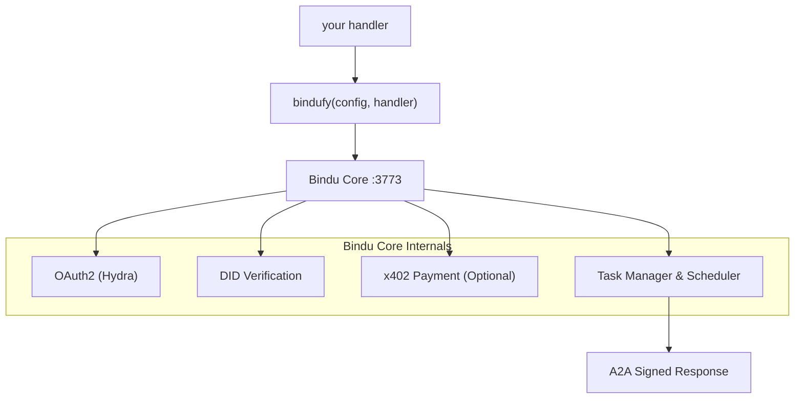

<p align="center">
  
</p>

<div align="center">


# Bindu

### AI এজেন্টদের জন্য পরিচয়, যোগাযোগ এবং পেমেন্ট স্তর।

</div>

<br>

> **যেকোনো ফ্রেমওয়ার্কে আপনার এজেন্ট লিখুন। `bindufy()` দিয়ে এটি মুড়ুন।**
> **দশ লাইন কোডে একটি স্বাক্ষরিত A2A মাইক্রোসার্ভিস পাঠান - পরিচয়, OAuth2, এবং অন-চেইন পেমেন্ট সহ।**

কোনো ইনফ্রাস্ট্রাকচার লিখতে হবে না। কোনো ফ্রেমওয়ার্ক পুনর্লিখ করতে হবে না। Python, TypeScript, এবং Kotlin থেকে কাজ করে, এবং দুটি ওপেন প্রোটোকলের উপর স্তরিত: [A2A](https://github.com/a2aproject/A2A) এবং [x402](https://github.com/coinbase/x402)।

<div align="center">

  <p>
    <a href="../README.md">English</a> ·
    <a href="README.de.md">Deutsch</a> ·
    <a href="README.es.md">Español</a> ·
    <a href="README.fr.md">Français</a> ·
    <a href="README.hi.md">हिंदी</a> ·
    <a href="README.bn.md">বাংলা</a> ·
    <a href="README.zh.md">中文</a> ·
    <a href="README.nl.md">Nederlands</a> ·
    <a href="README.ta.md">தமிழ்</a>
  </p>

  <p>
    <a href="https://opensource.org/licenses/Apache-2.0"></a>
    <a href="https://www.python.org/downloads/"></a>
    <a href="https://pypi.org/project/bindu/"></a>
    <a href="https://coveralls.io/github/Saptha-me/Bindu?branch=v0.3.18"></a>
    <a href="https://github.com/getbindu/Bindu/actions/workflows/release.yml"></a>
    <a href="https://discord.gg/3w5zuYUuwt"></a>
    <a href="https://github.com/getbindu/Bindu/graphs/contributors"></a>
    <a href="https://hits.sh/github.com/Saptha-me/Bindu.svg"></a>
  </p>

  <p>
    <a href="https://getbindu.com"><strong>আপনার এজেন্ট নিবন্ধন করুন</strong></a> ·
    <a href="https://docs.getbindu.com"><strong>ডকুমেন্টেশন</strong></a> ·
    <a href="https://discord.gg/3w5zuYUuwt"><strong>Discord</strong></a>
  </p>
</div>

---

## আপনি যা পান

যখন আপনি একটি হ্যান্ডলারকে `bindufy(config, handler)` দিয়ে মুড়েন, তখন প্রক্রিয়াটি মানক প্রোটোকলে কথা বলে, প্রতিটি উত্তরে স্বাক্ষর করে, এবং পেমেন্ট নিতে প্রস্তুত হয়ে ওঠে। এটি আপনার জন্য যা করে তার দ্বারা গোষ্ঠীবদ্ধ:

<br>

**প্রোটোকল - বিশ্বের সাথে কথা বলুন**

| ক্ষমতা | এর অর্থ কী |
|---|---|
| A2A JSON-RPC এন্ডপয়েন্ট | অন্যান্য এজেন্টরা ইতিমধ্যেই যে মানক প্রোটোকল ব্যবহার করে। 3773 পোর্টে `message/send`, `tasks/get`, `message/stream`। |
| পুশ নোটিফিকেশন | টাস্ক স্টেট পরিবর্তনে ওয়েবহুক কলব্যাক - কোনো পোলিং প্রয়োজন নেই। |
| ভাষা-নিরপেক্ষ | Python, TypeScript, এবং Kotlin SDK একটি gRPC কোর শেয়ার করে। একই প্রোটোকল, একই DID, একই অথ। |

<br>

**পরিচয় ও অ্যাক্সেস - কে কল করছে তা প্রমাণ করুন**

| ক্ষমতা | এর অর্থ কী |
|---|---|
| DID পরিচয় (Ed25519) | প্রতিটি ফেরত আর্টিফ্যাক্ট স্বাক্ষরিত। কলাররা W3C-মানক DID দিয়ে যাচাই করে - কোনো শেয়ার্ড সিক্রেট নেই। |
| Ory Hydra মাধ্যমে OAuth2 | একটি সব-বা-কিছুই না বিয়ারারের পরিবর্তে স্কোপড টোকেন (`agent:read`, `agent:write`, `agent:execute`)। |

<br>

**বাণিজ্য ও পৌঁছানো - পেমেন্ট পান এবং পৌঁছানোযোগ্য হন**

| ক্ষমতা | এর অর্থ কী |
|---|---|
| x402 পেমেন্ট | একটি ফ্ল্যাগ এবং এজেন্ট একটি অনুরোধ প্রক্রিয়া করার আগে Base এ USDC চার্জ করে। পেমেন্ট চেক আপনার হ্যান্ডলারের আগে চলে। |
| পাবলিক টানেল | `expose: true` একটি FRP টানেল খোলে যাতে আপনার স্থানীয় এজেন্ট পাবলিক ইন্টারনেট থেকে পৌঁছানোযোগ্য। |

---

## ইনস্টল

```bash
uv add bindu
```

টেস্ট সহ একটি ডেভেলপমেন্ট চেকআউটের জন্য:

```bash
git clone https://github.com/getbindu/Bindu.git
cd Bindu
uv sync --dev
```

Python 3.12+ এবং [uv](https://github.com/astral-sh/uv) প্রয়োজন। উদাহরণগুলি চালানোর জন্য অন্তত একটি LLM প্রোভাইডারের জন্য একটি API কী (`OPENROUTER_API_KEY`, `OPENAI_API_KEY`, বা `MINIMAX_API_KEY`) প্রয়োজন।

---

## হ্যালো এজেন্ট

Bindu-এর সম্পূর্ণ ধারণা একটি ফাইলে স্পষ্টভাবে দেখা যায় - আপনি যেকোনো এজেন্ট তৈরি করুন, এটি `bindufy()` এ হ্যান্ড করুন, এবং আপনার প্রক্রিয়া একটি স্বাক্ষরিত A2A মাইক্রোসার্ভিস হিসাবে আসে। নিচের ব্লকটি সম্পূর্ণ এবং রানযোগ্য।

```python
import os
from bindu.penguin.bindufy import bindufy
from agno.agent import Agent
from agno.models.openai import OpenAIChat
from agno.tools.duckduckgo import DuckDuckGoTools

# 1. আপনার পছন্দের যেকোনো ফ্রেমওয়ার্ক দিয়ে আপনার এজেন্ট তৈরি করুন। Bindu
#    ভিতরে কী আছে তা পরোয়া করে না - এটি শুধু কলযোগ্য কিছু প্রয়োজন।
agent = Agent(
    instructions="You are a research assistant that finds and summarizes information.",
    model=OpenAIChat(id="gpt-4o"),
    tools=[DuckDuckGoTools()],
)

# 2. Bindu কে বলুন আপনি কে এবং এজেন্ট কোথায় থাকে। `expose: True`
#    একটি পাবলিক FRP টানেল খোলে - স্থানীয়-এর জন্য এটি বাদ দিন।
config = {
    "author": "you@example.com",
    "name": "research_agent",
    "description": "Research assistant with web search.",
    "deployment": {
        "url": os.getenv("BINDU_DEPLOYMENT_URL", "http://localhost:3773"),
        "expose": True,
    },
    "skills": ["skills/question-answering"],
}

# 3. হ্যান্ডলার চুক্তি: (messages) -> response। এটাই।
def handler(messages: list[dict[str, str]]):
    return agent.run(input=messages)

# 4. bindufy() HTTP সার্ভার বুট করে, আপনার DID তৈরি করে, Hydra এর সাথে নিবন্ধন করে
#    (যদি auth চালু থাকে), এবং A2A কল গ্রহণ করা শুরু করে।
bindufy(config, handler)
```

এটি চালান, এবং এজেন্টটি কনফিগার করা URL এ লাইভ। ভিন্ন পোর্ট প্রয়োজন? `BINDU_PORT=4000` এক্সপোর্ট করুন - কোনো কোড পরিবর্তন নেই।

<details>
<summary>TypeScript সমতুল্য</summary>

```typescript
import { bindufy } from "@bindu/sdk";
import OpenAI from "openai";

const openai = new OpenAI();

bindufy({
  author: "you@example.com",
  name: "research_agent",
  description: "Research assistant.",
  deployment: { url: "http://localhost:3773", expose: true },
  skills: ["skills/question-answering"],
}, async (messages) => {
  const response = await openai.chat.completions.create({
    model: "gpt-4o",
    messages: messages.map(m => ({ role: m.role as "user" | "assistant" | "system", content: m.content })),
  });
  return response.choices[0].message.content || "";
});
```

TypeScript SDK স্বয়ংক্রিয়ভাবে Python কোর চালু করে। একই প্রোটোকল, একই DID। সম্পূর্ণ উদাহরণ [`examples/typescript-openai-agent/`](examples/typescript-openai-agent/) এ।

</details>

<details>
<summary>curl দিয়ে এজেন্ট কল করা</summary>

```bash
curl -X POST http://localhost:3773/ \
  -H 'Content-Type: application/json' \
  -d '{
    "jsonrpc": "2.0",
    "method": "message/send",
    "id": "<uuid>",
    "params": {
      "message": {
        "role": "user",
        "kind": "message",
        "parts": [{"kind": "text", "text": "Hello"}],
        "messageId": "<uuid>",
        "contextId": "<uuid>",
        "taskId": "<uuid>"
      }
    }
  }'
```

একই `taskId` দিয়ে `tasks/get` পোল করুন যতক্ষণ না স্টেট `completed` হয়। ফেরত আর্টিফ্যাক্ট `metadata["did.message.signature"]` এর অধীনে একটি DID স্বাক্ষর বহন করে।

</details>

---

## এটি কীভাবে ফিট করে

তাহলে সেই `bindufy()` কল কার্যকর হলে আসলে কী হয়? হ্যান্ডলার হল একমাত্র কোড যা আপনি লিখেন। বাকি সবকিছু Bindu এর চারপাশে স্ক্যাফোল্ডিং যা এটি রাখে:



`bindufy()` একটি পাতলা মোড়ক। আপনার হ্যান্ডলার বিশুদ্ধ থাকে - `(messages) -> response`। Bindu পরিচয়, প্রোটোকল, অথ, পেমেন্ট, স্টোরেজ, এবং শিডিউলিং মালিক।

---

## একটি সুরক্ষিত এজেন্ট কল করা

> **TL;DR** - যখন `AUTH__ENABLED=true`, প্রতিটি কলের জন্য একটি Hydra বিয়ারার টোকেন এবং তিনটি `X-DID-*` হেডার প্রয়োজন। Python ক্লায়েন্ট: ~25 লাইন, [নিচে](#step-2--pick-your-client)। Postman: একটি স্ক্রিপ্ট পেস্ট করুন। এই বিভাগের বাকি অংশ কেন এবং কীভাবে খোলে, এবং এটি ভুল হলে কী ভুল হয়।

*Hello agent* এ `curl` উদাহরণটি কাজ করে কারণ auth ডিফল্টভাবে বন্ধ - যেকেউ আপনার এজেন্টে POST করতে পারে। আপনি যখন `AUTH__ENABLED=true AUTH__PROVIDER=hydra` ফ্লিপ করেন, আপনার এজেন্ট কঠোর হয়ে যায়। এখন প্রতিটি কলারকে হ্যান্ডলার চলার আগে দুটি প্রশ্নের উত্তর দিতে হবে:

1. **আপনি কি আমাকে কল করার অনুমতি প্রাপ্ত?** - Hydra থেকে একটি বৈধ OAuth2 টোকেন দেখান।
2. **আপনি কি সত্যিই যা বলছেন তা?** - একটি DID কী দিয়ে অনুরোধে স্বাক্ষর করুন।

এটিকে ফ্লাইটে বোর্ডিং এর মতো ভাবুন: বোর্ডিং পাস (OAuth টোকেন) বলে "হ্যাঁ, এই ফ্লাইটে আপনার একটি আসন আছে," এবং পাসপোর্ট (DID স্বাক্ষর) বলে "এবং আপনি সত্যিই সেই বোর্ডিং পাসের ব্যক্তি।" সার্ভার উভয়ই পরীক্ষা করে।

সম্পূর্ণ তত্ত্ব [`docs/AUTHENTICATION.md`](docs/AUTHENTICATION.md) এবং [`docs/DID.md`](docs/DID.md) এ বাস করে - সাধারণ-ইংরেজি, কোনো ক্রিপ্টো ব্যাকগ্রাউন্ড অনুমান করা হয় না। নিচে ব্যবহারিক "আমি শুধু আমার এজেন্ট কল করতে চাই" সংস্করণ।

<br>

### তিনটি অতিরিক্ত হেডার

সাধারণ `Authorization: Bearer <hydra-jwt>` এর পাশাপাশি, প্রতিটি সুরক্ষিত অনুরোধ বহন করে:

| হেডার | মান |
|---|---|
| `X-DID` | আপনার DID স্ট্রিং, যেমন `did:bindu:you_at_example_com:myagent:<uuid>` |
| `X-DID-Timestamp` | বর্তমান ইউনিক্স সেকেন্ড (সার্ভার 5 মিনিট স্কিউ অনুমতি দেয়) |
| `X-DID-Signature` | `base58( Ed25519_sign( <signing payload> ) )` |

**স্বাক্ষর পেলোড** সার্ভারে এভাবে পুনর্নির্মিত হয়:

```python
json.dumps({"body": <raw-body-string>, "did": <did>, "timestamp": <ts>}, sort_keys=True)
```

দুটি গচ্ছা যা আপনাকে কামড়াবে যতক্ষণ না আপনি এগুলি অনুভব করেছেন:

- **Python এর JSON স্পেসিং ম্যাচ করুন।** Python এর ডিফল্ট `json.dumps` `", "` এবং `": "` (স্পেস সহ) লেখে। JS এ `JSON.stringify` এগুলি ছাড়াই লেখে। যদি আপনার পেলোড ভিন্নভাবে সিরিয়ালাইজ করে, Ed25519 ভিন্ন বাইট দেখে এবং সার্ভার `reason="crypto_mismatch"` ফেরত দেয়।
- **আপনি যা পাঠাচ্ছেন তা স্বাক্ষর করুন।** আপনি যদি বডি পার্স করেন, এটি পরিবর্তন করেন, পুনরায় সিরিয়ালাইজ করেন, এবং সেটি পাঠান - আপনি ভুল বাইট স্বাক্ষর করেছেন। বডি স্ট্রিং **একবার** তৈরি করুন, সেই হুবহু বাইট স্বাক্ষর করুন, সেই হুবহু বাইট পাঠান।

<br>

### ধাপ 1 - Hydra থেকে একটি বিয়ারার টোকেন পান

এজেন্ট তার স্টার্টআপ ব্যানারে একটি রান-রেডি curl প্রিন্ট করে। সংক্ষিপ্ত সংস্করণ:

```bash
SECRET=$(jq -r '.[].client_secret' < .bindu/oauth_credentials.json)
curl -X POST https://hydra.getbindu.com/oauth2/token \
  -H "Content-Type: application/x-www-form-urlencoded" \
  -d "grant_type=client_credentials" \
  -d "client_id=did:bindu:you_at_example_com:myagent:<uuid>" \
  -d "client_secret=$SECRET" \
  -d "scope=openid offline agent:read agent:write"
```

উত্তরে একটি `access_token` আছে। এটি এক ঘণ্টার জন্য ভাল - এটি ক্যাশ করুন, প্রয়োজনে পুনরায় ফেচ করুন।

<br>

### ধাপ 2 - আপনার ক্লায়েন্ট বেছে নিন

**Python - সবচেয়ে ছোট কাজ করা উদাহরণ।** এজেন্টের নিজস্ব কী পড়ে (Bindu প্রথম বুটে `.bindu/` এ লেখে), একটি অনুরোধে স্বাক্ষর করে, ফলাফলের জন্য পোল করে। সেলফ-কল কাজ করে কারণ এজেন্টের কী একটি বৈধ কলার পরিচয়।

```python
import base58, httpx, json, time, uuid
from pathlib import Path
from cryptography.hazmat.primitives import serialization

# 1. প্রথম বুটে Bindu যে কী লিখেছে তা লোড করুন
priv  = serialization.load_pem_private_key(Path(".bindu/private.pem").read_bytes(), password=None)
creds = next(iter(json.loads(Path(".bindu/oauth_credentials.json").read_text()).values()))
did   = creds["client_id"]            # DID হাইড্রা client_id হিসাবেও কাজ করে

# 2. শংসাপত্রগুলি একটি স্বল্প-জীবন JWT এর জন্য বিনিময় করুন
bearer = httpx.post("https://hydra.getbindu.com/oauth2/token", data={
    "grant_type": "client_credentials",
    "client_id": creds["client_id"], "client_secret": creds["client_secret"],
    "scope": "openid offline agent:read agent:write",
}).json()["access_token"]

# 3. বডি একবার তৈরি করুন - এগুলি বাইট যা আমরা স্বাক্ষর করব এবং পাঠাব
tid = str(uuid.uuid4())
body = json.dumps({
    "jsonrpc": "2.0", "method": "message/send", "id": str(uuid.uuid4()),
    "params": {"message": {
        "role": "user", "kind": "message",
        "parts": [{"kind": "text", "text": "Hello!"}],
        "messageId": str(uuid.uuid4()), "contextId": str(uuid.uuid4()), "taskId": tid,
    }},
})

# 4. স্বাক্ষর: base58(Ed25519( json.dumps({body,did,timestamp}, sort_keys=True) ))
ts      = int(time.time())
payload = json.dumps({"body": body, "did": did, "timestamp": ts}, sort_keys=True)
sig     = base58.b58encode(priv.sign(payload.encode())).decode()

# 5. এটি ফায়ার করুন
r = httpx.post("http://localhost:3773/", content=body, headers={
    "Content-Type":    "application/json",
    "Authorization":   f"Bearer {bearer}",
    "X-DID":           did,
    "X-DID-Timestamp": str(ts),
    "X-DID-Signature": sig,
})
print(r.status_code, r.json())
```

পোলিং এবং ত্রুটি হ্যান্ডলিং সহ একটি সম্পূর্ণ-বৈশিষ্ট্যযুক্ত সংস্করণের জন্য, দেখুন - [`examples/hermes_agent/call.py`](examples/hermes_agent/call.py)।

<br>

**Postman - আপনার সংগ্রহে একটি স্ক্রিপ্ট পেস্ট করুন।**

1. আপনার সংগ্রহ খুলুন → **Pre-request Script** ট্যাব → [`docs/postman-did-signing.js`](docs/postman-did-signing.js) এর বিষয়বস্তু পেস্ট করুন।
2. দুটি সংগ্রহ ভেরিয়েবল সেট করুন: `bindu_did` (আপনার DID স্ট্রিং) এবং `bindu_did_seed` (আপনার 32-বাইট Ed25519 সিড, base64-এনকোডেড)।
3. একটি `Authorization: Bearer {{bindu_bearer}}` হেডার যোগ করুন এবং আপনার Hydra টোকেন `bindu_bearer` এ ড্রপ করুন।
4. Send হিট করুন। স্ক্রিপ্টটি Postman যে হুবহু বডি বাইট পাঠাতে যাচ্ছে তা স্বাক্ষর করে এবং আপনার জন্য তিনটি `X-DID-*` হেডার সেট করে।

Postman Desktop v11+ প্রয়োজন (`crypto.subtle` এ Ed25519 প্রয়োজন)।

<br>

**সাধারণ curl - প্রযুক্তিগতভাবে সম্ভব, সাধারণত যন্ত্রণাদায়ক।** স্বাক্ষরটি আপনি যে বডি বাইট পাঠাতে যাচ্ছেন তার উপর নির্ভর করে, তাই আপনাকে প্রথমে স্বাক্ষর গণনা করতে একটি হেল্পার স্ক্রিপ্ট প্রয়োজন, তারপর এটিকে curl কলে প্রতিস্থাপন করুন। আপনি যদি এটি করছেন, আপনি সম্ভবত উপরের Python ক্লায়েন্ট ব্যবহার করে ভালো হবেন।

<br>

### যখন স্বাক্ষর ব্যর্থ হয়

সার্ভার লগ তিনটি কারণের একটি লগ করে। যদি আপনার অনুরোধ 403 দিয়ে প্রত্যাখ্যাত হয়, অপারেটরকে জিজ্ঞাসা করুন (বা নিজেই সার্ভার লগ পরীক্ষা করুন):

| লগ বলে | এর অর্থ কী | সমাধান |
|---|---|---|
| `timestamp_out_of_window` | আপনার `X-DID-Timestamp` সার্ভারের ঘড়ি থেকে 5 মিনিটের বেশি বন্ধ, বা আপনি একটি পুরানো টাইমস্ট্যাম্প পুনরায় ব্যবহার করেছেন | প্রতিটি অনুরোধে `int(time.time())` পুনর্গণনা করুন |
| `malformed_input` | স্বাক্ষর বা পাবলিক কী এর base58 ডিকোডিং ব্যর্থ হয়েছে | পরীক্ষা করুন `X-DID-Signature` URL-এনকোডেড, ছাঁটা, বা উদ্ধৃতিতে মোড়ানো নয় |
| `crypto_mismatch` | বাইট আপনি স্বাক্ষর করেছেন ≠ বাইট আপনি পাঠিয়েছেন | `sort_keys=True` এবং Python এর ডিফল্ট JSON স্পেসিং দিয়ে পেলোড পুনর্নির্মাণ করুন; কাঁচা বডি স্ট্রিং একবার স্বাক্ষর করুন এবং একই বাইট পাঠান |

আমরা টেস্টিং এ একটি তীক্ষ্ণ ব্যর্থতা মোড হিট করেছি: যদি `crypto_mismatch` অবিরত থাকে এবং আপনি *নিশ্চিত* যে আপনার বাইট ম্যাচ করে, Hydra এর এই DID এর জন্য সংরক্ষিত পাবলিক কী পুরানো নিবন্ধন থেকে স্থবির হতে পারে। সমাধান: এজেন্ট বন্ধ করুন, `.bindu/oauth_credentials.json` মুছুন, পুনরায় চালু করুন - Hydra এর ক্লায়েন্ট রেকর্ড বর্তমান কী দিয়ে রিফ্রেশ হবে।

---

## গেটওয়ে - মাল্টি-এজেন্ট অর্কেস্ট্রেশন

একটি একক `bindufy()` মোড়ানো এজেন্ট একটি মাইক্রোসার্ভিস। **Bindu গেটওয়ে** একটি টাস্ক-ফার্স্ট অর্কেস্ট্রেটর যা উপরে বসে: এটিকে একটি ব্যবহারকারী প্রশ্ন এবং A2A এজেন্টদের একটি ক্যাটালগ দিন, এবং একটি প্ল্যানার LLM কাজটি ডিকম্পোজ করে, A2A এর মাধ্যমে সঠিক এজেন্টদের কল করে, এবং ফলাফলগুলি সার্ভার-সেন্ট ইভেন্ট হিসাবে স্ট্রিম করে। কোনো DAG ইঞ্জিন নেই, কোনো আলাদা অর্কেস্ট্রেটর সার্ভিস নেই - প্ল্যানারের LLM প্রতি টার্নে টুল বেছে নেয়।

একটি একক এজেন্টের বাইরে আপনি যা পান:

- **একটি এন্ডপয়েন্ট: `POST /plan`** - এটিকে একটি প্রশ্ন এবং একটি এজেন্ট ক্যাটালগ দিন, স্ট্রিমড স্টেপ পান।
- **প্রতি অনুরোধ এজেন্ট ক্যাটালগ** - বাহ্যিক সিস্টেম এজেন্ট, দক্ষতা, এবং এন্ডপয়েন্টগুলির তালিকা পাস করে। গেটওয়ে নিজেতে কোনো ফ্লিট হোস্টিং নেই।
- **সেশন পার্সিসটেন্স (Supabase)** - Postgres-ব্যাকড কমপ্যাকশন, রিভার্ট, এবং মাল্টি-টার্ন হিস্ট্রি সহ।
- **নেটিভ TypeScript A2A** - কোনো Python সাবপ্রসেস নেই, গেটওয়েতে কোনো `@bindu/sdk` নির্ভরতা নেই।
- **ঐচ্ছিক DID স্বাক্ষর + Hydra ইন্টিগ্রেশন** - গেটওয়ে পরিচয় এন্ড-টু-এন্ড।

মিনিমাল কুইকস্টার্ট:

```bash
cd gateway
npm install
cp .env.example .env.local         # fill SUPABASE_*, GATEWAY_API_KEY, OPENROUTER_API_KEY
npm run dev                        # → http://localhost:3774
curl -sS http://localhost:3774/health
```

প্রথমে দুটি Supabase মাইগ্রেশন প্রয়োগ করুন (`gateway/migrations/001_init.sql`, `002_compaction_revert.sql`)। সম্পূর্ণ ওয়াকথ্রু এবং অপারেটর রেফারেন্স [`gateway/README.md`](gateway/README.md) এবং [`docs/GATEWAY.md`](docs/GATEWAY.md) এ বাস করে (45-মিনিট এন্ড-টু-এন্ড: ক্লিন ক্লোন → তিনটি চেইনড এজেন্ট → একটি রেসিপি লেখা → DID স্বাক্ষর)।

গেটওয়ে ডকুমেন্টেশন:

| বিষয় | লিংক |
|---|---|
| ওভারভিউ | [docs.getbindu.com/bindu/gateway/overview](https://docs.getbindu.com/bindu/gateway/overview) |
| কুইকস্টার্ট | [docs.getbindu.com/bindu/gateway/quickstart](https://docs.getbindu.com/bindu/gateway/quickstart) |
| মাল্টি-এজেন্ট প্ল্যানিং | [docs.getbindu.com/bindu/gateway/multi-agent](https://docs.getbindu.com/bindu/gateway/multi-agent) |
| রেসিপি (প্রগ্রেসিভ-ডিসক্লোজার প্লেবুক) | [docs.getbindu.com/bindu/gateway/recipes](https://docs.getbindu.com/bindu/gateway/recipes) |
| পরিচয় (DID স্বাক্ষর, Hydra) | [docs.getbindu.com/bindu/gateway/identity](https://docs.getbindu.com/bindu/gateway/identity) |
| প্রোডাকশন ডিপ্লয়মেন্ট | [docs.getbindu.com/bindu/gateway/production](https://docs.getbindu.com/bindu/gateway/production) |
| API রেফারেন্স | [docs.getbindu.com/api/introduction](https://docs.getbindu.com/api/introduction) |

একটি রানযোগ্য মাল্টি-এজেন্ট ডেমোর জন্য, দেখুন [`examples/gateway_test_fleet/`](examples/gateway_test_fleet/) - স্থানীয় পোর্টে পাঁচটি ছোট এজেন্ট, একটি গেটওয়ে, একটি কোয়েরি।

---

## সমর্থিত ফ্রেমওয়ার্ক এবং উদাহরণ

আপনি যেকোনো এজেন্ট ফ্রেমওয়ার্ক নিয়ে আসুন যা আপনি ইতিমধ্যেই পছন্দ করেন। আপনি Bindu এ একটি হ্যান্ডলার হ্যান্ড করেন; এটি আপনাকে একটি স্বাক্ষরিত A2A মাইক্রোসার্ভিস দেয়। হ্যান্ডলারের ভিতরে কী আছে তা নির্বিশেষে একই ফ্লো।

<br>

| ভাষা | এই রেপোতে পরীক্ষিত ফ্রেমওয়ার্ক |
|---|---|
| **Python** | [AG2](https://github.com/ag2ai/ag2) · [Agno](https://github.com/agno-agi/agno) · [CrewAI](https://github.com/joaomdmoura/crewAI) · [Hermes Agent](https://github.com/NousResearch/hermes-agent) · [LangChain](https://github.com/langchain-ai/langchain) · [LangGraph](https://github.com/langchain-ai/langgraph) · [Notte](https://github.com/nottelabs/notte) |
| **TypeScript** | [OpenAI SDK](https://github.com/openai/openai-node) · [LangChain.js](https://github.com/langchain-ai/langchainjs) |
| **Kotlin** | [OpenAI Kotlin SDK](https://github.com/aallam/openai-kotlin) |
| **অন্য যেকোনো ভাষা** | [gRPC কোর](docs/grpc/) এর মাধ্যমে - কয়েকশ লাইনে একটি SDK যোগ করুন |

OpenAI বা Anthropic API এ কথা বলা যেকোনো LLM প্রোভাইডারের সাথে সামঞ্জস্যপূর্ণ: [OpenRouter](https://openrouter.ai/) (100+ মডেল), [OpenAI](https://platform.openai.com/), [MiniMax](https://platform.minimaxi.com), এবং অন্যান্য।

<br>

### শুরু করার জন্য কয়েকটি উদাহরণ

পাঁচটি যা Bindu কী করতে পারে তার বর্ণালী কভার করে। সব 20+ রানযোগ্য উদাহরণ [`examples/`](examples/) এর অধীনে বাস করে।

| উদাহরণ | এটি কী দেখায় |
|---|---|
| [Agent Swarm](examples/agent_swarm/) | মাল্টি-এজেন্ট সহযোগিতা - একটি ছোট "সমাজ" Agno এজেন্ট যারা একে অপরকে কাজ প্রতিনিধিত্ব করে। |
| [Premium Advisor](examples/premium-advisor/) | **x402 পেমেন্ট** - কলারকে হ্যান্ডলার চলার আগে Base এ USDC পেমেন্ট করতে হবে। |
| [Hermes via Bindu](examples/hermes_agent/) | **থার্ড-পার্টি ফ্রেমওয়ার্ক ইন্টারঅপ** - Nous Research এর Hermes এজেন্ট ~90 লাইনে bindufied। |
| [Gateway Test Fleet](examples/gateway_test_fleet/) | পাঁচটি ছোট এজেন্ট + একটি গেটওয়ে - মাল্টি-এজেন্ট অর্কেস্ট্রেশন গল্প এন্ড-টু-এন্ড। |
| [TypeScript OpenAI Agent](examples/typescript-openai-agent/) | **পলিগ্লট প্রুফ** - একটি TS এজেন্ট Bindu TS SDK দিয়ে bindufied; কোনো Python লিখতে হবে না। |

**সম্পূর্ণ ক্যাটালগ দেখুন:** [`examples/`](examples/) - 20+ এজেন্ট CSV বিশ্লেষণ, PDF Q&A, স্পিচ-টু-টেক্সট, ওয়েব স্ক্র্যাপিং, সাইবারসিকিউরিটি নিউজলেটার, মাল্টি-লিঙ্গুয়াল কোল্যাব, ব্লগ লেখা, এবং আরও অনেক কভার করে।

আপনি যে ফ্রেমওয়ার্ক ব্যবহার করেন তা মিসিং? একটি ইস্যু খুলুন বা [Discord](https://discord.gg/3w5zuYUuwt) এ জিজ্ঞাসা করুন।

---

## ডেমো

<div align="center">
  <a href="https://www.youtube.com/watch?v=qppafMuw_KI">
    
  </a>
</div>

`cd bindu-communication && npm run dev` চালানোর পরে `http://localhost:3775` এ একটি বিল্ট-ইন চ্যাট UI উপলব্ধ।

<p align="center">
  
</p>

---

## মূল বৈশিষ্ট্য

নিচের সবকিছু ঐচ্ছিক এবং মডুলার - মিনিমাল ইনস্টল শুধুমাত্র A2A সার্ভার। প্রতিটি সারি [`docs/`](docs/) এ একটি নির্দিষ্ট গাইডে লিংক করে।

<br>

**পরিচয় ও অ্যাক্সেস**

| বৈশিষ্ট্য | গাইড |
|---|---|
| বিকেন্দ্রীভূত পরিচয়পত্র (DIDs) | [DID.md](docs/DID.md) |
| প্রমাণীকরণ (Ory Hydra OAuth2) | [AUTHENTICATION.md](docs/AUTHENTICATION.md) |

<br>

**প্রোটোকল ও ইনফ্রাস্ট্রাকচার**

| বৈশিষ্ট্য | গাইড |
|---|---|
| দক্ষতা সিস্টেম | [SKILLS.md](docs/SKILLS.md) |
| এজেন্ট আলোচনা | [NEGOTIATION.md](docs/NEGOTIATION.md) |
| পুশ নোটিফিকেশন | [NOTIFICATIONS.md](docs/NOTIFICATIONS.md) |
| PostgreSQL স্টোরেজ | [STORAGE.md](docs/STORAGE.md) |
| Redis শিডিউলার | [SCHEDULER.md](docs/SCHEDULER.md) |
| gRPC এর মাধ্যমে ভাষা-নিরপেক্ষ | [GRPC_LANGUAGE_AGNOSTIC.md](docs/GRPC_LANGUAGE_AGNOSTIC.md) |

<br>

**বাণিজ্য ও পৌঁছানো**

| বৈশিষ্ট্য | গাইড |
|---|---|
| x402 পেমেন্ট (Base এ USDC) | [PAYMENT.md](docs/PAYMENT.md) |
| টানেলিং (স্থানীয় ডেভ শুধুমাত্র) | [TUNNELING.md](docs/TUNNELING.md) |

<br>

**নির্ভরযোগ্যতা ও অপারেশন**

| বৈশিষ্ট্য | গাইড |
|---|---|
| এক্সপোনেনশিয়াল ব্যাকঅফ সহ পুনরায় চেষ্টা করুন | [Retry docs](https://docs.getbindu.com/bindu/learn/retry/overview) |
| অবজারভেবিলিটি (OpenTelemetry, Sentry) | [OBSERVABILITY.md](docs/OBSERVABILITY.md) |
| হেলথ চেক এবং মেট্রিক্স | [HEALTH_METRICS.md](docs/HEALTH_METRICS.md) |

---

## টেস্টিং

Bindu 70% টেস্ট কভারেজ টার্গেট করে (লক্ষ্য: 80%+):

```bash
uv run pytest tests/unit/ -v                                    # দ্রুত ইউনিট টেস্ট
uv run pytest tests/integration/grpc/ -v -m e2e                 # gRPC E2E
uv run pytest -n auto --cov=bindu --cov-report=term-missing     # সম্পূর্ণ স্যুট
```

CI প্রতিটি PR এ ইউনিট টেস্ট, gRPC E2E, এবং TypeScript SDK বিল্ড চালায়। দেখুন [`.github/workflows/ci.yml`](.github/workflows/ci.yml)।

---

## সমস্যা সমাধান

<details>
<summary>সাধারণ সমস্যা</summary>

| সমস্যা | সমাধান |
|---|---|
| `uv: command not found` | uv ইনস্টল করার পর আপনার শেল পুনরায় চালু করুন। |
| `Python version not supported` | [python.org](https://www.python.org/downloads/) থেকে Python 3.12+ ইনস্টল করুন বা `pyenv` এর মাধ্যমে। |
| `bindu: command not found` | আপনার virtualenv সক্রিয় করুন: `source .venv/bin/activate`। |
| `Port 3773 already in use` | `BINDU_PORT=4000` সেট করুন, অথবা `BINDU_DEPLOYMENT_URL=http://localhost:4000` দিয়ে ওভাররাইড করুন। |
| `ModuleNotFoundError` | `uv sync --dev` চালান। |
| Pre-commit ব্যর্থ | `pre-commit run --all-files` চালান। |
| `Permission denied` (macOS) | বর্ধিত অ্যাট্রিবিউট মুছতে `xattr -cr .` চালান। |

পরিবেশ রিসেট করুন:

```bash
rm -rf .venv && uv venv --python 3.12.9 && uv sync --dev
```

Windows PowerShell এ আপনার `Set-ExecutionPolicy RemoteSigned -Scope CurrentUser` প্রয়োজন হতে পারে।

</details>

---

## পরিচিত সমস্যা

আপনি যদি প্রোডাকশনে Bindu চালাচ্ছেন, প্রথমে [`bugs/known-issues.md`](bugs/known-issues.md) পড়ুন। এটি একটি পার-সাবসিস্টেম ক্যাটালগ যা ওয়ার্কআরাউন্ড সহ। ফিক্সড বাগের জন্য পোস্টমর্টেম [`bugs/core/`](bugs/core/), [`bugs/gateway/`](bugs/gateway/), [`bugs/sdk/`](bugs/sdk/) এর অধীনে বাস করে।

বর্তমান উচ্চ-তীব্রতা আইটেম:

| সাবসিস্টেম | স্লাগ | লক্ষণ |
|---|---|---|
| Core | [`x402-middleware-fails-open-on-body-parse`](bugs/known-issues.md#x402-middleware-fails-open-on-body-parse) | বিকৃত JSON বডি পেমেন্ট চেক বাইপাস করে |
| Core | [`x402-no-replay-prevention`](bugs/known-issues.md#x402-no-replay-prevention) | এক পেমেন্ট `validBefore` পর্যন্ত অসীম কাজ কেনে |
| Core | [`x402-no-signature-verification`](bugs/known-issues.md#x402-no-signature-verification) | EIP-3009 স্বাক্ষর কখনও যাচাই করা হয় না |
| Core | [`x402-balance-check-skipped-on-missing-contract-code`](bugs/known-issues.md#x402-balance-check-skipped-on-missing-contract-code) | ভুল কনফিগার করা RPC নীরবে ব্যালেন্স চেক এড়িয়ে যায় |
| Gateway | [`context-window-hardcoded`](bugs/known-issues.md#context-window-hardcoded) | কমপ্যাকশন থ্রেশহোল্ড একটি 200k-টোকেন উইন্ডো অনুমান করে |
| Gateway | [`poll-budget-unbounded-wall-clock`](bugs/known-issues.md#poll-budget-unbounded-wall-clock) | `sendAndPoll` প্রতি টুল কলে 5 মিনিট স্টল করতে পারে |
| Gateway | [`no-session-concurrency-guard`](bugs/known-issues.md#no-session-concurrency-guard) | একই সেশনে দুটি `/plan` কল ইতিহাস জড়ায় |

নতুন সমস্যা পেয়েছেন? স্লাগ রেফারেন্স করে একটি GitHub ইস্যু খুলুন (যেমন *"Fixes `context-window-hardcoded`"*)। একটি ফিক্স করেছেন? `known-issues.md` থেকে এন্ট্রি সরান এবং একটি ডেটেড পোস্টমর্টেম যোগ করুন - টেমপ্লেটের জন্য [`bugs/README.md`](bugs/README.md) দেখুন।

---

## অবদান

ক্লোন করুন, সেট আপ করুন, এবং প্রি-কমিট হুক চালান:

```bash
git clone https://github.com/getbindu/Bindu.git
cd Bindu
uv venv --python 3.12.9 && source .venv/bin/activate
uv sync --dev
pre-commit run --all-files
```

আলোচনা এবং সাহায্য [Discord](https://discord.gg/3w5zuYUuwt) এ হয়। সম্পূর্ণ গাইডের জন্য [`.github/contributing.md`](.github/contributing.md) দেখুন। আমরা bindufied দেখতে চাই এমন এজেন্টদের একটি ওপেন তালিকা আছে - [একটি অবদান রাখুন](https://www.notion.so/getbindu/305d3bb65095808eac2bf720368e9804?v=305d3bb6509580189941000cfad83ae7&source=copy_link)।

---

## মেইনটেইনার

<table>
  <tr>
    <td align="center"><a href="https://github.com/raahulrahl"><br /><sub><b>Raahul Dutta</b></sub></a></td>
    <td align="center"><a href="https://github.com/Paraschamoli"><br /><sub><b>Paras Chamoli</b></sub></a></td>
    <td align="center"><a href="https://github.com/chandan-1427"><br /><sub><b>Chandan</b></sub></a></td>
  </tr>
</table>

---

## স্বীকৃতি

Bindu এর কাঁধে দাঁড়িয়ে আছে:

[FastA2A](https://github.com/pydantic/fasta2a) · [A2A](https://github.com/a2aproject/A2A) · [x402](https://github.com/coinbase/x402) · [Hugging Face chat-ui](https://github.com/huggingface/chat-ui) · [12 Factor Agents](https://github.com/humanlayer/12-factor-agents/blob/main/content/factor-11-trigger-from-anywhere.md) · [OpenCode](https://github.com/anomalyco/opencode) · [OpenMoji](https://openmoji.org/library/emoji-1F33B/) · [ASCII Space Art](https://www.asciiart.eu/space/other)

---

## লাইসেন্স

Apache 2.0। দেখুন [LICENSE.md](LICENSE.md)।

<p align="center">
  <a href="https://api.star-history.com/svg?repos=getbindu/Bindu&type=Date">
    
  </a>
</p>

<br/>
<br/>

<p align="center">
  
</p>

<p align="center">
  <em>"আমরা সূর্যমুখী তত্ত্বে বিশ্বাস করি - একসাথে উঁচু হয়ে দাঁড়ানো, এজেন্টের ইন্টারনেটে আশা এবং আলো নিয়ে আসা।"</em>
</p>

<p align="center">
  <em>আইডিয়া থেকে এজেন্টের ইন্টারনেটে ২ মিনিটে।</em>
  <em>আপনার এজেন্ট। আপনার ফ্রেমওয়ার্ক। সার্বজনীন প্রোটোকল।</em>
</p>

<p align="center">
  <a href="https://github.com/getbindu/Bindu">GitHub এ আমাদের স্টার করুন</a> •
  <a href="https://discord.gg/3w5zuYUuwt">Discord এ যোগ দিন</a> •
  <a href="https://docs.getbindu.com">ডকুমেন্টেশন পড়ুন</a>
</p>

<p align="center">
  <sub>
    আমস্টারডাম এবং ভারতের মধ্যে তৈরি · Apache 2.0 এর অধীনে ওপেন সোর্স ·
    <a href="https://getbindu.com">getbindu.com</a>
  </sub>
</p>
