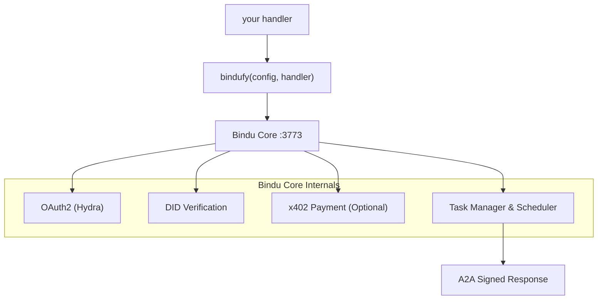

<p align="center">
  
</p>

<div align="center">


# Bindu

### Identitäts-, Kommunikations- und Zahlungsebene für KI-Agenten.

</div>

<br>

> **Schreiben Sie Ihren Agenten in jedem Framework. Wickeln Sie ihn mit `bindufy()` ein.**
> **Senden Sie einen signierten A2A-Mikroservice in zehn Zeilen Code - mit Identität, OAuth2 und On-Chain-Zahlungen.**

Keine Infrastruktur schreiben. Kein Framework umschreiben. Funktioniert mit Python, TypeScript und Kotlin und basiert auf zwei offenen Protokollen: [A2A](https://github.com/a2aproject/A2A) und [x402](https://github.com/coinbase/x402).

<div align="center">

  <p>
    <a href="../README.md">English</a> ·
    <a href="README.de.md">Deutsch</a> ·
    <a href="README.es.md">Español</a> ·
    <a href="README.fr.md">Français</a> ·
    <a href="README.hi.md">हिंदी</a> ·
    <a href="README.bn.md">বাংলা</a> ·
    <a href="README.zh.md">中文</a> ·
    <a href="README.nl.md">Nederlands</a> ·
    <a href="README.ta.md">தமிழ்</a>
  </p>

  <p>
    <a href="https://opensource.org/licenses/Apache-2.0"></a>
    <a href="https://www.python.org/downloads/"></a>
    <a href="https://pypi.org/project/bindu/"></a>
    <a href="https://coveralls.io/github/Saptha-me/Bindu?branch=v0.3.18"></a>
    <a href="https://github.com/getbindu/Bindu/actions/workflows/release.yml"></a>
    <a href="https://discord.gg/3w5zuYUuwt"></a>
    <a href="https://github.com/getbindu/Bindu/graphs/contributors"></a>
    <a href="https://hits.sh/github.com/Saptha-me/Bindu.svg"></a>
  </p>

  <p>
    <a href="https://getbindu.com"><strong>Registrieren Sie Ihren Agenten</strong></a> ·
    <a href="https://docs.getbindu.com"><strong>Dokumentation</strong></a> ·
    <a href="https://discord.gg/3w5zuYUuwt"><strong>Discord</strong></a>
  </p>
</div>

---

## Was Sie erhalten

Wenn Sie einen Handler mit `bindufy(config, handler)` einwickeln, spricht der Prozess Standardprotokolle, signiert jede Antwort und wird zahlungsbereit. Hier ist, was es für Sie tut, gruppiert nach Kategorien:

<br>

**Protokoll - Mit der Welt sprechen**

| Fähigkeit | Was es bedeutet |
|---|---|
| A2A JSON-RPC-Endpunkte | Das Standardprotokoll, das andere Agenten bereits verwenden. `message/send`, `tasks/get`, `message/stream` auf Port 3773. |
| Push-Benachrichtigungen | Webhook-Callbacks bei Aufgabenstatusänderungen - kein Polling erforderlich. |
| Sprachneutral | Python-, TypeScript- und Kotlin-SDKs teilen sich einen gRPC-Kern. Gleiches Protokoll, gleiche DID, gleicher Auth. |

<br>

**Identität und Zugriff - Beweisen, wer anruft**

| Fähigkeit | Was es bedeutet |
|---|---|
| DID-Identität (Ed25519) | Jedes zurückgegebene Artefakt ist signiert. Aufrufer verifizieren mit W3C-Standard-DIDs - keine gemeinsamen Geheimnisse. |
| OAuth2 über Ory Hydra | Bereichsbezogene Token (`agent:read`, `agent:write`, `agent:execute`) statt eines Alles-oder-Nichts-Bearers. |

<br>

**Handel und Erreichbarkeit - Zahlungen erhalten und erreichbar sein**

| Fähigkeit | Was es bedeutet |
|---|---|
| x402-Zahlungen | Mit einem Flag verlangt der Agent USDC auf Base, bevor er eine Anfrage verarbeitet. Die Zahlungsprüfung läuft vor Ihrem Handler. |
| Öffentlicher Tunnel | `expose: true` öffnet einen FRP-Tunnel, damit Ihr lokaler Agent vom öffentlichen Internet erreichbar ist. |

---

## Installation

```bash
uv add bindu
```

Für einen Entwicklungs-Checkout mit Tests:

```bash
git clone https://github.com/getbindu/Bindu.git
cd Bindu
uv sync --dev
```

Python 3.12+ und [uv](https://github.com/astral-sh/uv) erforderlich. Für das Ausführen der Beispiele wird mindestens ein API-Schlüssel für einen LLM-Anbieter benötigt (`OPENROUTER_API_KEY`, `OPENAI_API_KEY` oder `MINIMAX_API_KEY`).

---

## Hallo Agent

Das gesamte Konzept von Bindu ist in einer Datei klar ersichtlich - erstellen Sie jeden Agenten, geben Sie ihn an `bindufy()`, und Ihr Prozess kommt als signierter A2A-Mikroservice heraus. Der folgende Block ist vollständig und lauffähig.

```python
import os
from bindu.penguin.bindufy import bindufy
from agno.agent import Agent
from agno.models.openai import OpenAIChat
from agno.tools.duckduckgo import DuckDuckGoTools

# 1. Erstellen Sie Ihren Agenten mit Ihrem bevorzugten Framework. Bindu
#    kümmert sich nicht darum, was drin ist - es braucht nur etwas Aufrufbares.
agent = Agent(
    instructions="You are a research assistant that finds and summarizes information.",
    model=OpenAIChat(id="gpt-4o"),
    tools=[DuckDuckGoTools()],
)

# 2. Sagen Sie Bindu, wer Sie sind und wo der Agent lebt. `expose: True`
#    öffnet einen öffentlichen FRP-Tunnel - lassen Sie dies für lokale Entwicklung weg.
config = {
    "author": "you@example.com",
    "name": "research_agent",
    "description": "Research assistant with web search.",
    "deployment": {
        "url": os.getenv("BINDU_DEPLOYMENT_URL", "http://localhost:3773"),
        "expose": True,
    },
    "skills": ["skills/question-answering"],
}

# 3. Handler-Vertrag: (messages) -> response. Das ist alles.
def handler(messages: list[dict[str, str]]):
    return agent.run(input=messages)

# 4. bindufy() bootet den HTTP-Server, erstellt Ihre DID, registriert sich bei Hydra
#    (wenn auth aktiviert ist) und beginnt, A2A-Aufrufe zu akzeptieren.
bindufy(config, handler)
```

Führen Sie dies aus, und der Agent ist live auf der konfigurierten URL. Benötigen Sie einen anderen Port? Exportieren Sie `BINDU_PORT=4000` - keine Codeänderung.

<details>
<summary>TypeScript-Äquivalent</summary>

```typescript
import { bindufy } from "@bindu/sdk";
import OpenAI from "openai";

const openai = new OpenAI();

bindufy({
  author: "you@example.com",
  name: "research_agent",
  description: "Research assistant.",
  deployment: { url: "http://localhost:3773", expose: true },
  skills: ["skills/question-answering"],
}, async (messages) => {
  const response = await openai.chat.completions.create({
    model: "gpt-4o",
    messages: messages.map(m => ({ role: m.role as "user" | "assistant" | "system", content: m.content })),
  });
  return response.choices[0].message.content || "";
});
```

Das TypeScript-SDK bootet automatisch den Python-Kern. Gleiches Protokoll, gleiche DID. Vollständiges Beispiel unter [`examples/typescript-openai-agent/`](examples/typescript-openai-agent/).

</details>

<details>
<summary>Agent mit curl aufrufen</summary>

```bash
curl -X POST http://localhost:3773/ \
  -H 'Content-Type: application/json' \
  -d '{
    "jsonrpc": "2.0",
    "method": "message/send",
    "id": "<uuid>",
    "params": {
      "message": {
        "role": "user",
        "kind": "message",
        "parts": [{"kind": "text", "text": "Hello"}],
        "messageId": "<uuid>",
        "contextId": "<uuid>",
        "taskId": "<uuid>"
      }
    }
  }'
```

Pollen Sie mit demselben `taskId` `tasks/get`, bis der Status `completed` ist. Das zurückgegebene Artefakt trägt eine DID-Signatur unter `metadata["did.message.signature"]`.

</details>

---

## Wie es passt

Was passiert also tatsächlich, wenn dieser `bindufy()`-Aufruf wirksam wird? Der Handler ist der einzige Code, den Sie schreiben. Alles andere ist das Scaffolding von Bindu um ihn herum:



`bindufy()` ist ein dünner Wrapper. Ihr Handler bleibt rein - `(messages) -> response`. Bindu besitzt Identität, Protokoll, Auth, Zahlungen, Speicherung und Planung.

---

## Einen gesicherten Agenten aufrufen

> **TL;DR** - Wenn `AUTH__ENABLED=true`, wird für jeden Aufruf ein Hydra-Bearer-Token und drei `X-DID-*`-Header benötigt. Python-Client: ~25 Zeilen, [unten](#step-2--pick-your-client). Postman: Fügen Sie ein Skript ein. Der Rest dieses Abschnitts erklärt warum und wie es funktioniert, und was schiefgeht, wenn es nicht funktioniert.

Das `curl`-Beispiel in *Hallo Agent* funktioniert, weil auth standardmäßig deaktiviert ist - jeder kann POST an Ihren Agenten. Wenn Sie auf `AUTH__ENABLED=true AUTH__PROVIDER=hydra` umschalten, wird Ihr Agent streng. Jetzt muss jeder Anrufer zwei Fragen beantworten, bevor der Handler läuft:

1. **Haben Sie die Erlaubnis, mich anzurufen?** - Zeigen Sie ein gültiges OAuth2-Token von Hydra.
2. **Sind Sie wirklich das, was Sie sagen?** - Signieren Sie die Anfrage mit einem DID-Schlüssel.

Denken Sie daran wie das Boarding bei einem Flug: Der Boarding-Pass (OAuth-Token) sagt "Ja, Sie haben einen Sitzplatz auf diesem Flug", und der Reisepass (DID-Signatur) sagt "Und Sie sind wirklich die Person auf diesem Boarding-Pass." Der Server prüft beides.

Die vollständige Theorie finden Sie in [`docs/AUTHENTICATION.md`](docs/AUTHENTICATION.md) und [`docs/DID.md`](docs/DID.md) - einfaches Englisch, keine Krypto-Hintergrundkenntnisse vorausgesetzt. Unten finden Sie die praktische "Ich möchte nur meinen Agenten aufrufen"-Version.

<br>

### Drei zusätzliche Header

Zusammen mit dem üblichen `Authorization: Bearer <hydra-jwt>` trägt jede gesicherte Anfrage:

| Header | Wert |
|---|---|
| `X-DID` | Ihre DID-Zeichenkette, z.B. `did:bindu:you_at_example_com:myagent:<uuid>` |
| `X-DID-Timestamp` | Aktuelle Unix-Sekunden (Server erlaubt 5 Minuten Spielraum) |
| `X-DID-Signature` | `base58( Ed25519_sign( <signing payload> ) )` |

**Die Signatur-Payload** wird auf dem Server wie folgt rekonstruiert:

```python
json.dumps({"body": <raw-body-string>, "did": <did>, "timestamp": <ts>}, sort_keys=True)
```

Zwei Stolpersteine, die Sie beißen werden, bis Sie sie verstanden haben:

- **Passen Sie die JSON-Abstände von Python an.** Pythons Standard `json.dumps` schreibt `", "` und `": "` (mit Leerzeichen). In JS schreibt `JSON.stringify` diese ohne. Wenn Ihre Payload anders serialisiert, sieht Ed25519 andere Bytes und der Server gibt `reason="crypto_mismatch"` zurück.
- **Signieren Sie das, was Sie senden.** Wenn Sie den Body parsen, ändern, neu serialisieren und senden - Sie haben die falschen Bytes signiert. Erstellen Sie den Body-String **einmal**, signieren Sie genau diese Bytes, senden Sie genau diese Bytes.

<br>

### Schritt 1 - Erhalten Sie ein Bearer-Token von Hydra

Der Agent druckt einen lauffähigen curl beim Startbanner. Kurze Version:

```bash
SECRET=$(jq -r '.[].client_secret' < .bindu/oauth_credentials.json)
curl -X POST https://hydra.getbindu.com/oauth2/token \
  -H "Content-Type: application/x-www-form-urlencoded" \
  -d "grant_type=client_credentials" \
  -d "client_id=did:bindu:you_at_example_com:myagent:<uuid>" \
  -d "client_secret=$SECRET" \
  -d "scope=openid offline agent:read agent:write"
```

Die Antwort enthält ein `access_token`. Es ist eine Stunde lang gültig - cachen Sie es, holen Sie es bei Bedarf neu.

<br>

### Schritt 2 - Wählen Sie Ihren Client

**Python - Das kürzeste lauffähige Beispiel.** Liest die eigenen Schlüssel des Agents (Bindu schreibt sie beim ersten Boot nach `.bindu/`), signiert eine Anfrage, pollt nach dem Ergebnis. Selbstaufruf funktioniert, weil der Schlüssel des Agents eine gültige Anrufer-Identität ist.

```python
import base58, httpx, json, time, uuid
from pathlib import Path
from cryptography.hazmat.primitives import serialization

# 1. Laden Sie die Schlüssel, die Bindu beim ersten Boot geschrieben hat
priv  = serialization.load_pem_private_key(Path(".bindu/private.pem").read_bytes(), password=None)
creds = next(iter(json.loads(Path(".bindu/oauth_credentials.json").read_text()).values()))
did   = creds["client_id"]            # DID funktioniert auch als Hydra client_id

# 2. Tauschen Sie Anmeldeinformationen gegen ein kurzlebiges JWT
bearer = httpx.post("https://hydra.getbindu.com/oauth2/token", data={
    "grant_type": "client_credentials",
    "client_id": creds["client_id"], "client_secret": creds["client_secret"],
    "scope": "openid offline agent:read agent:write",
}).json()["access_token"]

# 3. Erstellen Sie den Body einmal - dies sind die Bytes, die wir signieren und senden
tid = str(uuid.uuid4())
body = json.dumps({
    "jsonrpc": "2.0", "method": "message/send", "id": str(uuid.uuid4()),
    "params": {"message": {
        "role": "user", "kind": "message",
        "parts": [{"kind": "text", "text": "Hello!"}],
        "messageId": str(uuid.uuid4()), "contextId": str(uuid.uuid4()), "taskId": tid,
    }},
})

# 4. Signatur: base58(Ed25519( json.dumps({body,did,timestamp}, sort_keys=True) ))
ts      = int(time.time())
payload = json.dumps({"body": body, "did": did, "timestamp": ts}, sort_keys=True)
sig     = base58.b58encode(priv.sign(payload.encode())).decode()

# 5. Feuern Sie es ab
r = httpx.post("http://localhost:3773/", content=body, headers={
    "Content-Type":    "application/json",
    "Authorization":   f"Bearer {bearer}",
    "X-DID":           did,
    "X-DID-Timestamp": str(ts),
    "X-DID-Signature": sig,
})
print(r.status_code, r.json())
```

Für eine voll funktionsfähige Version mit Polling und Fehlerbehandlung siehe - [`examples/hermes_agent/call.py`](examples/hermes_agent/call.py)。

<br>

**Postman - Fügen Sie ein Skript in Ihre Sammlung ein.**

1. Öffnen Sie Ihre Sammlung → Tab **Pre-request Script** → Fügen Sie den Inhalt von [`docs/postman-did-signing.js`](docs/postman-did-signing.js) ein.
2. Setzen Sie zwei Sammlungsvariablen: `bindu_did` (Ihre DID-Zeichenkette) und `bindu_did_seed` (Ihr 32-Byte Ed25519-Seed, base64-kodiert).
3. Fügen Sie einen `Authorization: Bearer {{bindu_bearer}}`-Header hinzu und legen Sie Ihr Hydra-Token in `bindu_bearer`.
4. Drücken Sie Send. Das Skript signiert genau die Body-Bytes, die Postman sendet, und setzt die drei `X-DID-*`-Header für Sie.

Postman Desktop v11+ erforderlich (`crypto.subtle` benötigt Ed25519).

<br>

**Gewöhnliches curl - technisch möglich, normalerweise lästig.** Die Signatur hängt von den Body-Bytes ab, die Sie senden, also benötigen Sie zuerst ein Hilfsskript, um die Signatur zu berechnen, und ersetzen Sie sie dann im curl-Aufruf. Wenn Sie dies tun, sind Sie wahrscheinlich besser dran mit dem Python-Client oben.

<br>

### Wenn die Signatur fehlschlägt

Der Server-Log protokolliert einen von drei Gründen. Wenn Ihre Anfrage mit 403 abgelehnt wird, fragen Sie den Operator (oder überprüfen Sie selbst die Server-Logs):

| Log sagt | Was es bedeutet | Lösung |
|---|---|---|
| `timestamp_out_of_window` | Ihr `X-DID-Timestamp` ist mehr als 5 Minuten von der Server-Uhr entfernt, oder Sie haben einen alten Zeitstempel wiederverwendet | Berechnen Sie `int(time.time())` bei jeder Anfrage neu |
| `malformed_input` | base58-Dekodierung der Signatur oder des öffentlichen Schlüssels fehlgeschlagen | Prüfen Sie, ob `X-DID-Signature` URL-kodiert, abgeschnitten oder in Anführungszeichen eingeschlossen ist |
| `crypto_mismatch` | Bytes, die Sie signiert haben ≠ Bytes, die Sie gesendet haben | Rekonstruieren Sie die Payload mit `sort_keys=True` und Pythons Standard-JSON-Abständen; signieren Sie den rohen Body-String einmal und senden Sie dieselben Bytes |

Wir haben beim Testen einen scharfen Ausfallmodus getroffen: Wenn `crypto_mismatch` anhält und Sie *sicher* sind, dass Ihre Bytes übereinstimmen, kann der von Hydra für diese DID gespeicherte öffentliche Schlüssel von einer alten Registrierung veraltet sein. Lösung: Stoppen Sie den Agenten, löschen Sie `.bindu/oauth_credentials.json`, starten Sie neu - der Hydra-Client-Datensatz wird mit dem aktuellen Schlüssel aktualisiert.

---

## Gateway - Multi-Agent-Orchestrierung

Ein einzelner `bindufy()`-eingewickelter Agent ist ein Mikroservice. **Bindu Gateway** ist ein aufgabenorientierter Orchestrator, der darüber sitzt: Geben Sie ihm eine Benutzeranfrage und einen Katalog von A2A-Agenten, und ein Planer-LLM zerlegt die Aufgabe, ruft die richtigen Agenten über A2A auf und streamt die Ergebnisse als serverseitige Ereignisse. Kein DAG-Engine, kein separater Orchestrator-Service - das Planer-LLM wählt bei jedem Turn Tools.

Außerhalb eines einzelnen Agents erhalten Sie:

- **Ein Endpunkt: `POST /plan`** - Geben Sie ihm eine Abfrage und einen Agentenkatalog, erhalten Sie gestreamte Schritte.
- **Agentenkatalog pro Anfrage** - Eine Liste externer Systemagenten, Fähigkeiten und Endpunkte wird übergeben. Das Gateway hostet selbst keine Flotte.
- **Sitzungspersistenz (Supabase)** - Postgres-gestützte Komprimierung, Rollback und Multi-Turn-Historie.
- **Native TypeScript A2A** - Kein Python-Subprozess, keine `@bindu/sdk`-Abhängigkeit im Gateway.
- **Optionale DID-Signatur + Hydra-Integration** - Gateway ist identitäts-end-to-end.

Minimaler Quickstart:

```bash
cd gateway
npm install
cp .env.example .env.local         # fill SUPABASE_*, GATEWAY_API_KEY, OPENROUTER_API_KEY
npm run dev                        # → http://localhost:3774
curl -sS http://localhost:3774/health
```

Wenden Sie zuerst zwei Supabase-Migrationen an (`gateway/migrations/001_init.sql`, `002_compaction_revert.sql`). Vollständiger Walkthrough und Operator-Referenz finden Sie in [`gateway/README.md`](gateway/README.md) und [`docs/GATEWAY.md`](docs/GATEWAY.md) (45-Minuten-End-to-End: sauberer Klon → drei verkettete Agents → ein Rezept schreiben → DID-Signatur).

Gateway-Dokumentation:

| Thema | Link |
|---|---|
| Übersicht | [docs.getbindu.com/bindu/gateway/overview](https://docs.getbindu.com/bindu/gateway/overview) |
| Quickstart | [docs.getbindu.com/bindu/gateway/quickstart](https://docs.getbindu.com/bindu/gateway/quickstart) |
| Multi-Agent-Planung | [docs.getbindu.com/bindu/gateway/multi-agent](https://docs.getbindu.com/bindu/gateway/multi-agent) |
| Rezepte (Progressive-Disclosure-Playbook) | [docs.getbindu.com/bindu/gateway/recipes](https://docs.getbindu.com/bindu/gateway/recipes) |
| Identität (DID-Signatur, Hydra) | [docs.getbindu.com/bindu/gateway/identity](https://docs.getbindu.com/bindu/gateway/identity) |
| Produktionsbereitstellung | [docs.getbindu.com/bindu/gateway/production](https://docs.getbindu.com/bindu/gateway/production) |
| API-Referenz | [docs.getbindu.com/api/introduction](https://docs.getbindu.com/api/introduction) |

Für ein lauffähiges Multi-Agent-Demo siehe [`examples/gateway_test_fleet/`](examples/gateway_test_fleet/) - fünf kleine Agents auf lokalen Ports, ein Gateway, eine Abfrage.

---

## Unterstützte Frameworks und Beispiele

Bringen Sie jedes Agenten-Framework mit, das Sie bereits mögen. Sie geben einen Handler an Bindu; es gibt Ihnen einen signierten A2A-Mikroservice. Unabhängig davon, was im Handler ist, ist der Fluss gleich.

<br>

| Sprache | In diesem Repo getestete Frameworks |
|---|---|
| **Python** | [AG2](https://github.com/ag2ai/ag2) · [Agno](https://github.com/agno-agi/agno) · [CrewAI](https://github.com/joaomdmoura/crewAI) · [Hermes Agent](https://github.com/NousResearch/hermes-agent) · [LangChain](https://github.com/langchain-ai/langchain) · [LangGraph](https://github.com/langchain-ai/langgraph) · [Notte](https://github.com/nottelabs/notte) |
| **TypeScript** | [OpenAI SDK](https://github.com/openai/openai-node) · [LangChain.js](https://github.com/langchain-ai/langchainjs) |
| **Kotlin** | [OpenAI Kotlin SDK](https://github.com/aallam/openai-kotlin) |
| **Jede andere Sprache** | Über [gRPC-Kern](docs/grpc/) - fügen Sie ein SDK in wenigen hundert Zeilen hinzu |

Kompatibel mit jedem LLM-Anbieter, der mit OpenAI- oder Anthropic-API spricht: [OpenRouter](https://openrouter.ai/) (100+ Modelle), [OpenAI](https://platform.openai.com/), [MiniMax](https://platform.minimaxi.com) und andere.

<br>

### Ein paar Beispiele zum Starten

Fünf decken das Spektrum ab, was Bindu kann. Alle 20+ lauffähigen Beispiele finden Sie unter [`examples/`](examples/)。

| Beispiel | Was es zeigt |
|---|---|
| [Agent Swarm](examples/agent_swarm/) | Multi-Agent-Zusammenarbeit - eine kleine "Gesellschaft" von Agno-Agenten, die sich gegenseitig Aufgaben zuweisen. |
| [Premium Advisor](examples/premium-advisor/) | **x402-Zahlungen** - Anrufer müssen USDC auf Base zahlen, bevor der Handler läuft. |
| [Hermes via Bindu](examples/hermes_agent/) | **Drittanbieter-Framework-Interop** - Nous Researchs Hermes-Agent in ~90 Zeilen bindufied. |
| [Gateway Test Fleet](examples/gateway_test_fleet/) | Fünf kleine Agents + ein Gateway - Multi-Agent-Orchestrierung-Story End-to-End. |
| [TypeScript OpenAI Agent](examples/typescript-openai-agent/) | **Polyglot-Proof** - Ein TS-Agent mit Bindu TS SDK bindufied; kein Python erforderlich. |

**Vollständigen Katalog ansehen:** [`examples/`](examples/) - 20+ Agents decken CSV-Analyse, PDF-Q&A, Speech-to-Text, Web-Scraping, Cybersicherheits-Newsletter, mehrsprachige Zusammenarbeit, Blog-Schreiben und mehr ab.

Ihr Framework fehlt? Öffnen Sie ein Issue oder fragen Sie auf [Discord](https://discord.gg/3w5zuYUuwt)。

---

## Demo

<div align="center">
  <a href="https://www.youtube.com/watch?v=qppafMuw_KI">
    
  </a>
</div>

Nach dem Ausführen von `cd bindu-communication && npm run dev` ist eine eingebaute Chat-UI unter `http://localhost:3775` verfügbar。

<p align="center">
  
</p>

---

## Kernfunktionen

Alles unten ist optional und modular - minimale Installation ist nur der A2A-Server. Jede Zeile verlinkt auf einen spezifischen Leitfaden in [`docs/`](docs/)。

<br>

**Identität und Zugriff**

| Funktion | Leitfaden |
|---|---|
| Dezentrale Identitäten (DIDs) | [DID.md](docs/DID.md) |
| Authentifizierung (Ory Hydra OAuth2) | [AUTHENTICATION.md](docs/AUTHENTICATION.md) |

<br>

**Protokoll und Infrastruktur**

| Funktion | Leitfaden |
|---|---|
| Fähigkeitensystem | [SKILLS.md](docs/SKILLS.md) |
| Agent-Verhandlung | [NEGOTIATION.md](docs/NEGOTIATION.md) |
| Push-Benachrichtigungen | [NOTIFICATIONS.md](docs/NOTIFICATIONS.md) |
| PostgreSQL-Speicherung | [STORAGE.md](docs/STORAGE.md) |
| Redis-Scheduler | [SCHEDULER.md](docs/SCHEDULER.md) |
| Sprachneutral über gRPC | [GRPC_LANGUAGE_AGNOSTIC.md](docs/GRPC_LANGUAGE_AGNOSTIC.md) |

<br>

**Handel und Erreichbarkeit**

| Funktion | Leitfaden |
|---|---|
| x402-Zahlungen (USDC auf Base) | [PAYMENT.md](docs/PAYMENT.md) |
| Tunneling (nur lokale Entwicklung) | [TUNNELING.md](docs/TUNNELING.md) |

<br>

**Zuverlässigkeit und Betrieb**

| Funktion | Leitfaden |
|---|---|
| Retry mit exponentiellem Backoff | [Retry docs](https://docs.getbindu.com/bindu/learn/retry/overview) |
| Observability (OpenTelemetry, Sentry) | [OBSERVABILITY.md](docs/OBSERVABILITY.md) |
| Health-Checks und Metriken | [HEALTH_METRICS.md](docs/HEALTH_METRICS.md) |

---

## Tests

Bindu zielt auf 70% Testabdeckung ab (Ziel: 80%+):

```bash
uv run pytest tests/unit/ -v                                    # Schnelle Unit-Tests
uv run pytest tests/integration/grpc/ -v -m e2e                 # gRPC E2E
uv run pytest -n auto --cov=bindu --cov-report=term-missing     # Vollständige Suite
```

CI führt bei jedem PR Unit-Tests, gRPC E2E und TypeScript SDK-Builds aus. Siehe [`.github/workflows/ci.yml`](.github/workflows/ci.yml)。

---

## Fehlerbehebung

<details>
<summary>Allgemeine Probleme</summary>

| Problem | Lösung |
|---|---|
| `uv: command not found` | Starten Sie Ihre Shell neu, nachdem Sie uv installiert haben. |
| `Python version not supported` | Installieren Sie Python 3.12+ von [python.org](https://www.python.org/downloads/) oder über `pyenv`. |
| `bindu: command not found` | Aktivieren Sie Ihr virtualenv: `source .venv/bin/activate`. |
| `Port 3773 already in use` | Setzen Sie `BINDU_PORT=4000`, oder überschreiben Sie mit `BINDU_DEPLOYMENT_URL=http://localhost:4000`. |
| `ModuleNotFoundError` | Führen Sie `uv sync --dev` aus. |
| Pre-commit fehlgeschlagen | Führen Sie `pre-commit run --all-files` aus. |
| `Permission denied` (macOS) | Führen Sie `xattr -cr .` aus, um erweiterte Attribute zu entfernen. |

Umgebung zurücksetzen:

```bash
rm -rf .venv && uv venv --python 3.12.9 && uv sync --dev
```

Unter Windows PowerShell benötigen Sie möglicherweise `Set-ExecutionPolicy RemoteSigned -Scope CurrentUser`。

</details>

---

## Bekannte Probleme

Wenn Sie Bindu in der Produktion betreiben, lesen Sie zuerst [`bugs/known-issues.md`](bugs/known-issues.md). Es ist ein Katalog pro Subsystem mit Workarounds. Postmortems für behobene Bugs finden Sie unter [`bugs/core/`](bugs/core/), [`bugs/gateway/`](bugs/gateway/), [`bugs/sdk/`](bugs/sdk/)。

Aktuelle High-Priority-Elemente:

| Subsystem | Slug | Symptom |
|---|---|---|
| Core | [`x402-middleware-fails-open-on-body-parse`](bugs/known-issues.md#x402-middleware-fails-open-on-body-parse) | Verzerrter JSON-Body umgeht Zahlungsprüfung |
| Core | [`x402-no-replay-prevention`](bugs/known-issues.md#x402-no-replay-prevention) | Eine Zahlung arbeitet unbegrenzt bis `validBefore` |
| Core | [`x402-no-signature-verification`](bugs/known-issues.md#x402-no-signature-verification) | EIP-3009-Signatur wird nie verifiziert |
| Core | [`x402-balance-check-skipped-on-missing-contract-code`](bugs/known-issues.md#x402-balance-check-skipped-on-missing-contract-code) | Falsch konfiguriertes RPC umgeht Bilanzprüfung stillschweigend |
| Gateway | [`context-window-hardcoded`](bugs/known-issues.md#context-window-hardcoded) | Komprimierungsschwellenwert geht von einem 200k-Token-Fenster aus |
| Gateway | [`poll-budget-unbounded-wall-clock`](bugs/known-issues.md#poll-budget-unbounded-wall-clock) | `sendAndPoll` kann 5 Minuten pro Tool-Aufruf stillstehen |
| Gateway | [`no-session-concurrency-guard`](bugs/known-issues.md#no-session-concurrency-guard) | Zwei `/plan`-Aufrufe in derselben Sitzung verwirren die Historie |

Neues Problem? Öffnen Sie ein GitHub-Issue mit Slug-Referenz (z.B. *"Fixes `context-window-hardcoded`"*)。 Haben Sie einen Fix? Entfernen Sie den Eintrag aus `known-issues.md` und fügen Sie ein datiertes Postmortem hinzu - siehe [`bugs/README.md`](bugs/README.md) für Vorlage。

---

## Beitrag

Klonen, einrichten und Pre-Commit-Hooks ausführen:

```bash
git clone https://github.com/getbindu/Bindu.git
cd Bindu
uv venv --python 3.12.9 && source .venv/bin/activate
uv sync --dev
pre-commit run --all-files
```

Diskussion und Hilfe finden auf [Discord](https://discord.gg/3w5zuYUuwt)。 Vollständiger Leitfaden unter [`.github/contributing.md`](.github/contributing.md)。 Wir haben eine offene Liste von Agents, die wir bindufied sehen möchten - [tragen Sie bei](https://www.notion.so/getbindu/305d3bb65095808eac2bf720368e9804?v=305d3bb6509580189941000cfad83ae7&source=copy_link)。

---

## Maintainer

<table>
  <tr>
    <td align="center"><a href="https://github.com/raahulrahl"><br /><sub><b>Raahul Dutta</b></sub></a></td>
    <td align="center"><a href="https://github.com/Paraschamoli"><br /><sub><b>Paras Chamoli</b></sub></a></td>
    <td align="center"><a href="https://github.com/chandan-1427"><br /><sub><b>Chandan</b></sub></a></td>
  </tr>
</table>

---

## Danksagungen

Bindu steht auf den Schultern von:

[FastA2A](https://github.com/pydantic/fasta2a) · [A2A](https://github.com/a2aproject/A2A) · [x402](https://github.com/coinbase/x402) · [Hugging Face chat-ui](https://github.com/huggingface/chat-ui) · [12 Factor Agents](https://github.com/humanlayer/12-factor-agents/blob/main/content/factor-11-trigger-from-anywhere.md) · [OpenCode](https://github.com/anomalyco/opencode) · [OpenMoji](https://openmoji.org/library/emoji-1F33B/) · [ASCII Space Art](https://www.asciiart.eu/space/other)

---

## Lizenz

Apache 2.0. Siehe [LICENSE.md](LICENSE.md)。

<p align="center">
  <a href="https://api.star-history.com/svg?repos=getbindu/Bindu&type=Date">
    
  </a>
</p>

<br/>
<br/>

<p align="center">
  
</p>

<p align="center">
  <em>"Wir glauben an die Sonnenblumen-Theorie - gemeinsam aufrecht stehen, Hoffnung und Licht in das Agenten-Internet bringen."</em>
</p>

<p align="center">
  <em>Von Idee zum Agenten-Internet in 2 Minuten.</em>
  <em>Ihr Agent. Ihr Framework. Universelles Protokoll.</em>
</p>

<p align="center">
  <a href="https://github.com/getbindu/Bindu">Geben Sie uns auf GitHub einen Stern</a> •
  <a href="https://discord.gg/3w5zuYUuwt">Treten Sie Discord bei</a> •
  <a href="https://docs.getbindu.com">Dokumentation lesen</a>
</p>

<p align="center">
  <sub>
    Hergestellt zwischen Amsterdam und Indien · Open Source unter Apache 2.0 ·
    <a href="https://getbindu.com">getbindu.com</a>
  </sub>
</p>
