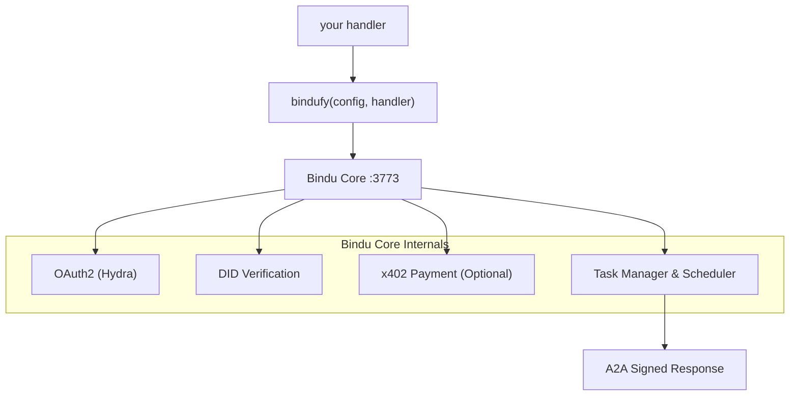

<p align="center">
  
</p>

<div align="center">


# Bindu

### Capa de identidad, comunicación y pagos para agentes de IA.

</div>

<br>

> **Escribe tu agente en cualquier framework. Envuélvelo con `bindufy()`.**
> **Envía un microservicio A2A firmado en diez líneas de código - con identidad, OAuth2 y pagos on-chain.**

No es necesario escribir infraestructura. No es necesario reescribir frameworks. Funciona con Python, TypeScript y Kotlin, y se basa en dos protocolos abiertos: [A2A](https://github.com/a2aproject/A2A) y [x402](https://github.com/coinbase/x402).

<div align="center">

  <p>
    <a href="../README.md">English</a> ·
    <a href="README.de.md">Deutsch</a> ·
    <a href="README.es.md">Español</a> ·
    <a href="README.fr.md">Français</a> ·
    <a href="README.hi.md">हिंदी</a> ·
    <a href="README.bn.md">বাংলা</a> ·
    <a href="README.zh.md">中文</a> ·
    <a href="README.nl.md">Nederlands</a> ·
    <a href="README.ta.md">தமிழ்</a>
  </p>

  <p>
    <a href="https://opensource.org/licenses/Apache-2.0"></a>
    <a href="https://www.python.org/downloads/"></a>
    <a href="https://pypi.org/project/bindu/"></a>
    <a href="https://coveralls.io/github/Saptha-me/Bindu?branch=v0.3.18"></a>
    <a href="https://github.com/getbindu/Bindu/actions/workflows/release.yml"></a>
    <a href="https://discord.gg/3w5zuYUuwt"></a>
    <a href="https://github.com/getbindu/Bindu/graphs/contributors"></a>
    <a href="https://hits.sh/github.com/Saptha-me/Bindu.svg"></a>
  </p>

  <p>
    <a href="https://getbindu.com"><strong>Registra tu agente</strong></a> ·
    <a href="https://docs.getbindu.com"><strong>Documentación</strong></a> ·
    <a href="https://discord.gg/3w5zuYUuwt"><strong>Discord</strong></a>
  </p>
</div>

---

## Lo que obtienes

Cuando envuelves un handler con `bindufy(config, handler)`, el proceso habla protocolos estándar, firma cada respuesta y se vuelve listo para recibir pagos. Esto es lo que hace por ti, agrupado por categorías:

<br>

**Protocolo - Habla con el mundo**

| Capacidad | Lo que significa |
|---|---|
| Endpoints JSON-RPC A2A | El protocolo estándar que otros agentes ya usan. `message/send`, `tasks/get`, `message/stream` en el puerto 3773. |
| Notificaciones push | Callbacks webhook en cambios de estado de tareas - no se requiere polling. |
| Agnóstico de idioma | Los SDK de Python, TypeScript y Kotlin comparten un núcleo gRPC. Mismo protocolo, misma DID, mismo auth. |

<br>

**Identidad y acceso - Prueba quién está llamando**

| Capacidad | Lo que significa |
|---|---|
| Identidad DID (Ed25519) | Cada artefacto devuelto está firmado. Los llamadores verifican con DID estándar W3C - sin secretos compartidos. |
| OAuth2 vía Ory Hydra | Tokens con ámbito (`agent:read`, `agent:write`, `agent:execute`) en lugar de un bearer todo-o-nada. |

<br>

**Comercio y accesibilidad - Recibe pagos y sé accesible**

| Capacidad | Lo que significa |
|---|---|
| Pagos x402 | Con una bandera, el agente cobra USDC en Base antes de procesar una solicitud. La verificación de pago ocurre antes que tu handler. |
| Túnel público | `expose: true` abre un túnel FRP para que tu agente local sea accesible desde Internet público. |

---

## Instalación

```bash
uv add bindu
```

Para un checkout de desarrollo con pruebas:

```bash
git clone https://github.com/getbindu/Bindu.git
cd Bindu
uv sync --dev
```

Se requiere Python 3.12+ y [uv](https://github.com/astral-sh/uv). Para ejecutar los ejemplos se necesita al menos una clave API para un proveedor LLM (`OPENROUTER_API_KEY`, `OPENAI_API_KEY` o `MINIMAX_API_KEY`).

---

## Hola agente

Todo el concepto de Bindu es claro en un solo archivo - crea cualquier agente, pásalo a `bindufy()`, y tu proceso llega como un microservicio A2A firmado. El siguiente bloque es completo y ejecutable.

```python
import os
from bindu.penguin.bindufy import bindufy
from agno.agent import Agent
from agno.models.openai import OpenAIChat
from agno.tools.duckduckgo import DuckDuckGoTools

# 1. Crea tu agente con tu framework preferido. Bindu
#    no le importa lo que hay dentro - solo necesita algo invocable.
agent = Agent(
    instructions="You are a research assistant that finds and summarizes information.",
    model=OpenAIChat(id="gpt-4o"),
    tools=[DuckDuckGoTools()],
)

# 2. Dile a Bindu quién eres y dónde vive el agente. `expose: True`
#    abre un túnel FRP público - déjalo fuera para desarrollo local.
config = {
    "author": "you@example.com",
    "name": "research_agent",
    "description": "Research assistant with web search.",
    "deployment": {
        "url": os.getenv("BINDU_DEPLOYMENT_URL", "http://localhost:3773"),
        "expose": True,
    },
    "skills": ["skills/question-answering"],
}

# 3. Contrato del handler: (messages) -> response. Eso es todo.
def handler(messages: list[dict[str, str]]):
    return agent.run(input=messages)

# 4. bindufy() inicia el servidor HTTP, crea tu DID, se registra con Hydra
#    (si auth está habilitado) y comienza a aceptar llamadas A2A.
bindufy(config, handler)
```

Ejecútalo, y el agente está vivo en la URL configurada. ¿Necesitas un puerto diferente? Exporta `BINDU_PORT=4000` - sin cambios de código.

<details>
<summary>Equivalente TypeScript</summary>

```typescript
import { bindufy } from "@bindu/sdk";
import OpenAI from "openai";

const openai = new OpenAI();

bindufy({
  author: "you@example.com",
  name: "research_agent",
  description: "Research assistant.",
  deployment: { url: "http://localhost:3773", expose: true },
  skills: ["skills/question-answering"],
}, async (messages) => {
  const response = await openai.chat.completions.create({
    model: "gpt-4o",
    messages: messages.map(m => ({ role: m.role as "user" | "assistant" | "system" | "content", content: m.content })),
  });
  return response.choices[0].message.content || "";
});
```

El SDK TypeScript inicia automáticamente el núcleo Python. Mismo protocolo, misma DID. Ejemplo completo en [`examples/typescript-openai-agent/`](examples/typescript-openai-agent/)。

</details>

<details>
<summary>Llamar al agente con curl</summary>

```bash
curl -X POST http://localhost:3773/ \
  -H 'Content-Type: application/json' \
  -d '{
    "jsonrpc": "2.0",
    "method": "message/send",
    "id": "<uuid>",
    "params": {
      "message": {
        "role": "user",
        "kind": "message",
        "parts": [{"kind": "text", "text": "Hello"}],
        "messageId": "<uuid>",
        "contextId": "<uuid>",
        "taskId": "<uuid>"
      }
    }
  }'
```

Haz polling de `tasks/get` con el mismo `taskId` hasta que el estado sea `completed`. El artefacto devuelto lleva una firma DID bajo `metadata["did.message.signature"]`。

</details>

---

## Cómo encaja

Entonces, ¿qué sucede realmente cuando esa llamada `bindufy()` se hace efectiva? El handler es el único código que escribes. Todo lo demás es el scaffolding de Bindu alrededor de él:



`bindufy()` es un wrapper delgado. Tu handler permanece puro - `(messages) -> response`. Bindu posee identidad, protocolo, auth, pagos, almacenamiento y programación.

---

## Llamar a un agente asegurado

> **TL;DR** - Cuando `AUTH__ENABLED=true`, se requiere un token bearer de Hydra y tres encabezados `X-DID-*` para cada llamada. Cliente Python: ~25 líneas, [abajo](#step-2--pick-your-client). Postman: pega un script. El resto de esta sección explica por qué y cómo funciona, y qué sale mal si no funciona.

El ejemplo `curl` en *Hola agente* funciona porque auth está deshabilitado por defecto - cualquiera puede POST a tu agente. Cuando cambias a `AUTH__ENABLED=true AUTH__PROVIDER=hydra`, tu agente se vuelve estricto. Ahora cada llamador debe responder dos preguntas antes de que el handler se ejecute:

1. **¿Tienes permiso para llamarme?** - Muestra un token OAuth2 válido de Hydra.
2. **¿Eres realmente quien dices ser?** - Firma la solicitud con una clave DID.

Piénsalo como el embarque en un vuelo: el pase de abordaje (token OAuth) dice "Sí, tienes un asiento en este vuelo", y el pasaporte (firma DID) dice "Y eres realmente la persona en ese pase de abordaje". El servidor verifica ambos.

La teoría completa reside en [`docs/AUTHENTICATION.md`](docs/AUTHENTICATION.md) y [`docs/DID.md`](docs/DID.md) - inglés simple, no se asume conocimientos de criptografía. Abajo encontrarás la versión práctica "Solo quiero llamar a mi agente".

<br>

### Tres encabezados adicionales

Junto con el habitual `Authorization: Bearer <hydra-jwt>`, cada solicitud segura lleva:

| Encabezado | Valor |
|---|---|
| `X-DID` | Tu cadena DID, por ejemplo `did:bindu:you_at_example_com:myagent:<uuid>` |
| `X-DID-Timestamp` | Segundos Unix actuales (servidor permite 5 minutos de margen) |
| `X-DID-Signature` | `base58( Ed25519_sign( <signing payload> ) )` |

**La payload de firma** se reconstruye en el servidor así:

```python
json.dumps({"body": <raw-body-string>, "did": <did>, "timestamp": <ts>}, sort_keys=True)
```

Dos escollos que te morderán hasta que los entiendas:

- **Emparea el espaciado JSON de Python.** El `json.dumps` por defecto de Python escribe `", "` y `": "` (con espacios). En JS `JSON.stringify` los escribe sin ellos. Si tu payload se serializa diferente, Ed25519 ve bytes diferentes y el servidor devuelve `reason="crypto_mismatch"`。
- **Firma lo que envías.** Si parseas el body, lo cambias, re-serializas y envías - firmaste los bytes incorrectos. Crea el string del body **una vez**, firma exactamente esos bytes, envía exactamente esos bytes.

<br>

### Paso 1 - Obtén un token bearer de Hydra

El agente imprime un curl listo para usar en el banner de inicio. Versión corta:

```bash
SECRET=$(jq -r '.[].client_secret' < .bindu/oauth_credentials.json)
curl -X POST https://hydra.getbindu.com/oauth2/token \
  -H "Content-Type: application/x-www-form-urlencoded" \
  -d "grant_type=client_credentials" \
  -d "client_id=did:bindu:you_at_example_com:myagent:<uuid>" \
  -d "client_secret=$SECRET" \
  -d "scope=openid offline agent:read agent:write"
```

La respuesta contiene un `access_token`. Es bueno por una hora - cachéalo, recupéralo cuando sea necesario.

<br>

### Paso 2 - Elige tu cliente

**Python - El ejemplo más corto ejecutable.** Lee las propias claves del agente (Bindu las escribe en `.bindu/` al primer boot), firma una solicitud, hace polling del resultado. Self-call funciona porque la clave del agente es una identidad de llamador válida.

```python
import base58, httpx, json, time, uuid
from pathlib import Path
from cryptography.hazmat.primitives import serialization

# 1. Carga las claves que Bindu escribió al primer boot
priv  = serialization.load_pem_private_key(Path(".bindu/private.pem").read_bytes(), password=None)
creds = next(iter(json.loads(Path(".bindu/oauth_credentials.json").read_text()).values()))
did   = creds["client_id"]            # DID también funciona como client_id de Hydra

# 2. Intercambia credenciales por un JWT de vida corta
bearer = httpx.post("https://hydra.getbindu.com/oauth2/token", data={
    "grant_type": "client_credentials",
    "client_id": creds["client_id"], "client_secret": creds["client_secret"],
    "scope": "openid offline agent:read agent:write",
}).json()["access_token"]

# 3. Crea el body una vez - estos son los bytes que firmaremos y enviaremos
tid = str(uuid.uuid4())
body = json.dumps({
    "jsonrpc": "2.0", "method": "message/send", "id": str(uuid.uuid4()),
    "params": {"message": {
        "role": "user", "kind": "message",
        "parts": [{"kind": "text", "text": "Hello!"}],
        "messageId": str(uuid.uuid4()), "contextId": str(uuid.uuid4()), "taskId": tid,
    }},
})

# 4. Firma: base58(Ed25519( json.dumps({body,did,timestamp}, sort_keys=True) ))
ts      = int(time.time())
payload = json.dumps({"body": body, "did": did, "timestamp": ts}, sort_keys=True)
sig     = base58.b58encode(priv.sign(payload.encode())).decode()

# 5. Dispara
r = httpx.post("http://localhost:3773/", content=body, headers={
    "Content-Type":    "application/json",
    "Authorization":   f"Bearer {bearer}",
    "X-DID":           did,
    "X-DID-Timestamp": str(ts),
    "X-DID-Signature": sig,
})
print(r.status_code, r.json())
```

Para una versión completa con polling y manejo de errores, ver - [`examples/hermes_agent/call.py`](examples/hermes_agent/call.py)。

<br>

**Postman - Pega un script en tu colección.**

1. Abre tu colección → Tab **Pre-request Script** → Pega el contenido de [`docs/postman-did-signing.js`](docs/postman-did-signing.js)。
2. Establece dos variables de colección: `bindu_did` (tu cadena DID) y `bindu_did_seed` (tu semilla Ed25519 de 32 bytes, codificada en base64)。
3. Añade un encabezado `Authorization: Bearer {{bindu_bearer}}` y deja tu token Hydra en `bindu_bearer`。
4. Presiona Send. El script firma exactamente los bytes del body que Postman envía y establece los tres encabezados `X-DID-*` para ti.

Postman Desktop v11+ requerido (`crypto.subtle` necesita Ed25519)。

<br>

**curl común - técnicamente posible, usualmente molesto.** La firma depende de los bytes del body que envías, así que necesitas primero un script auxiliar para calcular la firma, luego reemplazarla en la llamada curl. Si haces esto, probablemente estarás mejor con el cliente Python arriba.

<br>

### Cuando la firma falla

El log del servidor registra una de tres razones. Si tu solicitud es rechazada con 403, pregunta al operador (o verifica los logs del servidor tú mismo):

| Log dice | Lo que significa | Solución |
|---|---|---|
| `timestamp_out_of_window` | Tu `X-DID-Timestamp` está a más de 5 minutos del reloj del servidor, o reutilizaste un timestamp antiguo | Recalcula `int(time.time())` en cada solicitud |
| `malformed_input` | Decodificación base58 de la firma o clave pública falló | Verifica que `X-DID-Signature` no esté codificado en URL, recortado o envuelto en comillas |
| `crypto_mismatch` | Bytes que firmaste ≠ Bytes que enviaste | Reconstruye la payload con `sort_keys=True` y espaciado JSON por defecto de Python; firma el string del body crudo una vez y envía los mismos bytes |

Hemos golpeado un modo de falla agudo en pruebas: si `crypto_mismatch` persiste y estás *seguro* de que tus bytes coinciden, la clave pública que Hydra tiene para esta DID puede estar obsoleta de un registro antiguo. Solución: detén el agente, borra `.bindu/oauth_credentials.json`, reinicia - el registro de cliente de Hydra se actualizará con la clave actual.

---

## Gateway - Orquestación multi-agente

Un solo agente envuelto con `bindufy()` es un microservicio. **Bindu Gateway** es un orquestador orientado a tareas que se sienta encima: dale una consulta de usuario y un catálogo de agentes A2A, y un LLM planificador descompone la tarea, llama a los agentes correctos vía A2A y transmite los resultados como eventos del lado del servidor. Sin motor DAG, sin servicio de orquestador separado - el LLM planificador elige herramientas en cada turno.

Más allá de un solo agente obtienes:

- **Un endpoint: `POST /plan`** - Dale una consulta y un catálogo de agentes, obtén pasos transmitidos.
- **Catálogo de agentes por solicitud** - Se pasa una lista de agentes externos, habilidades y endpoints del sistema. El Gateway no aloja ninguna flota por sí mismo.
- **Persistencia de sesión (Supabase)** - Compresión respaldada por Postgres, rollback e historial multi-turno.
- **A2A TypeScript nativo** - Sin subproceso Python, sin dependencia `@bindu/sdk` en el Gateway.
- **Firma DID opcional + integración Hydra** - Gateway es identidad end-to-end.

Quickstart mínimo:

```bash
cd gateway
npm install
cp .env.example .env.local         # fill SUPABASE_*, GATEWAY_API_KEY, OPENROUTER_API_KEY
npm run dev                        # → http://localhost:3774
curl -sS http://localhost:3774/health
```

Aplica primero dos migraciones Supabase (`gateway/migrations/001_init.sql`, `002_compaction_revert.sql`)。 Walkthrough completo y referencia de operador en [`gateway/README.md`](gateway/README.md) y [`docs/GATEWAY.md`](docs/GATEWAY.md) (45 minutos end-to-end: clon limpio → tres agentes encadenados → escribir una receta → firma DID)。

Documentación del Gateway:

| Tema | Enlace |
|---|---|
| Resumen | [docs.getbindu.com/bindu/gateway/overview](https://docs.getbindu.com/bindu/gateway/overview) |
| Quickstart | [docs.getbindu.com/bindu/gateway/quickstart](https://docs.getbindu.com/bindu/gateway/quickstart) |
| Planificación multi-agente | [docs.getbindu.com/bindu/gateway/multi-agent](https://docs.getbindu.com/bindu/gateway/multi-agent) |
| Recetas (playbook de divulgación progresiva) | [docs.getbindu.com/bindu/gateway/recipes](https://docs.getbindu.com/bindu/gateway/recipes) |
| Identidad (firma DID, Hydra) | [docs.getbindu.com/bindu/gateway/identity](https://docs.getbindu.com/bindu/gateway/identity) |
| Despliegue en producción | [docs.getbindu.com/bindu/gateway/production](https://docs.getbindu.com/bindu/gateway/production) |
| Referencia API | [docs.getbindu.com/api/introduction](https://docs.getbindu.com/api/introduction) |

Para una demo multi-agente ejecutable, ver [`examples/gateway_test_fleet/`](examples/gateway_test_fleet/) - cinco agentes pequeños en puertos locales, un gateway, una consulta。

---

## Frameworks soportados y ejemplos

Trae cualquier framework de agente que ya te guste. Pasas un handler a Bindu; te da un microservicio A2A firmado. Independientemente de lo que haya en el handler, el flujo es el mismo.

<br>

| Lenguaje | Frameworks probados en este repo |
|---|---|
| **Python** | [AG2](https://github.com/ag2ai/ag2) · [Agno](https://github.com/agno-agi/agno) · [CrewAI](https://github.com/joaomdmoura/crewAI) · [Hermes Agent](https://github.com/NousResearch/hermes-agent) · [LangChain](https://github.com/langchain-ai/langchain) · [LangGraph](https://github.com/langchain-ai/langgraph) · [Notte](https://github.com/nottelabs/notte) |
| **TypeScript** | [OpenAI SDK](https://github.com/openai/openai-node) · [LangChain.js](https://github.com/langchain-ai/langchainjs) |
| **Kotlin** | [OpenAI Kotlin SDK](https://github.com/aallam/openai-kotlin) |
| **Cualquier otro lenguaje** | A través del [núcleo gRPC](docs/grpc/) - añade un SDK en unos cientos de líneas |

Compatible con cualquier proveedor LLM que hable con la API de OpenAI o Anthropic: [OpenRouter](https://openrouter.ai/) (100+ modelos), [OpenAI](https://platform.openai.com/), [MiniMax](https://platform.minimaxi.com) y otros。

<br>

### Algunos ejemplos para empezar

Cinco cubren el espectro de lo que Bindu puede hacer. Todos los 20+ ejemplos ejecutables residen bajo [`examples/`](examples/)。

| Ejemplo | Lo que muestra |
|---|---|
| [Agent Swarm](examples/agent_swarm/) | Colaboración multi-agente - una pequeña "sociedad" de agentes Agno que se asignan tareas entre sí. |
| [Premium Advisor](examples/premium-advisor/) | **Pagos x402** - Los llamadores deben pagar USDC en Base antes de que el handler se ejecute. |
| [Hermes via Bindu](examples/hermes_agent/) | **Interop de framework de terceros** - El agente Hermes de Nous Research bindufied en ~90 líneas. |
| [Gateway Test Fleet](examples/gateway_test_fleet/) | Cinco agentes pequeños + un gateway - historia de orquestación multi-agente end-to-end. |
| [TypeScript OpenAI Agent](examples/typescript-openai-agent/) | **Prueba políglota** - Un agente TS bindufied con Bindu TS SDK; no se requiere Python. |

**Ver catálogo completo:** [`examples/`](examples/) - 20+ agentes cubren análisis CSV, Q&A PDF, speech-to-text, web scraping, newsletter de ciberseguridad, colaboración multilingüe, escritura de blogs y más.

¿Falta tu framework? Abre un issue o pregunta en [Discord](https://discord.gg/3w5zuYUuwt)。

---

## Demo

<div align="center">
  <a href="https://www.youtube.com/watch?v=qppafMuw_KI">
    
  </a>
</div>

Después de ejecutar `cd bindu-communication && npm run dev`, hay una UI de chat integrada disponible en `http://localhost:3775`。

<p align="center">
  
</p>

---

## Características principales

Todo abajo es opcional y modular - instalación mínima es solo el servidor A2A. Cada fila enlaza a una guía específica en [`docs/`](docs/)。

<br>

**Identidad y acceso**

| Característica | Guía |
|---|---|
| Identidades descentralizadas (DIDs) | [DID.md](docs/DID.md) |
| Autenticación (Ory Hydra OAuth2) | [AUTHENTICATION.md](docs/AUTHENTICATION.md) |

<br>

**Protocolo e infraestructura**

| Característica | Guía |
|---|---|
| Sistema de habilidades | [SKILLS.md](docs/SKILLS.md) |
| Negociación de agentes | [NEGOTIATION.md](docs/NEGOTIATION.md) |
| Notificaciones push | [NOTIFICATIONS.md](docs/NOTIFICATIONS.md) |
| Almacenamiento PostgreSQL | [STORAGE.md](docs/STORAGE.md) |
| Programador Redis | [SCHEDULER.md](docs/SCHEDULER.md) |
| Agnóstico de idioma vía gRPC | [GRPC_LANGUAGE_AGNOSTIC.md](docs/GRPC_LANGUAGE_AGNOSTIC.md) |

<br>

**Comercio y accesibilidad**

| Característica | Guía |
|---|---|
| Pagos x402 (USDC en Base) | [PAYMENT.md](docs/PAYMENT.md) |
| Túnel (solo desarrollo local) | [TUNNELING.md](docs/TUNNELING.md) |

<br>

**Confiabilidad y operaciones**

| Característica | Guía |
|---|---|
| Reintento con backoff exponencial | [Retry docs](https://docs.getbindu.com/bindu/learn/retry/overview) |
| Observabilidad (OpenTelemetry, Sentry) | [OBSERVABILITY.md](docs/OBSERVABILITY.md) |
| Verificaciones de salud y métricas | [HEALTH_METRICS.md](docs/HEALTH_METRICS.md) |

---

## Pruebas

Bindu apunta a 70% de cobertura de pruebas (objetivo: 80%+):

```bash
uv run pytest tests/unit/ -v                                    # Pruebas unitarias rápidas
uv run pytest tests/integration/grpc/ -v -m e2e                 # gRPC E2E
uv run pytest -n auto --cov=bindu --cov-report=term-missing     # Suite completa
```

CI ejecuta pruebas unitarias, gRPC E2E y builds del SDK TypeScript en cada PR. Ver [`.github/workflows/ci.yml`](.github/workflows/ci.yml)。

---

## Solución de problemas

<details>
<summary>Problemas comunes</summary>

| Problema | Solución |
|---|---|
| `uv: command not found` | Reinicia tu shell después de instalar uv. |
| `Python version not supported` | Instala Python 3.12+ de [python.org](https://www.python.org/downloads/) o vía `pyenv`. |
| `bindu: command not found` | Activa tu virtualenv: `source .venv/bin/activate`. |
| `Port 3773 already in use` | Establece `BINDU_PORT=4000`, o sobrescribe con `BINDU_DEPLOYMENT_URL=http://localhost:4000`. |
| `ModuleNotFoundError` | Ejecuta `uv sync --dev`. |
| Pre-commit falló | Ejecuta `pre-commit run --all-files`. |
| `Permission denied` (macOS) | Ejecuta `xattr -cr .` para eliminar atributos extendidos. |

Restablecer entorno:

```bash
rm -rf .venv && uv venv --python 3.12.9 && uv sync --dev
```

En Windows PowerShell es posible que necesites `Set-ExecutionPolicy RemoteSigned -Scope CurrentUser`。

</details>

---

## Problemas conocidos

Si ejecutas Bindu en producción, lee primero [`bugs/known-issues.md`](bugs/known-issues.md)。 Es un catálogo por subsistema con workarounds. Postmortems para bugs corregidos residen bajo [`bugs/core/`](bugs/core/), [`bugs/gateway/`](bugs/gateway/), [`bugs/sdk/`](bugs/sdk/)。

Elementos de alta prioridad actuales:

| Subsistema | Slug | Síntoma |
|---|---|---|
| Core | [`x402-middleware-fails-open-on-body-parse`](bugs/known-issues.md#x402-middleware-fails-open-on-body-parse) | Body JSON distorsionado omite verificación de pago |
| Core | [`x402-no-replay-prevention`](bugs/known-issues.md#x402-no-replay-prevention) | Un pago trabaja indefinidamente hasta `validBefore` |
| Core | [`x402-no-signature-verification`](bugs/known-issues.md#x402-no-signature-verification) | La firma EIP-3009 nunca se verifica |
| Core | [`x402-balance-check-skipped-on-missing-contract-code`](bugs/known-issues.md#x402-balance-check-skipped-on-missing-contract-code) | RPC mal configurado omite verificación de balance silenciosamente |
| Gateway | [`context-window-hardcoded`](bugs/known-issues.md#context-window-hardcoded) | Umbral de compresión asume una ventana de 200k tokens |
| Gateway | [`poll-budget-unbounded-wall-clock`](bugs/known-issues.md#poll-budget-unbounded-wall-clock) | `sendAndPoll` puede estancarse 5 minutos por llamada de herramienta |
| Gateway | [`no-session-concurrency-guard`](bugs/known-issues.md#no-session-concurrency-guard) | Dos llamadas `/plan` en la misma sesión confunden la historia |

¿Nuevo problema? Abre un issue de GitHub con referencia de slug (ej. *"Fixes `context-window-hardcoded`"*)。 ¿Tienes un fix? Elimina la entrada de `known-issues.md` y añade un postmortem fechado - ver [`bugs/README.md`](bugs/README.md) para plantilla。

---

## Contribución

Clona, configura y ejecuta hooks pre-commit:

```bash
git clone https://github.com/getbindu/Bindu.git
cd Bindu
uv venv --python 3.12.9 && source .venv/bin/activate
uv sync --dev
pre-commit run --all-files
```

Discusión y ayuda en [Discord](https://discord.gg/3w5zuYUuwt)。 Guía completa en [`.github/contributing.md`](.github/contributing.md)。 Tenemos una lista abierta de agentes que nos gustaría ver bindufied - [contribuye](https://www.notion.so/getbindu/305d3bb65095808eac2bf720368e9804?v=305d3bb6509580189941000cfad83ae7&source=copy_link)。

---

## Mantenedores

<table>
  <tr>
    <td align="center"><a href="https://github.com/raahulrahl"><br /><sub><b>Raahul Dutta</b></sub></a></td>
    <td align="center"><a href="https://github.com/Paraschamoli"><br /><sub><b>Paras Chamoli</b></sub></a></td>
    <td align="center"><a href="https://github.com/chandan-1427"><br /><sub><b>Chandan</b></sub></a></td>
  </tr>
</table>

---

## Agradecimientos

Bindu se apoya en los hombros de:

[FastA2A](https://github.com/pydantic/fasta2a) · [A2A](https://github.com/a2aproject/A2A) · [x402](https://github.com/coinbase/x402) · [Hugging Face chat-ui](https://github.com/huggingface/chat-ui) · [12 Factor Agents](https://github.com/humanlayer/12-factor-agents/blob/main/content/factor-11-trigger-from-anywhere.md) · [OpenCode](https://github.com/anomalyco/opencode) · [OpenMoji](https://openmoji.org/library/emoji-1F33B/) · [ASCII Space Art](https://www.asciiart.eu/space/other)

---

## Licencia

Apache 2.0. Ver [LICENSE.md](LICENSE.md)。

<p align="center">
  <a href="https://api.star-history.com/svg?repos=getbindu/Bindu&type=Date">
    
  </a>
</p>

<br/>
<br/>

<p align="center">
  
</p>

<p align="center">
  <em>"Creemos en la teoría del girasol - de pie juntos, trayendo esperanza y luz al internet de los agentes."</em>
</p>

<p align="center">
  <em>De idea al internet de agentes en 2 minutos.</em>
  <em>Tu agente. Tu framework. Protocolo universal.</em>
</p>

<p align="center">
  <a href="https://github.com/getbindu/Bindu">Danos una estrella en GitHub</a> •
  <a href="https://discord.gg/3w5zuYUuwt">Únete a Discord</a> •
  <a href="https://docs.getbindu.com">Leer documentación</a>
</p>

<p align="center">
  <sub>
    Hecho entre Amsterdam e India · Open Source bajo Apache 2.0 ·
    <a href="https://getbindu.com">getbindu.com</a>
  </sub>
</p>
