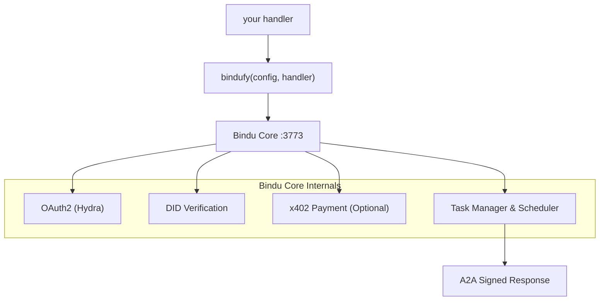

<p align="center">
  
</p>

<div align="center">


# Bindu

### AI एजेंटों के लिए पहचान, संचार और भुगतान परत।

</div>

<br>

> **किसी भी फ्रेमवर्क में अपना एजेंट लिखें। इसे `bindufy()` से लपेटें।**
> **दस लाइनों के कोड में एक हस्ताक्षरित A2A माइक्रोसर्विस भेजें - पहचान, OAuth2, और ऑन-चेन भुगतान के साथ।**

कोई इन्फ्रास्ट्रक्चर लिखने की जरूरत नहीं। कोई फ्रेमवर्क फिर से लिखने की जरूरत नहीं। Python, TypeScript, और Kotlin से काम करता है, और दो ओपन प्रोटोकॉल पर आधारित है: [A2A](https://github.com/a2aproject/A2A) और [x402](https://github.com/coinbase/x402)।

<div align="center">

  <p>
    <a href="../README.md">English</a> ·
    <a href="README.de.md">Deutsch</a> ·
    <a href="README.es.md">Español</a> ·
    <a href="README.fr.md">Français</a> ·
    <a href="README.hi.md">हिंदी</a> ·
    <a href="README.bn.md">বাংলা</a> ·
    <a href="README.zh.md">中文</a> ·
    <a href="README.nl.md">Nederlands</a> ·
    <a href="README.ta.md">தமிழ்</a>
  </p>

  <p>
    <a href="https://opensource.org/licenses/Apache-2.0"></a>
    <a href="https://www.python.org/downloads/"></a>
    <a href="https://pypi.org/project/bindu/"></a>
    <a href="https://coveralls.io/github/Saptha-me/Bindu?branch=v0.3.18"></a>
    <a href="https://github.com/getbindu/Bindu/actions/workflows/release.yml"></a>
    <a href="https://discord.gg/3w5zuYUuwt"></a>
    <a href="https://github.com/getbindu/Bindu/graphs/contributors"></a>
    <a href="https://hits.sh/github.com/Saptha-me/Bindu.svg"></a>
  </p>

  <p>
    <a href="https://getbindu.com"><strong>अपना एजेंट रजिस्टर करें</strong></a> ·
    <a href="https://docs.getbindu.com"><strong>दस्तावेज़</strong></a> ·
    <a href="https://discord.gg/3w5zuYUuwt"><strong>Discord</strong></a>
  </p>
</div>

---

## आपको क्या मिलता है

जब आप `bindufy(config, handler)` के साथ एक हैंडलर लपेटते हैं, तो प्रक्रिया मानक प्रोटोकॉल बोलती है, हर प्रतिक्रिया पर हस्ताक्षर करती है, और भुगतान लेने के लिए तैयार होती है। यह आपके लिए क्या करता है, इसके अनुसार वर्गीकृत:

<br>

**प्रोटोकॉल - दुनिया से बात करें**

| क्षमता | इसका क्या मतलब है |
|---|---|
| A2A JSON-RPC endpoint | मानक प्रोटोकॉल जो अन्य एजेंट पहले से बोलते हैं। पोर्ट 3773 पर `message/send`, `tasks/get`, `message/stream`। |
| पुश नोटिफिकेशन | कार्य स्थिति परिवर्तन पर वेबहुक कॉलबैक - कोई पोलिंग की आवश्यकता नहीं। |
| भाषा-अज्ञेय | Python, TypeScript, और Kotlin SDK एक gRPC कोर साझा करते हैं। समान प्रोटोकॉल, समान DID, समान auth। |

<br>

**पहचान और पहुंच - साबित करें कौन कॉल कर रहा है**

| क्षमता | इसका क्या मतलब है |
|---|---|
| DID पहचान (Ed25519) | हर लौटाया गया आर्टिफैक्ट हस्ताक्षरित है। कॉलर W3C-मानक DID के साथ सत्यापित करते हैं - कोई साझा रहस्य नहीं। |
| Ory Hydra के माध्यम से OAuth2 | एक सभी-या-कुछ नहीं bearer के बजाय स्कोप्ड टोकन (`agent:read`, `agent:write`, `agent:execute`)। |

<br>

**वाणिज्य और पहुंच - भुगतान प्राप्त करें और पहुंच योग्य बनें**

| क्षमता | इसका क्या मतलब है |
|---|---|
| x402 भुगतान | एक फ्लैग और एजेंट अनुरोध प्रोसेस करने से पहले Base पर USDC चार्ज करता है। भुगतान जांच आपके हैंडलर से पहले चलती है। |
| सार्वजनिक टनल | `expose: true` एक FRP टनल खोलता है ताकि आपका स्थानीय एजेंट सार्वजनिक इंटरनेट से पहुंच योग्य हो। |

---

## इंस्टॉलेशन

```bash
uv add bindu
```

परीक्षण के साथ एक विकास चेकआउट के लिए:

```bash
git clone https://github.com/getbindu/Bindu.git
cd Bindu
uv sync --dev
```

Python 3.12+ और [uv](https://github.com/astral-sh/uv) की आवश्यकता है। उदाहरण चलाने के लिए कम से कम एक LLM प्रदाता (`OPENROUTER_API_KEY`, `OPENAI_API_KEY`, या `MINIMAX_API_KEY`) के लिए एक API कुंजी की आवश्यकता है।

---

## हैलो एजेंट

Bindu का पूरा विचार एक फाइल में स्पष्ट रूप से दिखाई देता है - जो भी एजेंट आप पसंद करते हैं उसे बनाएं, इसे `bindufy()` को दें, और आपकी प्रक्रिया एक हस्ताक्षरित A2A माइक्रोसर्विस के रूप में आती है। नीचे दिया गया ब्लॉक पूरा और चलाने योग्य है।

```python
import os
from bindu.penguin.bindufy import bindufy
from agno.agent import Agent
from agno.models.openai import OpenAIChat
from agno.tools.duckduckgo import DuckDuckGoTools

# 1. जो भी फ्रेमवर्क आप पसंद करते हैं उसके साथ अपना एजेंट बनाएं। Bindu को
#    अंदर क्या है इससे कोई फर्क नहीं पड़ता - इसे बस कॉल करने योग्य कुछ चाहिए।
agent = Agent(
    instructions="You are a research assistant that finds and summarizes information.",
    model=OpenAIChat(id="gpt-4o"),
    tools=[DuckDuckGoTools()],
)

# 2. Bindu को बताएं कि आप कौन हैं और एजेंट कहां रहता है। `expose: True`
#    एक सार्वजनिक FRP टनल खोलता है - केवल स्थानीय के लिए इसे हटा दें।
config = {
    "author": "you@example.com",
    "name": "research_agent",
    "description": "Research assistant with web search.",
    "deployment": {
        "url": os.getenv("BINDU_DEPLOYMENT_URL", "http://localhost:3773"),
        "expose": True,
    },
    "skills": ["skills/question-answering"],
}

# 3. हैंडलर अनुबंध: (messages) -> response। बस इतना ही।
def handler(messages: list[dict[str, str]]):
    return agent.run(input=messages)

# 4. bindufy() HTTP सर्वर बूट करता है, आपका DID बनाता है, Hydra के साथ
#    पंजीकरण करता है (यदि auth चालू है), और A2A कॉल स्वीकार करना शुरू करता है।
bindufy(config, handler)
```

इसे चलाएं, और एजेंट कॉन्फ़िगर किए गए URL पर लाइव है। अलग पोर्ट की आवश्यकता है? `BINDU_PORT=4000` निर्यात करें - कोई कोड परिवर्तन नहीं।

<details>
<summary>TypeScript समकक्ष</summary>

```typescript
import { bindufy } from "@bindu/sdk";
import OpenAI from "openai";

const openai = new OpenAI();

bindufy({
  author: "you@example.com",
  name: "research_agent",
  description: "Research assistant.",
  deployment: { url: "http://localhost:3773", expose: true },
  skills: ["skills/question-answering"],
}, async (messages) => {
  const response = await openai.chat.completions.create({
    model: "gpt-4o",
    messages: messages.map(m => ({ role: m.role as "user" | "assistant" | "system", content: m.content })),
  });
  return response.choices[0].message.content || "";
});
```

TypeScript SDK स्वचालित रूप से Python कोर लॉन्च करता है। समान प्रोटोकॉल, समान DID। [`examples/typescript-openai-agent/`](examples/typescript-openai-agent/) में पूरा उदाहरण।

</details>

<details>
<summary>curl के साथ एजेंट को कॉल करना</summary>

```bash
curl -X POST http://localhost:3773/ \
  -H 'Content-Type: application/json' \
  -d '{
    "jsonrpc": "2.0",
    "method": "message/send",
    "id": "<uuid>",
    "params": {
      "message": {
        "role": "user",
        "kind": "message",
        "parts": [{"kind": "text", "text": "Hello"}],
        "messageId": "<uuid>",
        "contextId": "<uuid>",
        "taskId": "<uuid>"
      }
    }
  }'
```

समान `taskId` के साथ `tasks/get` का पोलिंग करें जब तक स्थिति `completed` न हो जाए। लौटाया गया आर्टिफैक्ट `metadata["did.message.signature"]` के तहत एक DID हस्ताक्षर ले जाता है।

</details>

---

## यह कैसे फिट होता है

तो वास्तव में क्या होता है जब वह `bindufy()` कॉल निष्पादित होती है? हैंडलर एकमात्र कोड है जो आप लिखते हैं। बाकी सब कुछ Bindu का स्कैफोल्डिंग है जो इसके चारों ओर रखा गया है:



`bindufy()` एक पतला रैपर है। आपका हैंडलर शुद्ध रहता है - `(messages) -> response`। Bindu पहचान, प्रोटोकॉल, auth, भुगतान, भंडारण और शेड्यूलिंग का मालिक है।

---

## एक सुरक्षित एजेंट को कॉल करना

> **TL;DR** - जब `AUTH__ENABLED=true`, हर कॉल को एक Hydra bearer टोकन और तीन `X-DID-*` हेडर की आवश्यकता होती है। Python क्लाइंट: ~25 लाइनें, [नीचे](#step-2--pick-your-client)। Postman: एक स्क्रिप्ट पेस्ट करें। इस अनुभाग का बाकी हिस्सा समझाता है कि क्यों और कैसे, और क्या गलत होता है जब यह गलत होता है।

*हैलो एजेंट* में `curl` उदाहरण इसलिए काम करता है क्योंकि auth डिफ़ॉल्ट रूप से बंद है - कोई भी आपके एजेंट को POST कर सकता है। जैसे ही आप `AUTH__ENABLED=true AUTH__PROVIDER=hydra` फ्लिप करते हैं, आपका एजेंट सख्त हो जाता है। अब हर कॉलर को हैंडलर चलने से पहले दो सवालों के जवाब देने होंगे:

1. **क्या आपको मुझे कॉल करने की अनुमति है?** - Hydra से एक वैध OAuth2 टोकन दिखाएं।
2. **क्या आप वास्तव में वही हैं जो आप कहते हैं?** - अनुरोध पर एक DID कुंजी के साथ हस्ताक्षर करें।

इसे एक उड़ान में बोर्डिंग की तरह सोचें: बोर्डिंग पास (OAuth टोकन) कहता है "हां, इस उड़ान में आपकी सीट है," और पासपोर्ट (DID हस्ताक्षर) कहता है "और आप वास्तव में उस बोर्डिंग पास पर व्यक्ति हैं।" सर्वर दोनों की जांच करता है।

पूर्ण सिद्धांत [`docs/AUTHENTICATION.md`](docs/AUTHENTICATION.md) और [`docs/DID.md`](docs/DID.md) में रहता है - सादे अंग्रेजी में, कोई क्रिप्टो पृष्ठभूमि मानी नहीं गई। जो आता है वह व्यावहारिक "मैं बस अपने एजेंट को कॉल करना चाहता हूं" संस्करण है।

<br>

### तीन अतिरिक्त हेडर

सामान्य `Authorization: Bearer <hydra-jwt>` के साथ, हर सुरक्षित अनुरोध ले जाता है:

| हेडर | मान |
|---|---|
| `X-DID` | आपकी DID स्ट्रिंग, जैसे `did:bindu:you_at_example_com:myagent:<uuid>` |
| `X-DID-Timestamp` | वर्तमान unix सेकंड (सर्वर 5 मिनट का स्क्यू अनुमति देता है) |
| `X-DID-Signature` | `base58( Ed25519_sign( <signing payload> ) )` |

**हस्ताक्षर पेलोड** सर्वर पर इस तरह पुनर्निर्मित होता है:

```python
json.dumps({"body": <raw-body-string>, "did": <did>, "timestamp": <ts>}, sort_keys=True)
```

दो गॉटचा जो आपको तब तक काटेंगी जब तक आप उन्हें महसूस नहीं करते:

- **Python के JSON स्पेसिंग से मेल खाएं।** Python का डिफ़ॉल्ट `json.dumps` `", "` और `": "` (स्पेस के साथ) लिखता है। JS में `JSON.stringify` उन्हें बिना लिखता है। यदि आपका पेलोड अलग तरह से क्रमबद्ध होता है, तो Ed25519 अलग बाइट्स देखता है और सर्वर `reason="crypto_mismatch"` लौटाता है।
- **जो भेजें उस पर हस्ताक्षर करें।** यदि आप body को पार्स करते हैं, इसे संशोधित करते हैं, फिर से क्रमबद्ध करते हैं, और उसे भेजते हैं - आपने गलत बाइट्स पर हस्ताक्षर किया। body स्ट्रिंग को **एक बार** बनाएं, उन सटीक बाइट्स पर हस्ताक्षर करें, उन सटीक बाइट्स भेजें।

<br>

### चरण 1 - Hydra से एक bearer टोकन प्राप्त करें

एजेंट अपने स्टार्टअप बैनर में एक तैयार-चलाने वाला curl प्रिंट करता है। छोटा संस्करण:

```bash
SECRET=$(jq -r '.[].client_secret' < .bindu/oauth_credentials.json)
curl -X POST https://hydra.getbindu.com/oauth2/token \
  -H "Content-Type: application/x-www-form-urlencoded" \
  -d "grant_type=client_credentials" \
  -d "client_id=did:bindu:you_at_example_com:myagent:<uuid>" \
  -d "client_secret=$SECRET" \
  -d "scope=openid offline agent:read agent:write"
```

प्रतिक्रिया में एक `access_token` है। यह एक घंटे के लिए अच्छा है - इसे कैश करें, जब आवश्यक हो तो फिर से प्राप्त करें।

<br>

### चरण 2 - अपना क्लाइंट चुनें

**Python - सबसे छोटा काम करने वाला उदाहरण।** एजेंट की अपनी कुंजियां पढ़ता है (Bindu उन्हें पहले बूट पर `.bindu/` में लिखता है), एक अनुरोध पर हस्ताक्षर करता है, परिणाम के लिए पोल करता है। Self-call काम करता है क्योंकि एजेंट की कुंजियां एक वैध कॉलर पहचान हैं।

```python
import base58, httpx, json, time, uuid
from pathlib import Path
from cryptography.hazmat.primitives import serialization

# 1. पहले बूट पर Bindu द्वारा लिखी गई कुंजियां लोड करें
priv  = serialization.load_pem_private_key(Path(".bindu/private.pem").read_bytes(), password=None)
creds = next(iter(json.loads(Path(".bindu/oauth_credentials.json").read_text()).values()))
did   = creds["client_id"]            # DID Hydra client_id के रूप में भी काम करता है

# 2. क्रेडेंशियल्स को एक अल्पकालिक JWT के लिए एक्सचेंज करें
bearer = httpx.post("https://hydra.getbindu.com/oauth2/token", data={
    "grant_type": "client_credentials",
    "client_id": creds["client_id"], "client_secret": creds["client_secret"],
    "scope": "openid offline agent:read agent:write",
}).json()["access_token"]

# 3. body को एक बार बनाएं - ये वे बाइट्स हैं जिन पर हम हस्ताक्षर करेंगे और भेजेंगे
tid = str(uuid.uuid4())
body = json.dumps({
    "jsonrpc": "2.0", "method": "message/send", "id": str(uuid.uuid4()),
    "params": {"message": {
        "role": "user", "kind": "message",
        "parts": [{"kind": "text", "text": "Hello!"}],
        "messageId": str(uuid.uuid4()), "contextId": str(uuid.uuid4()), "taskId": tid,
    }},
})

# 4. हस्ताक्षर: base58(Ed25519( json.dumps({body,did,timestamp}, sort_keys=True) ))
ts      = int(time.time())
payload = json.dumps({"body": body, "did": did, "timestamp": ts}, sort_keys=True)
sig     = base58.b58encode(priv.sign(payload.encode())).decode()

# 5. इसे फायर करें
r = httpx.post("http://localhost:3773/", content=body, headers={
    "Content-Type":    "application/json",
    "Authorization":   f"Bearer {bearer}",
    "X-DID":           did,
    "X-DID-Timestamp": str(ts),
    "X-DID-Signature": sig,
})
print(r.status_code, r.json())
```

पोलिंग और त्रुटि हैंडलिंग के साथ एक पूर्ण-विशेषता संस्करण के लिए, देखें - [`examples/hermes_agent/call.py`](examples/hermes_agent/call.py)।

<br>

**Postman - अपने संग्रह में एक स्क्रिप्ट पेस्ट करें।**

1. अपना संग्रह खोलें → **Pre-request Script** टैब → [`docs/postman-did-signing.js`](docs/postman-did-signing.js) की सामग्री पेस्ट करें।
2. दो संग्रह चर सेट करें: `bindu_did` (आपकी DID स्ट्रिंग) और `bindu_did_seed` (आपका 32-बाइट Ed25519 सीड, base64-एन्कोडेड)।
3. एक `Authorization: Bearer {{bindu_bearer}}` हेडर जोड़ें और अपना Hydra टोकन `bindu_bearer` में डालें।
4. Send हिट करें। स्क्रिप्ट उन सटीक body बाइट्स पर हस्ताक्षर करती है जो Postman भेजने वाला है और आपके लिए तीन `X-DID-*` हेडर सेट करती है।

Postman Desktop v11+ की आवश्यकता है (`crypto.subtle` को Ed25519 की आवश्यकता है)।

<br>

**सादा curl - तकनीकी रूप से संभव, आमतौर पर दर्दनाक।** हस्ताक्षर बाइट्स पर निर्भर करता है जो आप भेजने वाले हैं, इसलिए आपको पहले हस्ताक्षर की गणना करने के लिए एक हेल्पर स्क्रिप्ट की आवश्यकता होती है, फिर इसे curl कॉल में प्रतिस्थापित करें। यदि आप ऐसा कर रहे हैं, तो आप शायद ऊपर दिए गए Python क्लाइंट का उपयोग करके बेहतर होंगे।

<br>

### जब हस्ताक्षर विफल होते हैं

सर्वर लॉग तीन कारणों में से एक लॉग करता है। यदि आपका अनुरोध 403 के साथ अस्वीकार कर दिया जाता है, तो ऑपरेटर से पूछें (या सर्वर लॉग को स्वयं जांचें):

| लॉग कहता है | इसका क्या मतलब है | फिक्स |
|---|---|---|
| `timestamp_out_of_window` | आपका `X-DID-Timestamp` सर्वर के घड़ी से 5 मिनट से अधिक बंद है, या आपने एक पुराना टाइमस्टैम्प पुनः उपयोग किया | हर अनुरोध पर `int(time.time())` पुनर्गणना करें |
| `malformed_input` | हस्ताक्षर या सार्वजनिक कुंजी का base58 डिकोडिंग विफल हुआ | जांचें कि `X-DID-Signature` URL-एन्कोडेड, ट्रंकेटेड, या उद्धरण चिह्नों में लपेटा नहीं गया है |
| `crypto_mismatch` | बाइट्स जिन पर आपने हस्ताक्षर किया ≠ बाइट्स जो आपने भेजे | पेलोड को `sort_keys=True` और Python के डिफ़ॉल्ट JSON स्पेसिंग के साथ पुनर्निर्माण करें; कच्चे body स्ट्रिंग पर एक बार हस्ताक्षर करें और समान बाइट्स भेजें |

परीक्षण में हमने एक तीक्ष्ण विफलता मोड मारा: यदि `crypto_mismatch` बना रहता है और आप *सुनिश्चित* हैं कि आपके बाइट्स मेल खाते हैं, तो इस DID के लिए Hydra की संग्रहित सार्वजनिक कुंजी एक पुराने पंजीकरण से पुरानी हो सकती है। फिक्स: एजेंट को रोकें, `.bindu/oauth_credentials.json` हटाएं, पुनरारंभ करें - Hydra का क्लाइंट रिकॉर्ड वर्तमान कुंजियों के साथ ताज़ा हो जाएगा।

---

## Gateway - मल्टी-एजेंट ऑर्केस्ट्रेशन

एकल `bindufy()` लपेटा गया एजेंट एक माइक्रोसर्विस है। **Bindu Gateway** एक कार्य-प्रथम ऑर्केस्ट्रेटर है जो इसके ऊपर बैठता है: इसे एक उपयोगकर्ता प्रश्न और A2A एजेंटों की सूची दें, और एक प्लानर LLM कार्य को विघटित करता है, A2A के माध्यम से सही एजेंटों को कॉल करता है, और परिणामों को सर्वर-भेजे घटनाओं के रूप में स्ट्रीम करता है। कोई DAG इंजन, कोई अलग ऑर्केस्ट्रेटर सेवा नहीं - प्लानर का LLM प्रति टर्न टूल चुनता है।

एकल एजेंट के अलावा आपको क्या मिलता है:

- **एक endpoint: `POST /plan`** - इसे एक प्रश्न और एक एजेंट कैटलॉग दें, स्ट्रीम किए गए चरण प्राप्त करें।
- **प्रति अनुरोध एजेंट कैटलॉग** - बाहरी सिस्टम एजेंटों, कौशल और endpoints की सूची पास करते हैं। गेटवे में कोई फ्लीट होस्टिंग नहीं।
- **सत्र परिपूर्णता (Supabase)** - Postgres-समर्थित संपीड़न, रोलबैक और मल्टी-टर्न इतिहास के साथ।
- **मूल TypeScript A2A** - कोई Python सबप्रोसेस, गेटवे में कोई `@bindu/sdk` निर्भरता नहीं।
- **वैकल्पिक DID हस्ताक्षर + Hydra एकीकरण** - गेटवे end-to-end पहचान है।

न्यूनतम quickstart:

```bash
cd gateway
npm install
cp .env.example .env.local         # fill SUPABASE_*, GATEWAY_API_KEY, OPENROUTER_API_KEY
npm run dev                        # → http://localhost:3774
curl -sS http://localhost:3774/health
```

पहले दो Supabase माइग्रेशन लागू करें (`gateway/migrations/001_init.sql`, `002_compaction_revert.sql`)। पूर्ण walkthrough और ऑपरेटर संदर्भ [`gateway/README.md`](gateway/README.md) और [`docs/GATEWAY.md`](docs/GATEWAY.md) में रहते हैं (45-मिनट end-to-end: साफ क्लोन → तीन श्रृंखलित एजेंट → एक रेसिपी लेखन → DID हस्ताक्षर)।

Gateway दस्तावेज़ीकरण:

| विषय | लिंक |
|---|---|
| अवलोकन | [docs.getbindu.com/bindu/gateway/overview](https://docs.getbindu.com/bindu/gateway/overview) |
| Quickstart | [docs.getbindu.com/bindu/gateway/quickstart](https://docs.getbindu.com/bindu/gateway/quickstart) |
| मल्टी-एजेंट योजना | [docs.getbindu.com/bindu/gateway/multi-agent](https://docs.getbindu.com/bindu/gateway/multi-agent) |
| रेसिपी (प्रगतिशील-प्रकटन प्लेबुक) | [docs.getbindu.com/bindu/gateway/recipes](https://docs.getbindu.com/bindu/gateway/recipes) |
| पहचान (DID हस्ताक्षर, Hydra) | [docs.getbindu.com/bindu/gateway/identity](https://docs.getbindu.com/bindu/gateway/identity) |
| उत्पादन तैनाती | [docs.getbindu.com/bindu/gateway/production](https://docs.getbindu.com/bindu/gateway/production) |
| API संदर्भ | [docs.getbindu.com/api/introduction](https://docs.getbindu.com/api/introduction) |

एक चलाने योग्य मल्टी-एजेंट डेमो के लिए, देखें [`examples/gateway_test_fleet/`](examples/gateway_test_fleet/) - स्थानीय पोर्ट पर पांच छोटे एजेंट, एक गेटवे, एक प्रश्न।

---

## समर्थित फ्रेमवर्क और उदाहरण

जो भी एजेंट फ्रेमवर्क आप पहले से पसंद करते हैं उसे लाएं। आप Bindu को एक हैंडलर देते हैं; यह आपको एक हस्ताक्षरित A2A माइक्रोसर्विस देता है। हैंडलर के अंदर कुछ भी हो, प्रवाह समान है।

<br>

| भाषा | इस रेपो में परीक्षण किए गए फ्रेमवर्क |
|---|---|
| **Python** | [AG2](https://github.com/ag2ai/ag2) · [Agno](https://github.com/agno-agi/agno) · [CrewAI](https://github.com/joaomdmoura/crewAI) · [Hermes Agent](https://github.com/NousResearch/hermes-agent) · [LangChain](https://github.com/langchain-ai/langchain) · [LangGraph](https://github.com/langchain-ai/langgraph) · [Notte](https://github.com/nottelabs/notte) |
| **TypeScript** | [OpenAI SDK](https://github.com/openai/openai-node) · [LangChain.js](https://github.com/langchain-ai/langchainjs) |
| **Kotlin** | [OpenAI Kotlin SDK](https://github.com/aallam/openai-kotlin) |
| **कोई अन्य भाषा** | [gRPC कोर](docs/grpc/) के माध्यम से - कुछ सौ लाइनों में एक SDK जोड़ें |

OpenAI या Anthropic API बोलने वाले किसी भी LLM प्रदाता के साथ संगत: [OpenRouter](https://openrouter.ai/) (100+ मॉडल), [OpenAI](https://platform.openai.com/), [MiniMax](https://platform.minimaxi.com), और अन्य।

<br>

### शुरू करने के लिए कुछ उदाहरण

पांच जो Bindu क्या कर सकता है इसके स्पेक्ट्रम को कवर करते हैं। सभी 20+ चलाने योग्य उदाहरण [`examples/`](examples/) के तहत रहते हैं।

| उदाहरण | यह क्या दिखाता है |
|---|---|
| [Agent Swarm](examples/agent_swarm/) | मल्टी-एजेंट सहयोग - एक छोटा "समाज" Agno एजेंटों का जो एक-दूसरे को कार्य सौंपते हैं। |
| [Premium Advisor](examples/premium-advisor/) | **x402 भुगतान** - कॉलर को हैंडलर चलने से पहले Base पर USDC भुगतान करना होगा। |
| [Hermes via Bindu](examples/hermes_agent/) | **तीसरे पक्ष फ्रेमवर्क इंटरऑप** - Nous Research का Hermes एजेंट ~90 लाइनों में bindufied। |
| [Gateway Test Fleet](examples/gateway_test_fleet/) | पांच छोटे एजेंट + एक गेटवे - मल्टी-एजेंट ऑर्केस्ट्रेशन कहानी end-to-end। |
| [TypeScript OpenAI Agent](examples/typescript-openai-agent/) | **बहुभाषी प्रमाण** - एक TS एजेंट Bindu TS SDK के साथ bindufied; कोई Python लिखने की आवश्यकता नहीं। |

**पूरा कैटलॉग देखें:** [`examples/`](examples/) - 20+ एजेंट CSV विश्लेषण, PDF Q&A, speech-to-text, वेब स्क्रैपिंग, साइबर सुरक्षा न्यूज़लेटर, बहुभाषी सहयोग, ब्लॉग लेखन और अधिक को कवर करते हैं।

आपका फ्रेमवर्क गायब है? एक issue खोलें या [Discord](https://discord.gg/3w5zuYUuwt) पर पूछें।

---

## डेमो

<div align="center">
  <a href="https://www.youtube.com/watch?v=qppafMuw_KI">
    
  </a>
</div>

`cd bindu-communication && npm run dev` चलाने के बाद, `http://localhost:3775` पर एक अंतर्निहित चैट UI उपलब्ध है।

<p align="center">
  
</p>

---

## मुख्य विशेषताएं

नीचे सब कुछ वैकल्पिक और मॉड्यूलर है - न्यूनतम इंस्टॉल सिर्फ A2A सर्वर है। प्रत्येक पंक्ति [`docs/`](docs/) में एक समर्पित गाइड से जुड़ती है।

<br>

**पहचान और पहुंच**

| विशेषता | गाइड |
|---|---|
| विकेंद्रीकृत पहचानकर्ता (DIDs) | [DID.md](docs/DID.md) |
| प्रमाणीकरण (Ory Hydra OAuth2) | [AUTHENTICATION.md](docs/AUTHENTICATION.md) |

<br>

**प्रोटोकॉल और इन्फ्रास्ट्रक्चर**

| विशेषता | गाइड |
|---|---|
| कौशल सिस्टम | [SKILLS.md](docs/SKILLS.md) |
| एजेंट वार्ता | [NEGOTIATION.md](docs/NEGOTIATION.md) |
| पुश नोटिफिकेशन | [NOTIFICATIONS.md](docs/NOTIFICATIONS.md) |
| PostgreSQL भंडारण | [STORAGE.md](docs/STORAGE.md) |
| Redis शेड्यूलर | [SCHEDULER.md](docs/SCHEDULER.md) |
| gRPC के माध्यम से भाषा-अज्ञेय | [GRPC_LANGUAGE_AGNOSTIC.md](docs/GRPC_LANGUAGE_AGNOSTIC.md) |

<br>

**वाणिज्य और पहुंच**

| विशेषता | गाइड |
|---|---|
| x402 भुगतान (Base पर USDC) | [PAYMENT.md](docs/PAYMENT.md) |
| टनलिंग (केवल स्थानीय डेव) | [TUNNELING.md](docs/TUNNELING.md) |

<br>

**विश्वसनीयता और संचालन**

| विशेषता | गाइड |
|---|---|
| घातीय बैकऑफ के साथ पुनःप्रयास | [Retry docs](https://docs.getbindu.com/bindu/learn/retry/overview) |
| अवलोकनीयता (OpenTelemetry, Sentry) | [OBSERVABILITY.md](docs/OBSERVABILITY.md) |
| स्वास्थ्य जांच और मेट्रिक्स | [HEALTH_METRICS.md](docs/HEALTH_METRICS.md) |

---

## परीक्षण

Bindu 70% परीक्षण कवरेज का लक्ष्य रखता है (लक्ष्य: 80%+):

```bash
uv run pytest tests/unit/ -v                                    # तेज यूनिट परीक्षण
uv run pytest tests/integration/grpc/ -v -m e2e                 # gRPC E2E
uv run pytest -n auto --cov=bindu --cov-report=term-missing     # पूर्ण सूट
```

CI हर PR पर यूनिट परीक्षण, gRPC E2E और TypeScript SDK बिल्ड चलाता है। देखें [`.github/workflows/ci.yml`](.github/workflows/ci.yml)।

---

## समस्या निवारण

<details>
<summary>सामान्य समस्याएं</summary>

| समस्या | फिक्स |
|---|---|
| `uv: command not found` | uv इंस्टॉल करने के बाद अपना शेल पुनरारंभ करें। |
| `Python version not supported` | [python.org](https://www.python.org/downloads/) से Python 3.12+ इंस्टॉल करें या `pyenv` के माध्यम से। |
| `bindu: command not found` | अपना virtualenv सक्रिय करें: `source .venv/bin/activate`। |
| `Port 3773 already in use` | `BINDU_PORT=4000` सेट करें, या `BINDU_DEPLOYMENT_URL=http://localhost:4000` के साथ ओवरराइड करें। |
| `ModuleNotFoundError` | `uv sync --dev` चलाएं। |
| Pre-commit विफल होता है | `pre-commit run --all-files` चलाएं। |
| `Permission denied` (macOS) | विस्तारित विशेषताओं को साफ़ करने के लिए `xattr -cr .`। |

पर्यावरण रीसेट करें:

```bash
rm -rf .venv && uv venv --python 3.12.9 && uv sync --dev
```

Windows PowerShell पर आपको `Set-ExecutionPolicy RemoteSigned -Scope CurrentUser` की आवश्यकता हो सकती है।

</details>

---

## ज्ञात समस्याएं

यदि आप Bindu को उत्पादन में चला रहे हैं, तो पहले [`bugs/known-issues.md`](bugs/known-issues.md) पढ़ें। यह वर्कअराउंड के साथ प्रति-सबसिस्टम कैटलॉग है। तय किए गए बग के लिए पोस्टमॉर्टम [`bugs/core/`](bugs/core/), [`bugs/gateway/`](bugs/gateway/), [`bugs/sdk/`](bugs/sdk/) के तहत रहते हैं।

वर्तमान उच्च-गंभीरता आइटम:

| सबसिस्टम | Slug | लक्षण |
|---|---|---|
| Core | [`x402-middleware-fails-open-on-body-parse`](bugs/known-issues.md#x402-middleware-fails-open-on-body-parse) | विकृत JSON body भुगतान जांच को बायपास करता है |
| Core | [`x402-no-replay-prevention`](bugs/known-issues.md#x402-no-replay-prevention) | एक भुगतान `validBefore` तक असीमित काम खरीदता है |
| Core | [`x402-no-signature-verification`](bugs/known-issues.md#x402-no-signature-verification) | EIP-3009 हस्ताक्षर कभी सत्यापित नहीं होता है |
| Core | [`x402-balance-check-skipped-on-missing-contract-code`](bugs/known-issues.md#x402-balance-check-skipped-on-missing-contract-code) | गलत कॉन्फ़िगर किया गया RPC शांति से बैलेंस जांच को छोड़ देता है |
| Gateway | [`context-window-hardcoded`](bugs/known-issues.md#context-window-hardcoded) | संपीड़न सीमा एक 200k-टोकन विंडो मानती है |
| Gateway | [`poll-budget-unbounded-wall-clock`](bugs/known-issues.md#poll-budget-unbounded-wall-clock) | `sendAndPoll` प्रति टूल कॉल 5 मिनट तक रुक सकता है |
| Gateway | [`no-session-concurrency-guard`](bugs/known-issues.md#no-session-concurrency-guard) | एक ही सत्र पर दो `/plan` कॉल इतिहास को उलझा देते हैं |

नई समस्या मिली? slug का संदर्भ देते हुए एक GitHub Issue खोलें (जैसे *"Fixes `context-window-hardcoded`"*)। एक तय किया? `known-issues.md` से उसकी प्रविष्टि हटाएं और एक दिनांकित पोस्टमॉर्ट जोड़ें - टेम्पलेट के लिए [`bugs/README.md`](bugs/README.md) देखें।

---

## योगदान

क्लोन करें, सेट करें, और प्री-कमिट हुक चलाएं:

```bash
git clone https://github.com/getbindu/Bindu.git
cd Bindu
uv venv --python 3.12.9 && source .venv/bin/activate
uv sync --dev
pre-commit run --all-files
```

चर्चा और सहायता [Discord](https://discord.gg/3w5zuYUuwt) पर होती है। पूर्ण गाइड के लिए [`.github/contributing.md`](.github/contributing.md) देखें। एजेंटों की एक खुली सूची है जिन्हें हम bindufied देखना चाहेंगे - [योगदान दें](https://www.notion.so/getbindu/305d3bb65095808eac2bf720368e9804?v=305d3bb6509580189941000cfad83ae7&source=copy_link)।

---

## मेंटेनर्स

<table>
  <tr>
    <td align="center"><a href="https://github.com/raahulrahl"><br /><sub><b>Raahul Dutta</b></sub></a></td>
    <td align="center"><a href="https://github.com/Paraschamoli"><br /><sub><b>Paras Chamoli</b></sub></a></td>
    <td align="center"><a href="https://github.com/chandan-1427"><br /><sub><b>Chandan</b></sub></a></td>
  </tr>
</table>

---

## स्वीकृतियां

Bindu इनके कंधों पर खड़ा है:

[FastA2A](https://github.com/pydantic/fasta2a) · [A2A](https://github.com/a2aproject/A2A) · [x402](https://github.com/coinbase/x402) · [Hugging Face chat-ui](https://github.com/huggingface/chat-ui) · [12 Factor Agents](https://github.com/humanlayer/12-factor-agents/blob/main/content/factor-11-trigger-from-anywhere.md) · [OpenCode](https://github.com/anomalyco/opencode) · [OpenMoji](https://openmoji.org/library/emoji-1F33B/) · [ASCII Space Art](https://www.asciiart.eu/space/other)

---

## लाइसेंस

Apache 2.0. देखें [LICENSE.md](LICENSE.md)।

<p align="center">
  <a href="https://api.star-history.com/svg?repos=getbindu/Bindu&type=Date">
    
  </a>
</p>

<br/>
<br/>

<p align="center">
  
</p>

<p align="center">
  <em>"हम सूरजमुखी सिद्धांत में विश्वास करते हैं - एक साथ खड़े होकर, एजेंट इंटरनेट को आशा और प्रकाश लाना।"</em>
</p>

<p align="center">
  <em>विचार से एजेंट इंटरनेट तक 2 मिनट में।</em>
  <em>आपका एजेंट। आपका फ्रेमवर्क। सार्वभौमिक प्रोटोकॉल।</em>
</p>

<p align="center">
  <a href="https://github.com/getbindu/Bindu">GitHub पर हमें स्टार करें</a> •
  <a href="https://discord.gg/3w5zuYUuwt">Discord में शामिल हों</a> •
  <a href="https://docs.getbindu.com">दस्तावेज़ पढ़ें</a>
</p>

<p align="center">
  <sub>
    Amsterdam और India के बीच बनाया गया · Apache 2.0 के तहत ओपन सोर्स ·
    <a href="https://getbindu.com">getbindu.com</a>
  </sub>
</p>
