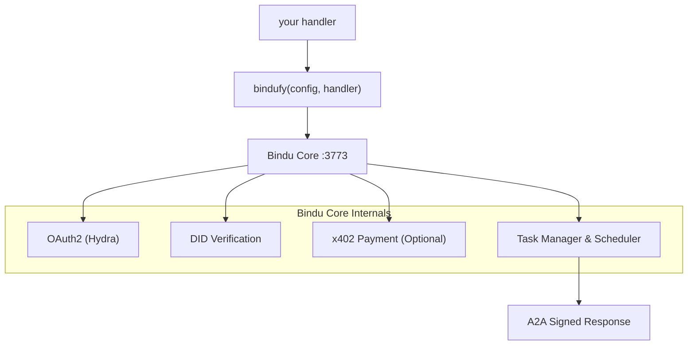

<p align="center">
  
</p>

<div align="center">


# Bindu

### De identiteits-, communicatie- en betalingslaag voor AI-agenten.

</div>

<br>

> **Schrijf uw agent in elk framework. Wikkel het in met `bindufy()`.**
> **Verzend een ondertekende A2A-microservice - identiteit, OAuth2 en on-chain betalingen - in tien regels code.**

Geen infrastructuur om te schrijven. Geen framework om te herschrijven. Werkt vanuit Python, TypeScript en Kotlin, en gebaseerd op twee open protocollen: [A2A](https://github.com/a2aproject/A2A) en [x402](https://github.com/coinbase/x402).

<div align="center">

  <p>
    <a href="../README.md">English</a> ·
    <a href="README.de.md">Deutsch</a> ·
    <a href="README.es.md">Español</a> ·
    <a href="README.fr.md">Français</a> ·
    <a href="README.hi.md">हिंदी</a> ·
    <a href="README.bn.md">বাংলা</a> ·
    <a href="README.zh.md">中文</a> ·
    <a href="README.nl.md">Nederlands</a> ·
    <a href="README.ta.md">தமிழ்</a>
  </p>

  <p>
    <a href="https://opensource.org/licenses/Apache-2.0"></a>
    <a href="https://www.python.org/downloads/"></a>
    <a href="https://pypi.org/project/bindu/"></a>
    <a href="https://coveralls.io/github/Saptha-me/Bindu?branch=v0.3.18"></a>
    <a href="https://github.com/getbindu/Bindu/actions/workflows/release.yml"></a>
    <a href="https://discord.gg/3w5zuYUuwt"></a>
    <a href="https://github.com/getbindu/Bindu/graphs/contributors"></a>
    <a href="https://hits.sh/github.com/Saptha-me/Bindu.svg"></a>
  </p>

  <p>
    <a href="https://getbindu.com"><strong>Registreer uw agent</strong></a> ·
    <a href="https://docs.getbindu.com"><strong>Documentatie</strong></a> ·
    <a href="https://discord.gg/3w5zuYUuwt"><strong>Discord</strong></a>
  </p>
</div>

---

## Wat u krijgt

Wanneer u een handler wikkelt met `bindufy(config, handler)`, komt het proces op met standaard protocollen, ondertekent elke reactie en is klaar om betaling te accepteren. Gegroepeerd op wat het voor u doet:

<br>

**Protocol - spreek met de wereld**

| Mogelijkheid | Wat het betekent |
|---|---|
| A2A JSON-RPC endpoint | Standaard protocol dat andere agenten al spreken. `message/send`, `tasks/get`, `message/stream` op poort 3773. |
| Push meldingen | Webhook callbacks bij taakstatuswijziging - geen polling vereist. |
| Taal-agnostisch | Python, TypeScript en Kotlin SDK's delen één gRPC-kern. Zelfde protocol, zelfde DID, zelfde auth. |

<br>

**Identiteit & toegang - bewijs wie belt**

| Mogelijkheid | Wat het betekent |
|---|---|
| DID-identiteit (Ed25519) | Elk geretourneerd artefact is ondertekend. Bellers verifiëren met een W3C-standaard DID - geen gedeelde geheimen. |
| OAuth2 via Ory Hydra | Gescoped tokens (`agent:read`, `agent:write`, `agent:execute`) in plaats van één alles-of-niets bearer. |

<br>

**Handel & bereik - ontvang betalingen en bereikbaar zijn**

| Mogelijkheid | Wat het betekent |
|---|---|
| x402 betalingen | Eén vlag en de agent rekent USDC op Base voordat een verzoek wordt verwerkt. Betalingscontrole draait voor uw handler. |
| Publieke tunnel | `expose: true` opent een FRP-tunnel zodat uw lokale agent bereikbaar is vanaf het openbare internet. |

---

## Installatie

```bash
uv add bindu
```

Voor een ontwikkelingscheckout met tests:

```bash
git clone https://github.com/getbindu/Bindu.git
cd Bindu
uv sync --dev
```

Vereist Python 3.12+ en [uv](https://github.com/astral-sh/uv). Een API-sleutel voor ten minste één LLM-provider (`OPENROUTER_API_KEY`, `OPENAI_API_KEY`, of `MINIMAX_API_KEY`) is nodig om de voorbeelden uit te voeren.

---

## Hallo agent

Het hele idee van Bindu komt duidelijk naar voren in één bestand - bouw elke agent die u leuk vindt, geef het aan `bindufy()`, en uw proces komt op als een ondertekende A2A-microservice. Het onderstaande blok is compleet en uitvoerbaar.

```python
import os
from bindu.penguin.bindufy import bindufy
from agno.agent import Agent
from agno.models.openai import OpenAIChat
from agno.tools.duckduckgo import DuckDuckGoTools

# 1. Bouw uw agent met welk framework u ook verkiest. Bindu doet
#    er niet toe wat erin zit - het heeft gewoon iets aanroepbaars nodig.
agent = Agent(
    instructions="You are a research assistant that finds and summarizes information.",
    model=OpenAIChat(id="gpt-4o"),
    tools=[DuckDuckGoTools()],
)

# 2. Vertel Bindu wie u bent en waar de agent woont. `expose: True`
#    opent een openbare FRP-tunnel - laat dit weg voor lokaal-only.
config = {
    "author": "you@example.com",
    "name": "research_agent",
    "description": "Research assistant with web search.",
    "deployment": {
        "url": os.getenv("BINDU_DEPLOYMENT_URL", "http://localhost:3773"),
        "expose": True,
    },
    "skills": ["skills/question-answering"],
}

# 3. Het handler-contract: (messages) -> response. Dat is alles.
def handler(messages: list[dict[str, str]]):
    return agent.run(input=messages)

# 4. bindufy() start de HTTP-server, slaat uw DID, registreert bij
#    Hydra (als auth aan staat) en begint A2A-aanroepen te accepteren.
bindufy(config, handler)
```

Voer het uit, en de agent is live op de geconfigureerde URL. Een andere poort nodig? Exporteer `BINDU_PORT=4000` - geen codewijziging.

<details>
<summary>TypeScript-equivalent</summary>

```typescript
import { bindufy } from "@bindu/sdk";
import OpenAI from "openai";

const openai = new OpenAI();

bindufy({
  author: "you@example.com",
  name: "research_agent",
  description: "Research assistant.",
  deployment: { url: "http://localhost:3773", expose: true },
  skills: ["skills/question-answering"],
}, async (messages) => {
  const response = await openai.chat.completions.create({
    model: "gpt-4o",
    messages: messages.map(m => ({ role: m.role as "user" | "assistant" | "system", content: m.content })),
  });
  return response.choices[0].message.content || "";
});
```

De TypeScript SDK start automatisch de Python-kern. Zelfde protocol, zelfde DID. Volledig voorbeeld in [`examples/typescript-openai-agent/`](examples/typescript-openai-agent/).

</details>

<details>
<summary>De agent aanroepen met curl</summary>

```bash
curl -X POST http://localhost:3773/ \
  -H 'Content-Type: application/json' \
  -d '{
    "jsonrpc": "2.0",
    "method": "message/send",
    "id": "<uuid>",
    "params": {
      "message": {
        "role": "user",
        "kind": "message",
        "parts": [{"kind": "text", "text": "Hello"}],
        "messageId": "<uuid>",
        "contextId": "<uuid>",
        "taskId": "<uuid>"
      }
    }
  }'
```

Poll `tasks/get` met dezelfde `taskId` totdat de status `completed` is. Het geretourneerde artefact draagt een DID-handtekening onder `metadata["did.message.signature"]`.

</details>

---

## Hoe het past

Dus wat gebeurt er eigenlijk wanneer die `bindufy()`-aanroep wordt uitgevoerd? De handler is de enige code die u schrijft. Alles anders is de scaffolding die Bindu eromheen zet:



`bindufy()` is een dunne wrapper. Uw handler blijft puur - `(messages) -> response`. Bindu bezit identiteit, protocol, auth, betaling, opslag en planning.

---

## Een beveiligde agent aanroepen

> **TL;DR** - wanneer `AUTH__ENABLED=true`, heeft elke aanroep een Hydra bearer-token en drie `X-DID-*` headers nodig. Python-client: ~25 regels, [hieronder](#step-2--pick-your-client). Postman: plak één script. De rest van deze sectie legt uit waarom en hoe, en wat er misgaat als het misgaat.

Het `curl`-voorbeeld in *Hallo agent* werkt omdat auth standaard uit staat - iedereen kan POST naar uw agent. Zodra u `AUTH__ENABLED=true AUTH__PROVIDER=hydra` omschakelt, wordt uw agent strikter. Elke beller moet nu twee vragen beantwoorden voordat de handler draait:

1. **Mag u mij bellen?** - toon een geldig OAuth2-token van Hydra.
2. **Bent u echt wie u zegt dat u bent?** - onderteken het verzoek met een DID-sleutel.

Denk er aan als het instappen op een vlucht: de instapkaart (OAuth-token) zegt "ja, u heeft een stoel op deze vlucht", en het paspoort (DID-handtekening) zegt "en u bent echt de persoon op die instapkaart". De server controleert beide.

De volledige theorie staat in [`docs/AUTHENTICATION.md`](docs/AUTHENTICATION.md) en [`docs/DID.md`](docs/DID.md) - gewoon Engels, geen crypto-achtergrond aangenomen. Wat volgt is de praktische "ik wil gewoon mijn agent bellen" versie.

<br>

### De drie extra headers

Naast de gebruikelijke `Authorization: Bearer <hydra-jwt>`, draagt elke beveiligde aanroep:

| Header | Waarde |
|---|---|
| `X-DID` | uw DID-string, bijv. `did:bindu:you_at_example_com:myagent:<uuid>` |
| `X-DID-Timestamp` | huidige unix seconden (server staat 5 min afwijking toe) |
| `X-DID-Signature` | `base58( Ed25519_sign( <signing payload> ) )` |

De **ondertekeningspayload** wordt op de server als volgt gereconstrueerd:

```python
json.dumps({"body": <raw-body-string>, "did": <did>, "timestamp": <ts>}, sort_keys=True)
```

Twee valkuilen die u bijten totdat u ze voelt:

- **Kom overeen met Python's JSON-spatiëring.** Python's standaard `json.dumps` schrijft `", "` en `": "` (met spaties). `JSON.stringify` in JS schrijft ze zonder. Als uw payload anders serialiseert, ziet Ed25519 andere bytes en de server retourneert `reason="crypto_mismatch"`.
- **Onderteken wat u verzendt.** Als u de body parseert, wijzigt, opnieuw serialiseert en verzendt - u heeft de verkeerde bytes ondertekend. Bouw de body-string **één keer**, onderteken die exacte bytes, verzend die exacte bytes.

<br>

### Stap 1 - haal een bearer-token van Hydra

De agent print een klaar-om-te-uitvoeren curl in zijn startbanner. Korte versie:

```bash
SECRET=$(jq -r '.[].client_secret' < .bindu/oauth_credentials.json)
curl -X POST https://hydra.getbindu.com/oauth2/token \
  -H "Content-Type: application/x-www-form-urlencoded" \
  -d "grant_type=client_credentials" \
  -d "client_id=did:bindu:you_at_example_com:myagent:<uuid>" \
  -d "client_secret=$SECRET" \
  -d "scope=openid offline agent:read agent:write"
```

Het antwoord heeft een `access_token`. Het is goed voor een uur - cache het, haal het opnieuw indien nodig.

<br>

### Stap 2 - kies uw client

**Python - het kortste werkende voorbeeld.** Leest de eigen sleutels van de agent (Bindu schrijft ze naar `.bindu/` bij eerste boot), ondertekent een aanroep, pollt voor het resultaat. Self-call werkt omdat de sleutels van de agent een geldige beller-identiteit zijn.

```python
import base58, httpx, json, time, uuid
from pathlib import Path
from cryptography.hazmat.primitives import serialization

# 1. Laad de sleutels die Bindu schreef bij eerste boot
priv  = serialization.load_pem_private_key(Path(".bindu/private.pem").read_bytes(), password=None)
creds = next(iter(json.loads(Path(".bindu/oauth_credentials.json").read_text()).values()))
did   = creds["client_id"]            # DID doet ook dienst als Hydra client_id

# 2. Wissel credentials om voor een kortlevende JWT
bearer = httpx.post("https://hydra.getbindu.com/oauth2/token", data={
    "grant_type": "client_credentials",
    "client_id": creds["client_id"], "client_secret": creds["client_secret"],
    "scope": "openid offline agent:read agent:write",
}).json()["access_token"]

# 3. Bouw de body ÉÉN KEER - dit zijn de bytes die we zullen ondertekenen EN verzenden
tid = str(uuid.uuid4())
body = json.dumps({
    "jsonrpc": "2.0", "method": "message/send", "id": str(uuid.uuid4()),
    "params": {"message": {
        "role": "user", "kind": "message",
        "parts": [{"kind": "text", "text": "Hello!"}],
        "messageId": str(uuid.uuid4()), "contextId": str(uuid.uuid4()), "taskId": tid,
    }},
})

# 4. Onderteken: base58(Ed25519( json.dumps({body,did,timestamp}, sort_keys=True) ))
ts      = int(time.time())
payload = json.dumps({"body": body, "did": did, "timestamp": ts}, sort_keys=True)
sig     = base58.b58encode(priv.sign(payload.encode())).decode()

# 5. Vuur het af
r = httpx.post("http://localhost:3773/", content=body, headers={
    "Content-Type":    "application/json",
    "Authorization":   f"Bearer {bearer}",
    "X-DID":           did,
    "X-DID-Timestamp": str(ts),
    "X-DID-Signature": sig,
})
print(r.status_code, r.json())
```

Voor een volledige versie met polling en foutafhandeling, zie - [`examples/hermes_agent/call.py`](examples/hermes_agent/call.py).

<br>

**Postman - plak één script in uw collectie.**

1. Open uw collectie → tab **Pre-request Script** → plak de inhoud van [`docs/postman-did-signing.js`](docs/postman-did-signing.js).
2. Stel twee collectievariabelen in: `bindu_did` (uw DID-string) en `bindu_did_seed` (uw 32-byte Ed25519 seed, base64-gecodeerd).
3. Voeg een `Authorization: Bearer {{bindu_bearer}}` header toe en laat uw Hydra-token vallen in `bindu_bearer`.
4. Druk op Send. Het script ondertekent de exacte body-bytes die Postman gaat verzenden en stelt de drie `X-DID-*` headers voor u in.

Vereist Postman Desktop v11+ (heeft Ed25519 nodig in `crypto.subtle`).

<br>

**Gewone curl - technisch mogelijk, meestal pijnlijk.** De handtekening hangt af van de body-bytes die u gaat verzenden, dus u heeft eerst een hulp-script nodig om de handtekening te berekenen, dan vervangt u het in de curl-aanroep. Als u dit doet, bent u waarschijnlijk beter af met de Python-client hierboven.

<br>

### Wanneer handtekeningen falen

De server logt één van drie redenen. Als uw aanroep wordt geweigerd met 403, vraag de operator (of controleer de serverlog zelf):

| Log zegt | Wat het betekent | Oplossing |
|---|---|---|
| `timestamp_out_of_window` | Uw `X-DID-Timestamp` is meer dan 5 min af van de klok van de server, of u hergebruikte een oude timestamp | Bereken `int(time.time())` opnieuw bij elke aanroep |
| `malformed_input` | De base58-decoding van de handtekening of publieke sleutel mislukte | Controleer dat `X-DID-Signature` niet URL-gecodeerd, afgekapt of in aanhalingstekens gewikkeld is |
| `crypto_mismatch` | De bytes die u ondertekende ≠ de bytes die u verzond | Rebouw de payload met `sort_keys=True` en Python's standaard JSON-spatiëring; onderteken de rauwe body-string één keer en verzend dezelfde bytes |

Een scherper faalmodus die we in tests tegenkwamen: als `crypto_mismatch` aanhoudt en u *zeker* weet dat uw bytes overeenkomen, kan de opgeslagen publieke sleutel van Hydra voor deze DID verouderd zijn van een oude registratie. Oplossing: stop de agent, verwijder `.bindu/oauth_credentials.json`, herstart - het client-record van Hydra wordt ververst met de huidige sleutels.

---

## Gateway - multi-agent orchestratie

Enkele `bindufy()`-gewikkelde agent is een microservice. De **Bindu Gateway** is een taak-eerst orchestrator die erboven zit: geef het een gebruikersvraag en een catalogus van A2A-agenten, en een planner-LLM breekt het werk af, roept de juiste agenten aan via A2A en streamt resultaten terug als Server-Sent Events. Geen DAG-engine, geen afzonderlijke orchestrator-service - de planner-LLM kiest tools per beurt.

Wat u krijgt boven een enkele agent:

- **Eén endpoint: `POST /plan`** - geef het een vraag en een agentencatalogus, krijg gestreamde stappen.
- **Agentencatalogus per aanroep** - externe systemen geven de lijst van agenten, vaardigheden en endpoints door. De Gateway host zelf geen vloot.
- **Sessie-persistentie (Supabase)** - Postgres-backed met compressie, rollback en multi-turn geschiedenis.
- **Native TypeScript A2A** - geen Python-subproces, geen `@bindu/sdk`-afhankelijkheid in de gateway.
- **Optionele DID-ondertekening + Hydra-integratie** - gateway is end-to-end identiteit.

Minimale quickstart:

```bash
cd gateway
npm install
cp .env.example .env.local         # fill SUPABASE_*, GATEWAY_API_KEY, OPENROUTER_API_KEY
npm run dev                        # → http://localhost:3774
curl -sS http://localhost:3774/health
```

Pas eerst de twee Supabase-migraties toe (`gateway/migrations/001_init.sql`, `002_compaction_revert.sql`). Volledige walkthrough en operator-referentie staan in [`gateway/README.md`](gateway/README.md) en [`docs/GATEWAY.md`](docs/GATEWAY.md) (45-minuut end-to-end: schone kloon → drie geketende agenten → een recept schrijven → DID-ondertekening).

Gateway-documentatie:

| Onderwerp | Link |
|---|---|
| Overzicht | [docs.getbindu.com/bindu/gateway/overview](https://docs.getbindu.com/bindu/gateway/overview) |
| Quickstart | [docs.getbindu.com/bindu/gateway/quickstart](https://docs.getbindu.com/bindu/gateway/quickstart) |
| Multi-agent planning | [docs.getbindu.com/bindu/gateway/multi-agent](https://docs.getbindu.com/bindu/gateway/multi-agent) |
| Recepten (progressive-disclosure playbooks) | [docs.getbindu.com/bindu/gateway/recipes](https://docs.getbindu.com/bindu/gateway/recipes) |
| Identiteit (DID-ondertekening, Hydra) | [docs.getbindu.com/bindu/gateway/identity](https://docs.getbindu.com/bindu/gateway/identity) |
| Productie-implementatie | [docs.getbindu.com/bindu/gateway/production](https://docs.getbindu.com/bindu/gateway/production) |
| API-referentie | [docs.getbindu.com/api/introduction](https://docs.getbindu.com/api/introduction) |

Voor een uitvoerbare multi-agent demo, zie [`examples/gateway_test_fleet/`](examples/gateway_test_fleet/) - vijf kleine agenten op lokale poorten, één gateway, één vraag.

---

## Ondersteunde frameworks en voorbeelden

Breng welk agent-framework u ook al leuk vindt. U geeft Bindu een handler; het geeft u een ondertekende A2A-microservice. Zelfde flow ongeacht wat erin de handler zit.

<br>

| Taal | Frameworks getest in deze repo |
|---|---|
| **Python** | [AG2](https://github.com/ag2ai/ag2) · [Agno](https://github.com/agno-agi/agno) · [CrewAI](https://github.com/joaomdmoura/crewAI) · [Hermes Agent](https://github.com/NousResearch/hermes-agent) · [LangChain](https://github.com/langchain-ai/langchain) · [LangGraph](https://github.com/langchain-ai/langgraph) · [Notte](https://github.com/nottelabs/notte) |
| **TypeScript** | [OpenAI SDK](https://github.com/openai/openai-node) · [LangChain.js](https://github.com/langchain-ai/langchainjs) |
| **Kotlin** | [OpenAI Kotlin SDK](https://github.com/aallam/openai-kotlin) |
| **Elke andere taal** | via de [gRPC-kern](docs/grpc/) - voeg een SDK toe in een paar honderd regels |

Compatibel met elke LLM-provider die de OpenAI- of Anthropic-API spreekt: [OpenRouter](https://openrouter.ai/) (100+ modellen), [OpenAI](https://platform.openai.com/), [MiniMax](https://platform.minimaxi.com), en anderen.

<br>

### Een handvol voorbeelden om te beginnen

Vijf die het spectrum van wat Bindu kan doen dekken. Alle 20+ uitvoerbare voorbeelden staan onder [`examples/`](examples/).

| Voorbeeld | Wat het laat zien |
|---|---|
| [Agent Swarm](examples/agent_swarm/) | Multi-agent samenwerking - een kleine "maatschappij" van Agno-agenten die taken aan elkaar delegeren. |
| [Premium Advisor](examples/premium-advisor/) | **x402 betalingen** - beller moet USDC op Base betalen voordat de handler draait. |
| [Hermes via Bindu](examples/hermes_agent/) | **Third-party framework interop** - Nous Research's Hermes-agent bindufied in ~90 regels. |
| [Gateway Test Fleet](examples/gateway_test_fleet/) | Vijf kleine agenten + één gateway - het multi-agent orchestratie verhaal end-to-end. |
| [TypeScript OpenAI Agent](examples/typescript-openai-agent/) | **Polyglot bewijs** - een TS-agent bindufied met de Bindu TS SDK; geen Python om te schrijven. |

**Zie de volledige catalogus:** [`examples/`](examples/) - 20+ agenten dekken CSV-analyse, PDF Q&A, speech-to-text, web scraping, cybersecurity nieuwsbrieven, meertalige samenwerking, blog schrijven en meer.

Mist u een framework dat u gebruikt? Open een issue of vraag op [Discord](https://discord.gg/3w5zuYUuwt).

---

## Demo

<div align="center">
  <a href="https://www.youtube.com/watch?v=qppafMuw_KI">
    
  </a>
</div>

Na het uitvoeren van `cd bindu-communication && npm run dev` is een ingebouwde chat-UI beschikbaar op `http://localhost:3775`.

<p align="center">
  
</p>

---

## Kernfuncties

Alles hieronder is optioneel en modulair - de minimale installatie is alleen de A2A-server. Elke rij linkt naar een specifieke gids in [`docs/`](docs/).

<br>

**Identiteit & toegang**

| Functie | Gids |
|---|---|
| Gedecentraliseerde Identificatoren (DIDs) | [DID.md](docs/DID.md) |
| Authenticatie (Ory Hydra OAuth2) | [AUTHENTICATION.md](docs/AUTHENTICATION.md) |

<br>

**Protocol & infrastructuur**

| Functie | Gids |
|---|---|
| Vaardighedensysteem | [SKILLS.md](docs/SKILLS.md) |
| Agent-onderhandeling | [NEGOTIATION.md](docs/NEGOTIATION.md) |
| Push meldingen | [NOTIFICATIONS.md](docs/NOTIFICATIONS.md) |
| PostgreSQL opslag | [STORAGE.md](docs/STORAGE.md) |
| Redis planner | [SCHEDULER.md](docs/SCHEDULER.md) |
| Taal-agnostisch via gRPC | [GRPC_LANGUAGE_AGNOSTIC.md](docs/GRPC_LANGUAGE_AGNOSTIC.md) |

<br>

**Handel & bereik**

| Functie | Gids |
|---|---|
| x402 betalingen (USDC op Base) | [PAYMENT.md](docs/PAYMENT.md) |
| Tunneling (alleen lokale dev) | [TUNNELING.md](docs/TUNNELING.md) |

<br>

**Betrouwbaarheid & operaties**

| Functie | Gids |
|---|---|
| Retry met exponentiële backoff | [Retry docs](https://docs.getbindu.com/bindu/learn/retry/overview) |
| Observability (OpenTelemetry, Sentry) | [OBSERVABILITY.md](docs/OBSERVABILITY.md) |
| Health check en metrics | [HEALTH_METRICS.md](docs/HEALTH_METRICS.md) |

---

## Testen

Bindu richt zich op 70% testdekking (doel: 80%+):

```bash
uv run pytest tests/unit/ -v                                    # snelle unit tests
uv run pytest tests/integration/grpc/ -v -m e2e                 # gRPC E2E
uv run pytest -n auto --cov=bindu --cov-report=term-missing     # volledige suite
```

CI draait unit tests, gRPC E2E en TypeScript SDK build op elke PR. Zie [`.github/workflows/ci.yml`](.github/workflows/ci.yml).

---

## Probleemoplossing

<details>
<summary>Veelvoorkomende problemen</summary>

| Probleem | Oplossing |
|---|---|
| `uv: command not found` | Start uw shell opnieuw na het installeren van uv. |
| `Python version not supported` | Installeer Python 3.12+ van [python.org](https://www.python.org/downloads/) of via `pyenv`. |
| `bindu: command not found` | Activeer uw virtualenv: `source .venv/bin/activate`. |
| `Port 3773 already in use` | Stel `BINDU_PORT=4000` in, of override met `BINDU_DEPLOYMENT_URL=http://localhost:4000`. |
| `ModuleNotFoundError` | Voer `uv sync --dev` uit. |
| Pre-commit faalt | Voer `pre-commit run --all-files` uit. |
| `Permission denied` (macOS) | `xattr -cr .` om uitgebreide attributen te wissen. |

Reset de omgeving:

```bash
rm -rf .venv && uv venv --python 3.12.9 && uv sync --dev
```

Op Windows PowerShell heeft u mogelijk `Set-ExecutionPolicy RemoteSigned -Scope CurrentUser` nodig.

</details>

---

## Bekende problemen

Als u Bindu in productie draait, lees eerst [`bugs/known-issues.md`](bugs/known-issues.md). Het is een per-subsysteem catalogus met workarounds. Postmortems voor opgeloste bugs staan onder [`bugs/core/`](bugs/core/), [`bugs/gateway/`](bugs/gateway/), [`bugs/sdk/`](bugs/sdk/).

Huidige items met hoge ernst:

| Subsysteem | Slug | Symptoom |
|---|---|---|
| Core | [`x402-middleware-fails-open-on-body-parse`](bugs/known-issues.md#x402-middleware-fails-open-on-body-parse) | Misvormde JSON body omzeilt betalingscontrole |
| Core | [`x402-no-replay-prevention`](bugs/known-issues.md#x402-no-replay-prevention) | Eén betaling koopt onbeperkt werk tot `validBefore` |
| Core | [`x402-no-signature-verification`](bugs/known-issues.md#x402-no-signature-verification) | EIP-3009 handtekening wordt nooit geverifieerd |
| Core | [`x402-balance-check-skipped-on-missing-contract-code`](bugs/known-issues.md#x402-balance-check-skipped-on-missing-contract-code) | Fout geconfigureerde RPC slaat balanscontrole stilzwijgend over |
| Gateway | [`context-window-hardcoded`](bugs/known-issues.md#context-window-hardcoded) | Compressiedrempel gaat uit van een 200k-token venster |
| Gateway | [`poll-budget-unbounded-wall-clock`](bugs/known-issues.md#poll-budget-unbounded-wall-clock) | `sendAndPoll` kan 5 minuten vastlopen per tool-aanroep |
| Gateway | [`no-session-concurrency-guard`](bugs/known-issues.md#no-session-concurrency-guard) | Twee `/plan` aanroepen op dezelfde sessie verwarren de geschiedenis |

Nieuw probleem gevonden? Open een GitHub Issue met verwijzing naar de slug (bijv. *"Fixes `context-window-hardcoded`"*). Eén opgelost? Verwijder de invoer uit `known-issues.md` en voeg een gedateerde postmortem toe - zie [`bugs/README.md`](bugs/README.md) voor de sjabloon.

---

## Bijdragen

Kloon, stel in en draai de pre-commit hooks:

```bash
git clone https://github.com/getbindu/Bindu.git
cd Bindu
uv venv --python 3.12.9 && source .venv/bin/activate
uv sync --dev
pre-commit run --all-files
```

Discussie en hulp gebeuren op [Discord](https://discord.gg/3w5zuYUuwt). Zie [`.github/contributing.md`](.github/contributing.md) voor de volledige gids. Er is een open lijst van agenten die we graag bindufied zouden zien - [draag bij](https://www.notion.so/getbindu/305d3bb65095808eac2bf720368e9804?v=305d3bb6509580189941000cfad83ae7&source=copy_link).

---

## Onderhouders

<table>
  <tr>
    <td align="center"><a href="https://github.com/raahulrahl"><br /><sub><b>Raahul Dutta</b></sub></a></td>
    <td align="center"><a href="https://github.com/Paraschamoli"><br /><sub><b>Paras Chamoli</b></sub></a></td>
    <td align="center"><a href="https://github.com/chandan-1427"><br /><sub><b>Chandan</b></sub></a></td>
  </tr>
</table>

---

## Erkenningen

Bindu staat op de schouders van:

[FastA2A](https://github.com/pydantic/fasta2a) · [A2A](https://github.com/a2aproject/A2A) · [x402](https://github.com/coinbase/x402) · [Hugging Face chat-ui](https://github.com/huggingface/chat-ui) · [12 Factor Agents](https://github.com/humanlayer/12-factor-agents/blob/main/content/factor-11-trigger-from-anywhere.md) · [OpenCode](https://github.com/anomalyco/opencode) · [OpenMoji](https://openmoji.org/library/emoji-1F33B/) · [ASCII Space Art](https://www.asciiart.eu/space/other)

---

## Licentie

Apache 2.0. Zie [LICENSE.md](LICENSE.md).

<p align="center">
  <a href="https://api.star-history.com/svg?repos=getbindu/Bindu&type=Date">
    
  </a>
</p>

<br/>
<br/>

<p align="center">
  
</p>

<p align="center">
  <em>"Wij geloven in de zonnebloemtheorie - samen staande, hoop en licht brengen naar het Internet van Agents."</em>
</p>

<p align="center">
  <em>Van idee tot het Internet van Agents in 2 minuten.</em>
  <em>Uw agent. Uw framework. Universele protocollen.</em>
</p>

<p align="center">
  <a href="https://github.com/getbindu/Bindu">Geef ons een ster op GitHub</a> •
  <a href="https://discord.gg/3w5zuYUuwt">Word lid van Discord</a> •
  <a href="https://docs.getbindu.com">Lees de documentatie</a>
</p>

<p align="center">
  <sub>
    Gemaakt tussen Amsterdam en India · open source onder Apache 2.0 ·
    <a href="https://getbindu.com">getbindu.com</a>
  </sub>
</p>
