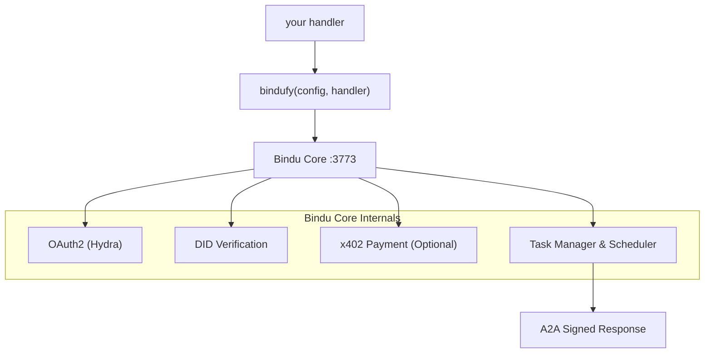

<p align="center">
  
</p>

<div align="center">


# Bindu

### AI முகவர்களுக்கான அடையாளம், தகவல் தொடர்பு மற்றும் கட்டண அடுக்கம்.

</div>

<br>

> **எந்த கட்டமைப்பிலும் உங்கள் முகவரை எழுதுங்கள். அதை `bindufy()` உடன் சுற்றுங்கள்.**
> **ஒரு கையொப்பமிட்ட A2A மைக்ரோசர்வீஸை அனுப்புங்கள் - அடையாளம், OAuth2 மற்றும் ஆன்-செயின் கட்டணங்களுடன் - பத்து வரி குறியீட்டில்.**

எழுத வேண்டிய உள்கட்டமைப்பு இல்லை. மீண்டும் எழுத வேண்டிய கட்டமைப்பு இல்லை. Python, TypeScript மற்றும் Kotlin இருந்து வேலை செய்கிறது, மற்றும் இரண்டு திறந்த நெறிமுறைகளின் அடிப்படையில்: [A2A](https://github.com/a2aproject/A2A) மற்றும் [x402](https://github.com/coinbase/x402).

<div align="center">

  <p>
    <a href="../README.md">English</a> ·
    <a href="README.de.md">Deutsch</a> ·
    <a href="README.es.md">Español</a> ·
    <a href="README.fr.md">Français</a> ·
    <a href="README.hi.md">हिंदी</a> ·
    <a href="README.bn.md">বাংলা</a> ·
    <a href="README.zh.md">中文</a> ·
    <a href="README.nl.md">Nederlands</a> ·
    <a href="README.ta.md">தமிழ்</a>
  </p>

  <p>
    <a href="https://opensource.org/licenses/Apache-2.0"></a>
    <a href="https://www.python.org/downloads/"></a>
    <a href="https://pypi.org/project/bindu/"></a>
    <a href="https://coveralls.io/github/Saptha-me/Bindu?branch=v0.3.18"></a>
    <a href="https://github.com/getbindu/Bindu/actions/workflows/release.yml"></a>
    <a href="https://discord.gg/3w5zuYUuwt"></a>
    <a href="https://github.com/getbindu/Bindu/graphs/contributors"></a>
    <a href="https://hits.sh/github.com/Saptha-me/Bindu.svg"></a>
  </p>

  <p>
    <a href="https://getbindu.com"><strong>உங்கள் முகவரை பதிவுசெய்யுங்கள்</strong></a> ·
    <a href="https://docs.getbindu.com"><strong>ஆவணம்</strong></a> ·
    <a href="https://discord.gg/3w5zuYUuwt"><strong>Discord</strong></a>
  </p>
</div>

---

## நீங்கள் பெறுவது

நீங்கள் `bindufy(config, handler)` உடன் ஒரு handler ஐ சுற்றும்போது, செயல்முறை நியமித நெறிமுறைகளை பேசுகிறது, ஒவ்வொரு பதிலும் கையொப்பமிடுகிறது, மற்றும் கட்டணம் பெற தயாராக உள்ளது. இது உங்களுக்கு என்ன செய்கிறது என்பதன் அடிப்படையில் வகைப்படுத்தப்பட்டது:

<br>

**நெறிமுறை - உலகுடன் பேசுங்கள்**

| திறன் | இதன் பொருள் |
|---|---|
| A2A JSON-RPC endpoint | மற்ற முகவர்கள் ஏற்கனவே பேசும் நியமித நெறிமுறை. போர்ட் 3773 இல் `message/send`, `tasks/get`, `message/stream`. |
| புஷ் அறிவிப்புகள் | பணி நிலை மாற்றத்தில் webhook callbacks - தேவையில்லாத polling. |
| மொழி-அறியாத | Python, TypeScript மற்றும் Kotlin SDKகள் ஒரு gRPC கோரைப் பகிர்கின்றன. அதே நெறிமுறை, அதே DID, அதே auth. |

<br>

**அடையாளம் & அணுகல் - யார் அழைக்கிறார் என்பதை நிரூபிக்கவும்**

| திறன் | இதன் பொருள் |
|---|---|
| DID அடையாளம் (Ed25519) | ஒவ்வொரு திரும்பப்பட்ட கலைப்பொருளும் கையொப்பமிடப்பட்டது. அழைப்பவர்கள் W3C-நியமித DID உடன் சரிபார்க்கின்றனர் - பகிரப்பட்ட ரகசியங்கள் இல்லை. |
| Ory Hydra வழியாக OAuth2 | ஒரு அனைத்து-அல்லது-ஒன்றுமில்லா bearer க்கு பதிலாக குறைந்த tokens (`agent:read`, `agent:write`, `agent:execute`). |

<br>

**வர்த்தகம் & எட்டுதல் - கட்டணம் பெறுங்கள் மற்றும் அணுகக்கூடியதாக இருங்கள்**

| திறன் | இதன் பொருள் |
|---|---|
| x402 கட்டணங்கள் | ஒரு கொடி மற்றும் முகவர் ஒரு கோரிக்கையை செயலாற்றுவதற்கு முன்பு Base இல் USDC வசூலிக்கிறது. கட்டண சரிபார்ப்பு உங்கள் handler க்கு முன் இயங்குகிறது. |
| பொது சுரங்கம் | `expose: true` ஒரு FRP சுரங்கத்தைத் திறக்குகிறது என்றால் உங்கள் உள்ளூர் முகவர் பொது இணையத்திலிருந்து அணுகக்கூடியதாக இருக்கும். |

---

## நிறுவல்

```bash
uv add bindu
```

சோதனைகளுடன் ஒரு மேம்பாட்டு செக்கவுட் செய்ய:

```bash
git clone https://github.com/getbindu/Bindu.git
cd Bindu
uv sync --dev
```

Python 3.12+ மற்றும் [uv](https://github.com/astral-sh/uv) தேவைப்படுகிறது. எடுத்துக்காட்டுதல்களை இயக்க குறைந்தபட்சம் ஒரு LLM வழங்குநருக்கு (`OPENROUTER_API_KEY`, `OPENAI_API_KEY`, அல்லது `MINIMAX_API_KEY`) ஒரு API விசை தேவைப்படுகிறது.

---

## வணக்கம் முகவர்

Bindu இன் முழு யோசனை ஒரு கோப்பியில் தெளிவாக தெரிகிறது - நீங்கள் விரும்பும் எந்த முகவரையும் உருவாக்குங்கள், அதை `bindufy()` க்கு கொடுங்கள், மற்றும் உங்கள் செயல்முறை ஒரு கையொப்பமிட்ட A2A மைக்ரோசர்வீஸாக வருகிறது. கீழே உள்ள தொகுப்பு முழுமையாக மற்றும் இயக்கக்கூடியது.

```python
import os
from bindu.penguin.bindufy import bindufy
from agno.agent import Agent
from agno.models.openai import OpenAIChat
from agno.tools.duckduckgo import DuckDuckGoTools

# 1. நீங்கள் விரும்பும் எந்த கட்டமைப்பிலும் உங்கள் முகவரை உருவாக்குங்கள். Bindu க்கு
#    அதன் உள் என்ன இருந்தாலும் பரவாது - அதற்கு வெறும் அழைக்கக்கூடிய ஏதாவது தேவை.
agent = Agent(
    instructions="You are a research assistant that finds and summarizes information.",
    model=OpenAIChat(id="gpt-4o"),
    tools=[DuckDuckGoTools()],
)

# 2. Bindu க்கு நீங்கள் யார் என்றும் முகவர் எங்கே வாழ்கிறது என்றும் சொல்லுங்கள். `expose: True`
#    ஒரு பொது FRP சுரங்கத்தைத் திறக்குகிறது - உள்ளூர்-மட்டும் இதை விட்டுவிடுங்கள்.
config = {
    "author": "you@example.com",
    "name": "research_agent",
    "description": "Research assistant with web search.",
    "deployment": {
        "url": os.getenv("BINDU_DEPLOYMENT_URL", "http://localhost:3773"),
        "expose": True,
    },
    "skills": ["skills/question-answering"],
}

# 3. Handler ஒப்பந்தம்: (messages) -> response. இதுவே போதும்.
def handler(messages: list[dict[str, str]]):
    return agent.run(input=messages)

# 4. bindufy() HTTP சர்வரைத் தொடங்குகிறது, உங்கள் DID ஐ உருவாக்குகிறது, Hydra உடன்
#    பதிவு செய்கிறது (auth இயக்கில் இருந்தால்), மற்றும் A2A அழைப்புகளை ஏற்கத் தொடங்குகிறது.
bindufy(config, handler)
```

இதை இயக்குங்கள், மற்றும் முகவர் கட்டமைசெய்யப்பட்ட URL இல் நேரடியாக உள்ளது. வேறு போர்ட் தேவையா? `BINDU_PORT=4000` ஏற்றுங்கள் - குறியீடு மாற்றம் இல்லை.

<details>
<summary>TypeScript சமமானது</summary>

```typescript
import { bindufy } from "@bindu/sdk";
import OpenAI from "openai";

const openai = new OpenAI();

bindufy({
  author: "you@example.com",
  name: "research_agent",
  description: "Research assistant.",
  deployment: { url: "http://localhost:3773", expose: true },
  skills: ["skills/question-answering"],
}, async (messages) => {
  const response = await openai.chat.completions.create({
    model: "gpt-4o",
    messages: messages.map(m => ({ role: m.role as "user" | "assistant" | "system", content: m.content })),
  });
  return response.choices[0].message.content || "";
});
```

TypeScript SDK தானாக Python கோரைத் தொடங்குகிறது. அதே நெறிமுறை, அதே DID. [`examples/typescript-openai-agent/`](examples/typescript-openai-agent/) இல் முழு எடுத்துக்காட்டு.

</details>

<details>
<summary>curl உடன் முகவரை அழைப்பது</summary>

```bash
curl -X POST http://localhost:3773/ \
  -H 'Content-Type: application/json' \
  -d '{
    "jsonrpc": "2.0",
    "method": "message/send",
    "id": "<uuid>",
    "params": {
      "message": {
        "role": "user",
        "kind": "message",
        "parts": [{"kind": "text", "text": "Hello"}],
        "messageId": "<uuid>",
        "contextId": "<uuid>",
        "taskId": "<uuid>"
      }
    }
  }'
```

அதே `taskId` உடன் `tasks/get` ஐ poll செய்யுங்கள் நிலை `completed` ஆகும் வரை. திரும்பப்பட்ட கலைப்பொருள் `metadata["did.message.signature"]` கீழ் ஒரு DID கையொப்பத்தை கொண்டு வருகிறது.

</details>

---

## இது எப்படி பொருந்துகிறது

அப்படி அந்த `bindufy()` அழைப்பு இயங்கும்போது உண்மையில் என்ன நடக்கிறது? Handler என்பது நீங்கள் எழுதும் ஒரே குறியீடு. மற்ற எல்லாம் Bindu அதைச் சுற்றி வைக்கும் scaffolding:



`bindufy()` ஒரு மெல்லிய wrapper. உங்கள் handler தூய்மையாக இருக்கும் - `(messages) -> response`. Bindu அடையாளம், நெறிமுறை, auth, கட்டணம், சேமிப்பு மற்றும் திட்டமிடலை சொந்தமாக்கிறது.

---

## ஒரு பாதுகாப்பான முகவரை அழைப்பது

> **TL;DR** - `AUTH__ENABLED=true` இருந்தால், ஒவ்வொரு அழைப்பிற்கும் ஒரு Hydra bearer token மற்றும் மூன்று `X-DID-*` headers தேவைப்படுகிறது. Python client: ~25 வரிகள், [கீழே](#step-2--pick-your-client). Postman: ஒரு script ஒட்டவும். இந்த பிரிவின் மீதம் ஏன் மற்றும் எப்படி என்பதை விளக்குகிறது, மற்றும் எது தவறாக நடந்தால் என்ன நடக்கும்.

*வணக்கம் முகவர்* இல் `curl` எடுத்துக்காட்டு auth இயக்கில் இருப்பதால் வேலை செய்கிறது - யார் வேண்டும் உங்கள் முகவருக்கு POST செய்யலாம். நீங்கள் `AUTH__ENABLED=true AUTH__PROVIDER=hydra` என்று மாற்றும்போது, உங்கள் முகவர் கடுமையாகிறது. இப்போது ஒவ்வொரு அழைப்பவரும் handler இயங்குவதற்கு முன் இரண்டு கேள்களுக்கு பதிலள் அளிக்க வேண்டும்:

1. **என்னை அழைக்க அனுமதி உள்ளதா?** - Hydra இருந்து ஒரு சரியான OAuth2 token காட்டுங்கள்.
2. **நீங்கள் சொல்வது போலவே நீங்கள் உண்மையில் நீங்களா?** - ஒரு DID விசையுடன் கோரிக்கையை கையொப்பமிடுங்கள்.

இதை ஒரு விமானத்தில் ஏறுவது போல நினைவு செய்யுங்கள்: போர்டிங் பாஸ் (OAuth token) "ஆமாம், இந்த விமானத்தில் உங்களுக்கு ஒரு இருக்கை உள்ளது" என்று கூறுகிறது, மற்றும் பாஸ்போர்ட் (DID கையொப்பம்) "மேலும் நீங்கள் அந்த போர்டிங் பாஸில் உள்ள நபர் நீங்கள்தான்" என்று கூறுகிறது. சர்வர் இரண்டையும் சரிபார்க்கிறது.

முழு கோட்பு [`docs/AUTHENTICATION.md`](docs/AUTHENTICATION.md) மற்றும் [`docs/DID.md`](docs/DID.md) இல் உள்ளது - எளிய ஆங்கிலம், crypto பின்னணி எதுவும் கருதிக்கப்படவில்லை. இதைத் தொடர்ந்து வருவது நடைமுறை "நான என் முகவரை அழைக்க விரும்புகிறேன்" பதிப்பு.

<br>

### மூன்று கூடுதல் headers

வழக்க `Authorization: Bearer <hydra-jwt>` உடன், ஒவ்வொரு பாதுகாப்பான கோரிக்கையும் கொண்டு வருகிறது:

| Header | மதிப்பு |
|---|---|
| `X-DID` | உங்கள் DID string, எ.கா `did:bindu:you_at_example_com:myagent:<uuid>` |
| `X-DID-Timestamp` | தற்போதைய unix நொடிகள் (சர்வர் 5 நிமிட வித்தியாடத்தை அனுமதிக்கிறது) |
| `X-DID-Signature` | `base58( Ed25519_sign( <signing payload> ) )` |

**கையொப்பு payload** சர்வரில் இவ்வாறு மீண்டும் கட்டமைக்கப்படுகிறது:

```python
json.dumps({"body": <raw-body-string>, "did": <did>, "timestamp": <ts>}, sort_keys=True)
```

நீங்கள் உணரும் வரை இரண்டு பொறுக்கள்:

- **Python இன் JSON இடைவெளியுடன் பொருந்துங்கள்.** Python இன் இயல்பான `json.dumps` `", "` மற்றும் `": "` (இடைவெளிகளுடன்) எழுகிறது. JS இல் `JSON.stringify` அவற்றை இல்லாமல் எழுகிறது. உங்கள் payload வேறுவாறு வரிசைப்பட்டால், Ed25519 வேறு bytes காணுகிறது மற்றும் சர்வர் `reason="crypto_mismatch"` திரும்பப்புகிறது.
- **நீங்கள் அனுப்புவதை கையொப்பமிடுங்கள்.** நீங்கள் body ஐ parse செய்து, மாற்றி, மீண்டும் வரிசைப்பட்டு அனுப்பினால் - நீங்கள் தவறான bytes ஐ கையொப்பமிட்டுள்ளீர்கள். body string ஐ **ஒருமுறை** உருவாக்குங்கள், அந்த சரியான bytes ஐ கையொப்பமிடுங்கள், அந்த சரியான bytes ஐ அனுப்புங்கள்.

<br>

### படி 1 - Hydra இருந்து ஒரு bearer token பெறுங்கள்

முகவர் அதன் தொடக்க பேனரில் ஒரு தயார்-இயக்க curl ஐ அச்சிடுகிறது. குறைந்த பதிப்பு:

```bash
SECRET=$(jq -r '.[].client_secret' < .bindu/oauth_credentials.json)
curl -X POST https://hydra.getbindu.com/oauth2/token \
  -H "Content-Type: application/x-www-form-urlencoded" \
  -d "grant_type=client_credentials" \
  -d "client_id=did:bindu:you_at_example_com:myagent:<uuid>" \
  -d "client_secret=$SECRET" \
  -d "scope=openid offline agent:read agent:write"
```

பதிலில் ஒரு `access_token` உள்ளது. அது ஒரு மணி நல்லது - அதை cache செய்யுங்கள், தேவைப்படும்போது மீண்டும் பெறுங்கள்.

<br>

### படி 2 - உங்கள் client ஐ தேர்வு செய்யுங்கள்

**Python - செயல்படுத்தக்கூடிய மிககுறைந்த எடுத்துக்காட்டு.** முகவரின் சொந்த விசைகளைப் படிக்கிறது (Bindu அவற்றை முதல் boot இல் `.bindu/` இல் எழுகிறது), ஒரு கோரிக்கையை கையொப்பமிடுகிறது, முடிவுக்காக poll செய்கிறது. Self-call வேலை செய்கிறது ஏனெனில் முகவரின் விசைகள் ஒரு சரியான அழைப்பவர் அடையாளம்.

```python
import base58, httpx, json, time, uuid
from pathlib import Path
from cryptography.hazmat.primitives import serialization

# 1. முதல் boot இல் Bindu எழுதிய விசைகளை ஏற்றுங்கள்
priv  = serialization.load_pem_private_key(Path(".bindu/private.pem").read_bytes(), password=None)
creds = next(iter(json.loads(Path(".bindu/oauth_credentials.json").read_text()).values()))
did   = creds["client_id"]            # DID Hydra client_id ஆகவும் பணியாற்றுகிறது

# 2. credentials ஐ ஒரு குறுகிய ஆயுளுக்கு பரிமாற்றுங்கள்
bearer = httpx.post("https://hydra.getbindu.com/oauth2/token", data={
    "grant_type": "client_credentials",
    "client_id": creds["client_id"], "client_secret": creds["client_secret"],
    "scope": "openid offline agent:read agent:write",
}).json()["access_token"]

# 3. body ஐ ஒருமுறை உருவாக்குங்கள் - இவை தான் நாம் கையொப்பமித்து அனுப்புவோம் bytes
tid = str(uuid.uuid4())
body = json.dumps({
    "jsonrpc": "2.0", "method": "message/send", "id": str(uuid.uuid4()),
    "params": {"message": {
        "role": "user", "kind": "message",
        "parts": [{"kind": "text", "text": "Hello!"}],
        "messageId": str(uuid.uuid4()), "contextId": str(uuid.uuid4()), "taskId": tid,
    }},
})

# 4. கையொப்பு: base58(Ed25519( json.dumps({body,did,timestamp}, sort_keys=True) ))
ts      = int(time.time())
payload = json.dumps({"body": body, "did": did, "timestamp": ts}, sort_keys=True)
sig     = base58.b58encode(priv.sign(payload.encode())).decode()

# 5. அதை சுடுங்கள்
r = httpx.post("http://localhost:3773/", content=body, headers={
    "Content-Type":    "application/json",
    "Authorization":   f"Bearer {bearer}",
    "X-DID":           did,
    "X-DID-Timestamp": str(ts),
    "X-DID-Signature": sig,
})
print(r.status_code, r.json())
```

Polling மற்றும் பிழை கையாளுடன் முழு பதிப்புக்கு, பாருங்கள் - [`examples/hermes_agent/call.py`](examples/hermes_agent/call.py).

<br>

**Postman - உங்கள் சேகரியில் ஒரு script ஒட்டவும்.**

1. உங்கள் சேகரியைத் திறக்குங்கள் → tab **Pre-request Script** → [`docs/postman-did-signing.js`](docs/postman-did-signing.js) இன் உள்ளடக்கத்தை ஒட்டவும்.
2. இரண்டு சேகரி மாறிகளை அமைக்குங்கள்: `bindu_did` (உங்கள் DID string) மற்றும் `bindu_did_seed` (உங்கள் 32-பைட் Ed25519 seed, base64-குறியீடப்பட்டது).
3. ஒரு `Authorization: Bearer {{bindu_bearer}}` header ஐச் சேர்க்குங்கள் மற்றும் உங்கள் Hydra token ஐ `bindu_bearer` இல் விடுங்கள்.
4. Send அழுங்கள். Script Postman அனுப்பபோகும் சரியான body bytes ஐ கையொப்பமிடுகிறது மற்றும் உங்களுக்கு மூன்று `X-DID-*` headers ஐ அமைக்கிறது.

Postman Desktop v11+ தேவைப்படுகிறது (`crypto.subtle` க்கு Ed25519 தேவைப்படுகிறது).

<br>

**சாதாரண curl - தொழில்நுட்பமாக சாத்தியம், பொதுவாக வேதனையுடன்.** கையொப்பு நீங்கள் அனுப்பபோகும் body bytes ஐப் பொறுத்தது, எனவே நீங்களுக்கு முதலில் கையொப்பு கணக்க ஒரு உதவி script தேவைப்படும், பின்னர் அதை curl அழைப்பில் மாற்றுங்கள். நீங்கள் இதைச் செய்தால், நீங்கள் மேலே உள்ள Python client ஐப் பயன்படுத்து நன்றாக இருப்பீர்கள்.

<br>

### கையொப்புகள் தோற்றினால்

சர்வர் மூன்று காரணங்களில் ஒன்றை பதிவு செய்கிறது. உங்கள் கோரிக்கை 403 உடன் மறுக்கப்பட்டால், ஆபரேட்டரைக் கேளுங்கள் (அல்லது சர்வர் log ஐ சுயம் சரிபார்க்கவும்):

| Log கூறுகிறது | அதன் பொருள் | தீர்வு |
|---|---|---|
| `timestamp_out_of_window` | உங்கள் `X-DID-Timestamp` சர்வர் கடிகையிலிருந்து 5 நிமிடக்கு மேல் உள்ளது, அல்லது நீங்கள் ஒரு பழைய timestamp ஐ மீண்டும் பயன்படுத்துள்ளீர்கள் | ஒவ்வொரு கோரிக்கையிலும் `int(time.time())` ஐ மீண்டும் கணக்குங்கள் |
| `malformed_input` | கையொப்பு அல்லது பொது விசையின் base58 decoding தோல்வியடுகிறது | `X-DID-Signature` URL-குறியீடப்பட்டது, அறுப்பட்டது, அல்லது மேறோட்டுகளில் சுற்றப்பட்டது என்பதை சரிபார்க்கவும் |
| `crypto_mismatch` | நீங்கள் கையொப்பிய bytes ≠ நீங்கள் அனுப்பிய bytes | payload ஐ `sort_keys=True` மற்றும் Python இன் இயல்பான JSON இடைவெளியுடன் மீண்டும் கட்டமைக்குங்கள்; மூல body string ஐ ஒருமுறை கையொப்பமிடுங்கள் மற்றும் அதே bytes ஐ அனுப்புங்கள் |

சோதனைகளில் நாம் ஒரு கடுமையான தோல்வு முறையை சந்தித்தோம்: `crypto_mismatch` தொடர்ந்தால் மற்றும் நீங்கள் உங்கள் bytes பொருந்துவது *உறுதியாக* இருந்தால், இந்த DID க்கு Hydra இன் சேமித்த பொது விசை ஒரு பழைய பதிவிலிருந்து பழையாக இருக்கலாம். தீர்வு: முகவரை நிறுத்துங்கள், `.bindu/oauth_credentials.json` ஐ நீக்குங்கள், மீண்டும் தொடங்குங்கள் - Hydra இன் client record தற்போதை விசைகளுடன் புதுப்பிக்கப்படும்.

---

## Gateway - மல்டி-முகவர் ஆர்கெஸ்ட்ரேஷன்

ஒரு `bindufy()` சுற்றப்பட்ட முகவர் ஒரு மைக்ரோசர்வீஸ். **Bindu Gateway** ஒரு பணி-முதல் orchestrator அதன் மேல் அமர்கிறது: அதற்கு ஒரு பயனர் கேள்சை மற்றும் A2A முகவர்களின் ஒரு கேடலாக் கொடுங்கள், மற்றும் ஒரு planner-LLM வேலையை உடைக்குகிறது, A2A வழியாக சரியான முகவர்களை அழைக்கிறது மற்று முடிவுகளை Server-Sent Events ஆக ஸ்ட்ரீம் செய்கிறது. எந்த DAG engine இல்லை, எந்த தனி orchestrator service இல்லை - planner-LLM ஒவ்வொரு டர்னில் tools ஐ தேர்வு செய்கிறது.

ஒரு முகவருக்கு மேல் நீங்கள் பெறுவது:

- **ஒரு endpoint: `POST /plan`** - அதற்கு ஒரு கேள்சை மற்றும் ஒரு முகவர் கேடலாக் கொடுங்கள், ஸ்ட்ரீம் செய்யப்பட்ட படிகளைப் பெறுங்கள்.
- **கோரிக்கைக்கு முகவர் கேடலாக்** - வெளி அமைப்புகள் முகவர்கள், திறன்கள் மற்று endpoints இன் பட்டியை கடத்துகின்றன. Gateway தானாக எந்த fleet ஐயும் host செய்யாது.
- **அமர்வு persistence (Supabase)** - Postgres-backed உடன் சுருக்கம், rollback மற்றும் multi-turn வரலாறு.
- **Native TypeScript A2A** - எந்த Python subprocess இல்லை, gateway இல் எந்த `@bindu/sdk` சார்பு இல்லை.
- **விருப்ப DID கையொப்பம் + Hydra ஒருங்கம்** - gateway end-to-end அடையாளம்.

குறைந்த quickstart:

```bash
cd gateway
npm install
cp .env.example .env.local         # fill SUPABASE_*, GATEWAY_API_KEY, OPENROUTER_API_KEY
npm run dev                        # → http://localhost:3774
curl -sS http://localhost:3774/health
```

முதல் இரண்டு Supabase migrations ஐ பயன்படுத்துங்கள் (`gateway/migrations/001_init.sql`, `002_compaction_revert.sql`). முழு walkthrough மற்றும் operator குறிப்பு [`gateway/README.md`](gateway/README.md) மற்றும் [`docs/GATEWAY.md`](docs/GATEWAY.md) இல் உள்ளன (45-நிமிட end-to-end: சுத்த க்லோன் → மூன்று சங்கிலித முகவர்கள் → ஒரு ரெசிப்பி எழுதல் → DID கையொப்பம்).

Gateway ஆவணம்:

| தலைப்பு | இணைப்பு |
|---|---|
| கண்ணோட்டம் | [docs.getbindu.com/bindu/gateway/overview](https://docs.getbindu.com/bindu/gateway/overview) |
| Quickstart | [docs.getbindu.com/bindu/gateway/quickstart](https://docs.getbindu.com/bindu/gateway/quickstart) |
| மல்டி-முகவர் திட்டமிடல் | [docs.getbindu.com/bindu/gateway/multi-agent](https://docs.getbindu.com/bindu/gateway/multi-agent) |
| ரெசிப்கள் (progressive-disclosure playbooks) | [docs.getbindu.com/bindu/gateway/recipes](https://docs.getbindu.com/bindu/gateway/recipes) |
| அடையாளம் (DID கையொப்பம், Hydra) | [docs.getbindu.com/bindu/gateway/identity](https://docs.getbindu.com/bindu/gateway/identity) |
| உற்பத்தி டெப்ளாய்மெண்ட் | [docs.getbindu.com/bindu/gateway/production](https://docs.getbindu.com/bindu/gateway/production) |
| API குறிப்பு | [docs.getbindu.com/api/introduction](https://docs.getbindu.com/api/introduction) |

ஒரு இயக்கக்கூடிய மல்டி-முகவர் demo க்கு, பாருங்கள் [`examples/gateway_test_fleet/`](examples/gateway_test_fleet/) - உள்ளூர் போர்டுகளில் ஐந்து சிறிய முகவர்கள், ஒரு gateway, ஒரு கேள்சை.

---

## ஆதரிக்கப்பட்ட frameworks மற்றும் எடுத்துக்காட்டுகள்

நீங்கள் ஏற்கனவே விரும்பும் எந்த முகவர் framework ஐயும் கொண்டு வாருங்கள். நீங்கள் Bindu க்கு ஒரு handler கொடுகிறீர்கள்; அது உங்களுக்கு ஒரு கையொப்பமிட்ட A2A மைக்ரோசர்வீஸைக் கொடுகிறது. Handler இல் என்ன இருந்தாலும், பாய் ஒன்றே.

<br>

| மொழி | இந்த repo இல் சோதிக்கப்பட்ட frameworks |
|---|---|
| **Python** | [AG2](https://github.com/ag2ai/ag2) · [Agno](https://github.com/agno-agi/agno) · [CrewAI](https://github.com/joaomdmoura/crewAI) · [Hermes Agent](https://github.com/NousResearch/hermes-agent) · [LangChain](https://github.com/langchain-ai/langchain) · [LangGraph](https://github.com/langchain-ai/langgraph) · [Notte](https://github.com/nottelabs/notte) |
| **TypeScript** | [OpenAI SDK](https://github.com/openai/openai-node) · [LangChain.js](https://github.com/langchain-ai/langchainjs) |
| **Kotlin** | [OpenAI Kotlin SDK](https://github.com/aallam/openai-kotlin) |
| **வேறு எந்த மொழி** | [gRPC கோர்](docs/grpc/) வழியாக - சில நூறு வரிகளில் ஒரு SDK சேர்க்கவும் |

OpenAI அல்லது Anthropic API பேசும் எந்த LLM வழங்குநருடன் இணக்கப்படும்: [OpenRouter](https://openrouter.ai/) (100+ மாதிரிகள்), [OpenAI](https://platform.openai.com/), [MiniMax](https://platform.minimaxi.com), மற்றும் மற்றவர்.

<br>

### தொடங்க சில எடுத்துக்காட்டுகள்

ஐந்து Bindu என்ன செய்ய முடிய ஸ்பெக்ட்ரத்தை கவர் செய்கின்றன. அனைத்து 20+ இயக்கக்கூடிய எடுத்துக்காட்டுகள் [`examples/`](examples/) இன் கீழே உள்ளன.

| எடுத்துக்காட்டு | அது என்ன காட்டுகிறது |
|---|---|
| [Agent Swarm](examples/agent_swarm/) | மல்டி-முகவர் ஒத்துரிப்பு - ஒரு சிறிய "சமூகம்" Agno முகவர்கள் ஒருவருக்கு பணிகளை ஒதுவருக்கு ஒதுப்பவது. |
| [Premium Advisor](examples/premium-advisor/) | **x402 கட்டணங்கள்** - அழைப்பவர் handler இயங்குவதற்கு முன் Base இல் USDC செலுவதித்த வேண்டும். |
| [Hermes via Bindu](examples/hermes_agent/) | **Third-party framework interop** - Nous Research இன் Hermes முகவர் ~90 வரிகளில் bindufied. |
| [Gateway Test Fleet](examples/gateway_test_fleet/) | ஐந்து சிறிய முகவர்கள் + ஒரு gateway - மல்டி-முகவர் orchestratio கதை end-to-end. |
| [TypeScript OpenAI Agent](examples/typescript-openai-agent/) | **Polyglot நிரூபம்** - ஒரு TS முகவர் Bindu TS SDK உடன் bindufied; Python எழுக தேவையில்லை. |

**முழு கேடலாக்களைப் பாருங்கள்:** [`examples/`](examples/) - 20+ முகவர்கள் CSV பகுப்பாய்வு, PDF Q&A, speech-to-text, web scraping, cybersecurity செய்திகள், பல்மொழி ஒத்துரிப்பு, வலைப்பு எழுதல் மற்றும் பலவறை கவர் செய்கின்றன.

நீங்கள் பயன்படும் framework காணுவது இல்லையா? ஒரு issue திறக்கவும் அல்லது [Discord](https://discord.gg/3w5zuYUuwt) இல் கேளுங்கள்.

---

## டெமோ

<div align="center">
  <a href="https://www.youtube.com/watch?v=qppafMuw_KI">
    
  </a>
</div>

`cd bindu-communication && npm run dev` இயக்கிய பிறகு, `http://localhost:3775` இல் ஒரு உள்ளமைந்த chat UI கிடைக்கிறது.

<p align="center">
  
</p>

---

## முக்கிய அம்சங்கள்

கீழே எல்லாம் விருப்பமானது மற்றும் மாடுலராகப்பட்டது - குறைந்த நிறுவல் வெறும் A2A சர்வர். ஒவ்வொரு வரி [`docs/`](docs/) இல் ஒரு குறிப்பிட்ட வழிக்கு இணைக்கிறது.

<br>

**அடையாளம் & அணுகல்**

| அம்சம் | வழிக்கு |
|---|---|
| மையவின்றியல்கள் (DIDs) | [DID.md](docs/DID.md) |
| பயனாளம் (Ory Hydra OAuth2) | [AUTHENTICATION.md](docs/AUTHENTICATION.md) |

<br>

**நெறிமுறை & உள்கட்டமைப்பு**

| அம்சம் | வழிக்கு |
|---|---|
| திறன் அமைப்பு | [SKILLS.md](docs/SKILLS.md) |
| முகவர் பேரம்பு | [NEGOTIATION.md](docs/NEGOTIATION.md) |
| புஷ் அறிவிப்புகள் | [NOTIFICATIONS.md](docs/NOTIFICATIONS.md) |
| PostgreSQL சேமிப்பு | [STORAGE.md](docs/STORAGE.md) |
| Redis planner | [SCHEDULER.md](docs/SCHEDULER.md) |
| gRPC வழியாக மொழி-அறியாத | [GRPC_LANGUAGE_AGNOSTIC.md](docs/GRPC_LANGUAGE_AGNOSTIC.md) |

<br>

**வர்த்தகம் & எட்டுதல்**

| அம்சம் | வழிக்கு |
|---|---|
| x402 கட்டணங்கள் (Base இல் USDC) | [PAYMENT.md](docs/PAYMENT.md) |
| Tunneling (உள்ளூர் dev மட்டும்) | [TUNNELING.md](docs/TUNNELING.md) |

<br>

**நம்பகர்ப்பு & செயல்கள்**

| அம்சம் | வழிக்கு |
|---|---|
| எக்ஸ்போனென்ஷியல் backoff உடன் retry | [Retry docs](https://docs.getbindu.com/bindu/learn/retry/overview) |
| Observability (OpenTelemetry, Sentry) | [OBSERVABILITY.md](docs/OBSERVABILITY.md) |
| Health check மற்றும் metrics | [HEALTH_METRICS.md](docs/HEALTH_METRICS.md) |

---

| சோதனை

Bindu 70% சோதனை கவரேஜை நோக்குகிறது (இலக்கு: 80%+):

```bash
uv run pytest tests/unit/ -v                                    # வேக unit tests
uv run pytest tests/integration/grpc/ -v -m e2e                 # gRPC E2E
uv run pytest -n auto --cov=bindu --cov-report=term-missing     # முழு suite
```

CI ஒவ்வொரு PR இல் unit tests, gRPC E2E மற்றுm TypeScript SDK build இயக்குகிறது. பாருங்கள் [`.github/workflows/ci.yml`](.github/workflows/ci.yml).

---

## சிக்கல் தீர்வு

<details>
<summary>பொதுவான சிக்கல்கள்</summary>

| சிக்கல் | தீர்வு |
|---|---|
| `uv: command not found` | uv நிறுவித்த பிறகு உங்கள் shell ஐ மீண்டும் தொடங்குங்கள். |
| `Python version not supported` | [python.org](https://www.python.org/downloads/) இருந்து அல்லது `pyenv` வழியாக Python 3.12+ நிறுவுங்கள். |
| `bindu: command not found` | உங்கள் virtualenv ஐ செயல்படுத்துங்கள்: `source .venv/bin/activate`. |
| `Port 3773 already in use` | `BINDU_PORT=4000` அமைக்குங்கள், அல்லது `BINDU_DEPLOYMENT_URL=http://localhost:4000` உடன் override செய்யுங்கள். |
| `ModuleNotFoundError` | `uv sync --dev` இயக்குங்கள். |
| Pre-commit தோற்றுகிறது | `pre-commit run --all-files` இயக்குங்கள். |
| `Permission denied` (macOS) | விரிவுத்த பண்புகளை அழிக்க `xattr -cr .`. |

சூழலை மீண்டும் அமைக்குங்கள்:

```bash
rm -rf .venv && uv venv --python 3.12.9 && uv sync --dev
```

Windows PowerShell இல் நீங்களுக்கு `Set-ExecutionPolicy RemoteSigned -Scope CurrentUser` தேவைப்படலாம்.

</details>

---

## அறியப்பட்ட சிக்கல்கள்

நீங்கள் Bindu ஐ உற்பத்தியில் இயக்கும்போது, முதலில [`bugs/known-issues.md`](bugs/known-issues.md) படியுங்கள். இது workarounds உடன் ஒரு per-subsistem கேடலாக். சரிசையான bugs க்கான postmortems [`bugs/core/`](bugs/core/), [`bugs/gateway/`](bugs/gateway/), [`bugs/sdk/`](bugs/sdk/) இன் கீழே உள்ளன.

தற்போது உயர்-தீவிரம் உருப்புகள்:

| Subsystem | Slug | அறிகுறி |
|---|---|---|
| Core | [`x402-middleware-fails-open-on-body-parse`](bugs/known-issues.md#x402-middleware-fails-open-on-body-parse) | முறையற்ற JSON body கட்டண சரிபார்ப்பை தவிர்க்கிறது |
| Core | [`x402-no-replay-prevention`](bugs/known-issues.md#x402-no-replay-prevention) | ஒரு கட்டணம் `validBefore` வரை அறியற்ற வேலை வாங்குகிறது |
| | [`x402-no-signature-verification`](bugs/known-issues.md#x402-no-signature-verification) | EIP-3009 கையொப்பம் ஒரும் சரிபார்க்கப்படவில்லை |
| Core | [`x402-balance-check-skipped-on-missing-contract-code`](bugs/known-issues.md#x402-balance-check-skipped-on-missing-contract-code) | தவறாக கட்டமைப்பட்ட RPC சத்தமாயாக பேலன்ஸ் சரிபார்ப்பை தவிர்க்கிறது |
| Gateway | [`context-window-hardcoded`](bugs/known-issues.md#context-window-hardcoded) | சுருக்கம் செயலின் 200k-டோகன் சாளரத்தை கருதுகிறது |
| Gateway | [`poll-budget-unbounded-wall-clock`](bugs/known-issues.md#poll-budget-unbounded-wall-clock) | `sendAndPoll` ஒரு tool அழைப்புக்கு 5 நிமிட நிறுத்திருக்கலாம் |
| Gateway | [`no-session-concurrency-guard`](bugs/known-issues.md#no-session-concurrency-guard) | ஒரே அமர்வில் இரண்டு `/plan` அழைப்புகள் வரலாற்றை குழப்புகின்றன |

புதிய சிக்கல் கண்டைப்பதா? slug குறிப்பிட்டு ஒரு GitHub Issue திறக்கவும் (எ.கா *"Fixes `context-window-hardcoded`"*). ஒன்று தீர்த்தா? `known-issues.md` இருந்து அதன் உள்ளீயை நீக்குங்கள் மற்று ஒரு தேதியிட்ட postmortem சேர்க்கவும் - வார்ப்புக்கு க்கு [`bugs/README.md`](bugs/README.md) பாருங்கள்.

---

## பங்கள்

க்லோன் செய்யு, அமைக்கு, மற்று pre-commit hooks இயக்குங்கள்:

```bash
git clone https://github.com/getbindu/Bindu.git
cd Bindu
uv venv --python 3.12.9 && source .venv/bin/activate
uv sync --dev
pre-commit run --all-files
```

விவாதாரணம் மற்றும் உதவி [Discord](https://discord.gg/3w5zuYUuwt) இல் நடக்கிறது. முழு வழிக்கு [`.github/contributing.md`](.github/contributing.md) இல் உள்ளது. நாம் bindufied பார்க்க விரும்பும் முகவர்களின் ஒரு திறந்த பட்டியம் உள்ளது - [பங்களளுங்கள்](https://www.notion.so/getbindu/305d3bb65095808eac2bf720368e9804?v=305d3bb6509580189941000cfad83ae7&source=copy_link).

---

| பராமரிப்பவர்கள்

<table>
  <tr>
    <td align="center"><a href="https://github.com/raahulrahl"><br /><sub><b>Raahul Dutta</b></sub></a></td>
    <td align="center"><a href="https://github.com/Paraschamoli"><br /><sub><b>Paras Chamoli</b></sub></a></td>
    <td align="center"><a href="https://github.com/chandan-1427"><br /><sub><b>Chandan</b></sub></a></td>
  </tr>
</table>

---

## அங்கீரங்கள்

Bindu இவர்களின் தோள்களில் நிற்கியுள்ளது:

[FastA2A](https://github.com/pydantic/fasta2a) · [A2A](https://github.com/a2aproject/A2A) · [x402](https://github.com/coinbase/x402) · [Hugging Face chat-ui](https://github.com/huggingface/chat-ui) · [12 Factor Agents](https://github.com/humanlayer/12-factor-agents/blob/main/content/factor-11-trigger-from-anywhere.md) · [OpenCode](https://github.com/anomalyco/opencode) · [OpenMoji](https://openmoji.org/library/emoji-1F33B/) · [ASCII Space Art](https://www.asciiart.eu/space/other)

---

## உரிமை

Apache 2.0. பாருங்கள் [LICENSE.md](LICENSE.md).

<p align="center">
  <a href="https://api.star-history.com/svg?repos=getbindu/Bindu&type=Date">
    
  </a>
</p>

<br/>
<br/>

<p align="center">
  
</p>

<p align="center">
  <em>"நாம் சூரியம் தத்தியில் நம்பகிறோம் - ஒன்பாக நின்று, முகவர் இணையத்திற்கு நம்பம் மற்று ஒளியை கொண்டு கொண்டு வருகிறோம்."</em>
</p>

<p align="center">
  <em>யோசனையிலிருந்து முகவர் இணையத்திற்கு 2 நிமிடில்.</em>
  <em>உங்கள் முகவர். உங்கள் framework. உலகள் நெறிமுறைகள்.</em>
</p>

<p align="center">
  <a href="https://github.com/getbindu/Bindu">GitHub இல் எங்களுக்கு நட்சை வழங்கள்</a> •
  <a href="https://discord.gg/3w5zuYUuwt">Discord இல் சேருங்கள்</a> •
  <a href="https://docs.getbindu.com">ஆவணம் படியுங்கள்</a>
</p>

<p align="center">
  <sub>
    Amsterdam மற்று India இடையில் உருவாக்கப்பட்டது · Apache 2.0 கீழ் ஓபன் சோர்ஸ் ·
    <a href="https://getbindu.com">getbindu.com</a>
  </sub>
</p>
