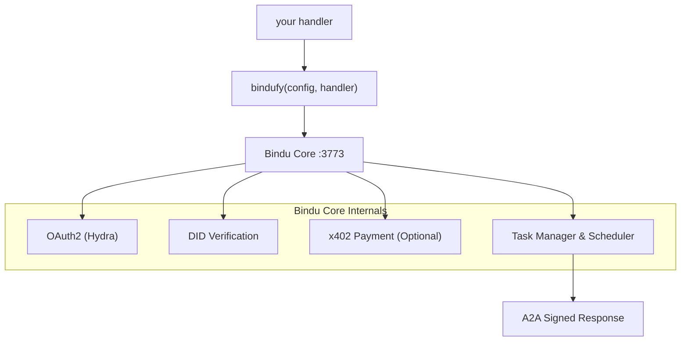

<p align="center">
  
</p>

<div align="center">


# Bindu

### AI 智能体的身份、通信和支付层。

</div>

<br>

> **用任何框架编写您的智能体。用 `bindufy()` 包装它。**
> **发送一个签名的 A2A 微服务 - 身份、OAuth2 和链上支付 - 十行代码。**

无需编写基础设施。无需重写框架。从 Python、TypeScript 和 Kotlin 运行，基于两个开放协议：[A2A](https://github.com/a2aproject/A2A) 和 [x402](https://github.com/coinbase/x402)。

<div align="center">

  <p>
    <a href="../README.md">English</a> ·
    <a href="README.de.md">Deutsch</a> ·
    <a href="README.es.md">Español</a> ·
    <a href="README.fr.md">Français</a> ·
    <a href="README.hi.md">हिंदी</a> ·
    <a href="README.bn.md">বাংলা</a> ·
    <a href="README.zh.md">中文</a> ·
    <a href="README.nl.md">Nederlands</a> ·
    <a href="README.ta.md">தமிழ்</a>
  </p>

  <p>
    <a href="https://opensource.org/licenses/Apache-2.0"></a>
    <a href="https://www.python.org/downloads/"></a>
    <a href="https://pypi.org/project/bindu/"></a>
    <a href="https://coveralls.io/github/Saptha-me/Bindu?branch=v0.3.18"></a>
    <a href="https://github.com/getbindu/Bindu/actions/workflows/release.yml"></a>
    <a href="https://discord.gg/3w5zuYUuwt"></a>
    <a href="https://github.com/getbindu/Bindu/graphs/contributors"></a>
    <a href="https://hits.sh/github.com/Saptha-me/Bindu.svg"></a>
  </p>

  <p>
    <a href="https://getbindu.com"><strong>注册您的智能体</strong></a> ·
    <a href="https://docs.getbindu.com"><strong>文档</strong></a> ·
    <a href="https://discord.gg/3w5zuYUuwt"><strong>Discord</strong></a>
  </p>
</div>

---

## 您将获得

当您用 `bindufy(config, handler)` 包装一个 handler 时，进程会以标准协议启动，对每个响应进行签名，并准备好接受支付。按它为您做什么分组：

<br>

**协议 - 与世界对话**

| 能力 | 意味着什么 |
|---|---|
| A2A JSON-RPC endpoint | 其他智能体已经讲的标准协议。在端口 3773 上的 `message/send`、`tasks/get`、`message/stream`。 |
| 推送通知 | 任务状态更改时的 webhook 回调 - 无需轮询。 |
| 语言无关 | Python、TypeScript 和 Kotlin SDK 共享一个 gRPC 核心。相同的协议、相同的 DID、相同的 auth。 |

<br>

**身份与访问 - 证明谁在调用**

| 能力 | 意味着什么 |
|---|---|
| DID 身份 (Ed25519) | 每个返回的工件都已签名。调用者使用 W3C 标准 DID 验证 - 无共享密钥。 |
| 通过 Ory Hydra 的 OAuth2 | 作用域令牌（`agent:read`、`agent:write`、`agent:execute`）而不是一个全有或全无的 bearer。 |

<br>

**贸易与触达 - 接收支付和可达**

| 能力 | 意味着什么 |
|---|---|
| x402 支付 | 一个标志，智能体在处理请求之前在 Base 上收取 USDC。支付检查在您的 handler 之前运行。 |
| 公共隧道 | `expose: true` 打开一个 FRP 隧道，以便您的本地智能体可以从公共互联网访问。 |

---

## 安装

```bash
uv add bindu
```

对于带有测试的开发检出：

```bash
git clone https://github.com/getbindu/Bindu.git
cd Bindu
uv sync --dev
```

需要 Python 3.12+ 和 [uv](https://github.com/astral-sh/uv)。至少需要一个 LLM 提供商（`OPENROUTER_API_KEY`、`OPENAI_API_KEY` 或 `MINIMAX_API_KEY`）的 API 密钥来运行示例。

---

## 你好智能体

Bindu 的整个想法在一个文件中清楚地体现 - 构建您喜欢的任何智能体，将其传递给 `bindufy()`，您的进程就会作为一个签名的 A2A 微服务启动。下面的块是完整且可执行的。

```python
import os
from bindu.penguin.bindufy import bindufy
from agno.agent import Agent
from agno.models.openai import OpenAIChat
from agno.tools.duckduckgo import DuckDuckGoTools

# 1. 用您喜欢的任何框架构建您的智能体。Bindu 不关心里面有什么 -
#    它只需要一些可调用的东西。
agent = Agent(
    instructions="You are a research assistant that finds and summarizes information.",
    model=OpenAIChat(id="gpt-4o"),
    tools=[DuckDuckGoTools()],
)

# 2. 告诉 Bindu 您是谁以及智能体住在哪里。`expose: True`
#    打开一个公共 FRP 隧道 - 仅限本地使用时省略。
config = {
    "author": "you@example.com",
    "name": "research_agent",
    "description": "Research assistant with web search.",
    "deployment": {
        "url": os.getenv("BINDU_DEPLOYMENT_URL", "http://localhost:3773"),
        "expose": True,
    },
    "skills": ["skills/question-answering"],
}

# 3. handler 契约：(messages) -> response。就是这样。
def handler(messages: list[dict[str, str]]):
    return agent.run(input=messages)

# 4. bindufy() 启动 HTTP 服务器，生成您的 DID，向 Hydra 注册
#    （如果 auth 启用），并开始接受 A2A 调用。
bindufy(config, handler)
```

运行它，智能体在配置的 URL 上上线。需要不同的端口？导出 `BINDU_PORT=4000` - 无需代码更改。

<details>
<summary>TypeScript 等效项</summary>

```typescript
import { bindufy } from "@bindu/sdk";
import OpenAI from "openai";

const openai = new OpenAI();

bindufy({
  author: "you@example.com",
  name: "research_agent",
  description: "Research assistant.",
  deployment: { url: "http://localhost:3773", expose: true },
  skills: ["skills/question-answering"],
}, async (messages) => {
  const response = await openai.chat.completions.create({
    model: "gpt-4o",
    messages: messages.map(m => ({ role: m.role as "user" | "assistant" | "system", content: m.content })),
  });
  return response.choices[0].message.content || "";
});
```

TypeScript SDK 自动启动 Python 核心。相同的协议，相同的 DID。完整示例在 [`examples/typescript-openai-agent/`](examples/typescript-openai-agent/)。

</details>

<details>
<summary>用 curl 调用智能体</summary>

```bash
curl -X POST http://localhost:3773/ \
  -H 'Content-Type: application/json' \
  -d '{
    "jsonrpc": "2.0",
    "method": "message/send",
    "id": "<uuid>",
    "params": {
      "message": {
        "role": "user",
        "kind": "message",
        "parts": [{"kind": "text", "text": "Hello"}],
        "messageId": "<uuid>",
        "contextId": "<uuid>",
        "taskId": "<uuid>"
      }
    }
  }'
```

用相同的 `taskId` 轮询 `tasks/get` 直到状态为 `completed`。返回的工件在 `metadata["did.message.signature"]` 下携带 DID 签名。

</details>

---

## 它如何适应

那么当那个 `bindufy()` 调用执行时实际上发生了什么？handler 是您编写的唯一代码。其他一切都是 Bindu 围绕它搭建的脚手架：



`bindufy()` 是一个薄包装器。您的 handler 保持纯净 - `(messages) -> response`。Bindu 拥有身份、协议、auth、支付、存储和调度。

---

## 调用受保护的智能体

> **TL;DR** - 当 `AUTH__ENABLED=true` 时，每个调用需要一个 Hydra bearer token 和三个 `X-DID-*` headers。Python client：~25 行，[下面](#step-2--pick-your-client)。Postman：粘贴一个脚本。本节的其余部分解释了为什么和如何，以及如果出错了会发生什么。

*你好智能体* 中的 `curl` 示例有效是因为 auth 默认关闭 - 任何人都可以 POST 到您的智能体。当您切换到 `AUTH__ENABLED=true AUTH__PROVIDER=hydra` 时，您的智能体变得更严格。现在每个调用者在 handler 运行之前必须回答两个问题：

1. **您可以给我打电话吗？** - 显示来自 Hydra 的有效 OAuth2 token。
2. **您真的是您所说的那个人吗？** - 用 DID 密钥签署请求。

把它想象成登机：登机牌（OAuth token）说"是的，您在这个航班上有座位"，护照（DID 签名）说"而且您确实是登机牌上的那个人"。服务器检查两者。

完整理论在 [`docs/AUTHENTICATION.md`](docs/AUTHENTICATION.md) 和 [`docs/DID.md`](docs/DID.md) - 简单的英语，不假设加密背景。以下是实用的"我只是想调用我的智能体"版本。

<br>

### 三个额外的 headers

除了通常的 `Authorization: Bearer <hydra-jwt>`，每个受保护的调用还携带：

| Header | 值 |
|---|---|
| `X-DID` | 您的 DID 字符串，例如 `did:bindu:you_at_example_com:myagent:<uuid>` |
| `X-DID-Timestamp` | 当前 unix 秒（服务器允许 5 分钟偏差） |
| `X-DID-Signature` | `base58( Ed25519_sign( <signing payload> ) )` |

**签名 payload** 在服务器上重建如下：

```python
json.dumps({"body": <raw-body-string>, "did": <did>, "timestamp": <ts>}, sort_keys=True)
```

两个陷阱，直到您感觉到它们才会咬您：

- **匹配 Python 的 JSON 间距。** Python 的默认 `json.dumps` 写入 `", "` 和 `": "`（带空格）。JS 中的 `JSON.stringify` 不写。如果您的 payload 序列化不同，Ed25519 看到不同的字节，服务器返回 `reason="crypto_mismatch"`。
- **签署您发送的内容。** 如果您解析 body，修改，重新序列化并发送 - 您签署了错误的字节。构建 body 字符串 **一次**，签署那些确切的字节，发送那些确切的字节。

<br>

### 步骤 1 - 从 Hydra 获取 bearer token

智能体在其启动横幅中打印一个即用型 curl。简短版本：

```bash
SECRET=$(jq -r '.[].client_secret' < .bindu/oauth_credentials.json)
curl -X POST https://hydra.getbindu.com/oauth2/token \
  -H "Content-Type: application/x-www-form-urlencoded" \
  -d "grant_type=client_credentials" \
  -d "client_id=did:bindu:you_at_example_com:myagent:<uuid>" \
  -d "client_secret=$SECRET" \
  -d "scope=openid offline agent:read agent:write"
```

响应有一个 `access_token`。它有效一小时 - 缓存它，必要时重新获取。

<br>

### 步骤 2 - 选择您的 client

**Python - 最短的工作示例。** 读取智能体自己的密钥（Bindu 在首次启动时将它们写入 `.bindu/`），签署调用，轮询结果。自调用有效，因为智能体的密钥是有效的调用者身份。

```python
import base58, httpx, json, time, uuid
from pathlib import Path
from cryptography.hazmat.primitives import serialization

# 1. 加载 Bindu 在首次启动时写入的密钥
priv  = serialization.load_pem_private_key(Path(".bindu/private.pem").read_bytes(), password=None)
creds = next(iter(json.loads(Path(".bindu/oauth_credentials.json").read_text()).values()))
did   = creds["client_id"]            # DID 也作为 Hydra client_id

# 2. 交换 credentials 以获得短期 JWT
bearer = httpx.post("https://hydra.getbindu.com/oauth2/token", data={
    "grant_type": "client_credentials",
    "client_id": creds["client_id"], "client_secret": creds["client_secret"],
    "scope": "openid offline agent:read agent:write",
}).json()["access_token"]

# 3. 构建 body 一次 - 这些是我们将签署和发送的字节
tid = str(uuid.uuid4())
body = json.dumps({
    "jsonrpc": "2.0", "method": "message/send", "id": str(uuid.uuid4()),
    "params": {"message": {
        "role": "user", "kind": "message",
        "parts": [{"kind": "text", "text": "Hello!"}],
        "messageId": str(uuid.uuid4()), "contextId": str(uuid.uuid4()), "taskId": tid,
    }},
})

# 4. 签署：base58(Ed25519( json.dumps({body,did,timestamp}, sort_keys=True) ))
ts      = int(time.time())
payload = json.dumps({"body": body, "did": did, "timestamp": ts}, sort_keys=True)
sig     = base58.b58encode(priv.sign(payload.encode())).decode()

# 5. 开火
r = httpx.post("http://localhost:3773/", content=body, headers={
    "Content-Type":    "application/json",
    "Authorization":   f"Bearer {bearer}",
    "X-DID":           did,
    "X-DID-Timestamp": str(ts),
    "X-DID-Signature": sig,
})
print(r.status_code, r.json())
```

对于带有轮询和错误处理的完整版本，请参阅 - [`examples/hermes_agent/call.py`](examples/hermes_agent/call.py)。

<br>

**Postman - 在您的集合中粘贴一个脚本。**

1. 打开您的集合 → 标签 **Pre-request Script** → 粘贴 [`docs/postman-did-signing.js`](docs/postman-did-signing.js) 的内容。
2. 设置两个集合变量：`bindu_did`（您的 DID 字符串）和 `bindu_did_seed`（您的 32 字节 Ed25519 seed，base64 编码）。
3. 添加一个 `Authorization: Bearer {{bindu_bearer}}` header 并将您的 Hydra token 放入 `bindu_bearer`。
4. 按 Send。脚本签署 Postman 将要发送的确切 body 字节，并为您设置三个 `X-DID-*` headers。

需要 Postman Desktop v11+（需要 `crypto.subtle` 中的 Ed25519）。

<br>

**普通 curl - 技术上可能，通常痛苦。** 签名取决于您将要发送的 body 字节，所以您首先需要一个辅助脚本来计算签名，然后在 curl 调用中替换它。如果您这样做，您可能最好使用上面的 Python client。

<br>

### 当签名失败时

服务器记录三个原因之一。如果您的调用被 403 拒绝，请询问操作员（或自己检查服务器日志）：

| 日志说 | 意味着什么 | 解决方案 |
|---|---|---|
| `timestamp_out_of_window` | 您的 `X-DID-Timestamp` 距离服务器时钟超过 5 分钟，或者您重用了旧的时间戳 | 在每次调用时重新计算 `int(time.time())` |
| `malformed_input` | 签名或公钥的 base58 解码失败 | 检查 `X-DID-Signature` 不是 URL 编码、截断或包裹在引号中 |
| `crypto_mismatch` | 您签署的字节 ≠ 您发送的字节 | 用 `sort_keys=True` 和 Python 的默认 JSON 间距重建 payload；签署原始 body 字符串一次并发送相同的字节 |

我们在测试中遇到的一个更尖锐的失败模式：如果 `crypto_mismatch` 持续存在并且您 *确定* 您的字节匹配，则此 DID 的 Hydra 存储公钥可能来自旧注册。解决方案：停止智能体，删除 `.bindu/oauth_credentials.json`，重新启动 - Hydra 的 client 记录将使用当前密钥刷新。

---

## Gateway - 多智能体编排

单个 `bindufy()` 包装的智能体是一个微服务。**Bindu Gateway** 是一个任务优先的编排器，它位于其上：给它一个用户查询和 A2A 智能体目录，一个 planner-LLM 分解工作，通过 A2A 调用正确的智能体，并将结果作为 Server-Sent Events 流式传输回来。没有 DAG 引擎，没有单独的编排器服务 - planner-LLM 每轮选择工具。

您获得超出单个智能体的内容：

- **一个端点：`POST /plan`** - 给它一个查询和智能体目录，获取流式步骤。
- **每次调用的智能体目录** - 外部系统传递智能体、技能和端点的列表。Gateway 本身不托管任何舰队。
- **会话持久化 (Supabase)** - Postgres 支持的压缩、回滚和多轮历史。
- **原生 TypeScript A2A** - 没有 Python 子进程，gateway 中没有 `@bindu/sdk` 依赖。
- **可选 DID 签名 + Hydra 集成** - gateway 是端到端身份。

最小 quickstart：

```bash
cd gateway
npm install
cp .env.example .env.local         # fill SUPABASE_*, GATEWAY_API_KEY, OPENROUTER_API_KEY
npm run dev                        # → http://localhost:3774
curl -sS http://localhost:3774/health
```

首先应用两个 Supabase 迁移（`gateway/migrations/001_init.sql`、`002_compaction_revert.sql`）。完整的演练和操作员参考在 [`gateway/README.md`](gateway/README.md) 和 [`docs/GATEWAY.md`](docs/GATEWAY.md)（45 分钟端到端：干净克隆 → 三个链式智能体 → 编写食谱 → DID 签名）。

Gateway 文档：

| 主题 | 链接 |
|---|---|
| 概述 | [docs.getbindu.com/bindu/gateway/overview](https://docs.getbindu.com/bindu/gateway/overview) |
| Quickstart | [docs.getbindu.com/bindu/gateway/quickstart](https://docs.getbindu.com/bindu/gateway/quickstart) |
| 多智能体规划 | [docs.getbindu.com/bindu/gateway/multi-agent](https://docs.getbindu.com/bindu/gateway/multi-agent) |
| 食谱（渐进式披露手册） | [docs.getbindu.com/bindu/gateway/recipes](https://docs.getbindu.com/bindu/gateway/recipes) |
| 身份（DID 签名、Hydra） | [docs.getbindu.com/bindu/gateway/identity](https://docs.getbindu.com/bindu/gateway/identity) |
| 生产部署 | [docs.getbindu.com/bindu/gateway/production](https://docs.getbindu.com/bindu/gateway/production) |
| API 参考 | [docs.getbindu.com/api/introduction](https://docs.getbindu.com/api/introduction) |

对于可运行的多智能体演示，请参阅 [`examples/gateway_test_fleet/`](examples/gateway_test_fleet/) - 本地端口上的五个小智能体，一个 gateway，一个查询。

---

## 支持的框架和示例

带来您已经喜欢的任何智能体框架。您给 Bindu 一个 handler；它给您一个签名的 A2A 微服务。无论 handler 里面有什么，流程都相同。

<br>

| 语言 | 在此 repo 中测试的框架 |
|---|---|
| **Python** | [AG2](https://github.com/ag2ai/ag2) · [Agno](https://github.com/agno-agi/agno) · [CrewAI](https://github.com/joaomdmoura/crewAI) · [Hermes Agent](https://github.com/NousResearch/hermes-agent) · [LangChain](https://github.com/langchain-ai/langchain) · [LangGraph](https://github.com/langchain-ai/langgraph) · [Notte](https://github.com/nottelabs/notte) |
| **TypeScript** | [OpenAI SDK](https://github.com/openai/openai-node) · [LangChain.js](https://github.com/langchain-ai/langchainjs) |
| **Kotlin** | [OpenAI Kotlin SDK](https://github.com/aallam/openai-kotlin) |
| **任何其他语言** | 通过 [gRPC 核心](docs/grpc/) - 在几百行中添加一个 SDK |

与任何讲 OpenAI 或 Anthropic API 的 LLM 提供商兼容：[OpenRouter](https://openrouter.ai/)（100+ 模型）、[OpenAI](https://platform.openai.com/)、[MiniMax](https://platform.minimaxi.com) 和其他。

<br>

### 开始的一些示例

五个涵盖 Bindu 能做什么的谱系。所有 20+ 可运行示例都在 [`examples/`](examples/) 下。

| 示例 | 它展示什么 |
|---|---|
| [Agent Swarm](examples/agent_swarm/) | 多智能体协作 - 一个 Agno 智能体的小"社会"，彼此委托任务。 |
| [Premium Advisor](examples/premium-advisor/) | **x402 支付** - 调用者必须在 handler 运行之前在 Base 上支付 USDC。 |
| [Hermes via Bindu](examples/hermes_agent/) | **第三方框架互操作** - Nous Research 的 Hermes 智能体在 ~90 行中 bindufied。 |
| [Gateway Test Fleet](examples/gateway_test_fleet/) | 五个小智能体 + 一个 gateway - 多智能体编排故事端到端。 |
| [TypeScript OpenAI Agent](examples/typescript-openai-agent/) | **多语言证明** - 一个 TS 智能体用 Bindu TS SDK bindufied；无需编写 Python。 |

**查看完整目录：** [`examples/`](examples/) - 20+ 智能体涵盖 CSV 分析、PDF Q&A、语音转文本、网络爬取、网络安全通讯、多语言协作、博客写作等。

缺少您使用的框架？打开 issue 或在 [Discord](https://discord.gg/3w5zuYUuwt) 上询问。

---

## 演示

<div align="center">
  <a href="https://www.youtube.com/watch?v=qppafMuw_KI">
    
  </a>
</div>

运行 `cd bindu-communication && npm run dev` 后，`http://localhost:3775` 上可用的内置聊天 UI。

<p align="center">
  
</p>

---

## 核心功能

以下所有内容都是可选和模块化的 - 最小安装仅是 A2A 服务器。每一行链接到 [`docs/`](docs/) 中的特定指南。

<br>

**身份与访问**

| 功能 | 指南 |
|---|---|
| 去中心化标识符 (DIDs) | [DID.md](docs/DID.md) |
| 身份验证 (Ory Hydra OAuth2) | [AUTHENTICATION.md](docs/AUTHENTICATION.md) |

<br>

**协议与基础设施**

| 功能 | 指南 |
|---|---|
| 技能系统 | [SKILLS.md](docs/SKILLS.md) |
| 智能体协商 | [NEGOTIATION.md](docs/NEGOTIATION.md) |
| 推送通知 | [NOTIFICATIONS.md](docs/NOTIFICATIONS.md) |
| PostgreSQL 存储 | [STORAGE.md](docs/STORAGE.md) |
| Redis 调度器 | [SCHEDULER.md](docs/SCHEDULER.md) |
| 通过 gRPC 语言无关 | [GRPC_LANGUAGE_AGNOSTIC.md](docs/GRPC_LANGUAGE_AGNOSTIC.md) |

<br>

**贸易与触达**

| 功能 | 指南 |
|---|---|
| x402 支付（Base 上的 USDC） | [PAYMENT.md](docs/PAYMENT.md) |
| 隧道（仅本地开发） | [TUNNELING.md](docs/TUNNELING.md) |

<br>

**可靠性与操作**

| 功能 | 指南 |
|---|---|
| 指数退避重试 | [Retry docs](https://docs.getbindu.com/bindu/learn/retry/overview) |
| 可观察性 (OpenTelemetry、Sentry) | [OBSERVABILITY.md](docs/OBSERVABILITY.md) |
| 健康检查和指标 | [HEALTH_METRICS.md](docs/HEALTH_METRICS.md) |

---

## 测试

Bindu 以 70% 测试覆盖率为目标（目标：80%+）：

```bash
uv run pytest tests/unit/ -v                                    # 快速单元测试
uv run pytest tests/integration/grpc/ -v -m e2e                 # gRPC E2E
uv run pytest -n auto --cov=bindu --cov-report=term-missing     # 完整套件
```

CI 在每个 PR 上运行单元测试、gRPC E2E 和 TypeScript SDK 构建。请参阅 [`.github/workflows/ci.yml`](.github/workflows/ci.yml)。

---

## 故障排除

<details>
<summary>常见问题</summary>

| 问题 | 解决方案 |
|---|---|
| `uv: command not found` | 安装 uv 后重新启动您的 shell。 |
| `Python version not supported` | 从 [python.org](https://www.python.org/downloads/) 或通过 `pyenv` 安装 Python 3.12+。 |
| `bindu: command not found` | 激活您的 virtualenv：`source .venv/bin/activate`。 |
| `Port 3773 already in use` | 设置 `BINDU_PORT=4000`，或用 `BINDU_DEPLOYMENT_URL=http://localhost:4000` 覆盖。 |
| `ModuleNotFoundError` | 运行 `uv sync --dev`。 |
| Pre-commit 失败 | 运行 `pre-commit run --all-files`。 |
| `Permission denied` (macOS) | `xattr -cr .` 以清除扩展属性。 |

重置环境：

```bash
rm -rf .venv && uv venv --python 3.12.9 && uv sync --dev
```

在 Windows PowerShell 上，您可能需要 `Set-ExecutionPolicy RemoteSigned -Scope CurrentUser`。

</details>

---

## 已知问题

如果您在生产中运行 Bindu，请先阅读 [`bugs/known-issues.md`](bugs/known-issues.md)。它是一个带有变通方法的 per-subsistem 目录。已解决错误的 postmortems 在 [`bugs/core/`](bugs/core/)、[`bugs/gateway/`](bugs/gateway/)、[`bugs/sdk/`](bugs/sdk/) 下。

当前高严重性项目：

| Subsystem | Slug | 症状 |
|---|---|---|
| Core | [`x402-middleware-fails-open-on-body-parse`](bugs/known-issues.md#x402-middleware-fails-open-on-body-parse) | 格式错误的 JSON body 绕过支付检查 |
| Core | [`x402-no-replay-prevention`](bugs/known-issues.md#x402-no-replay-prevention) | 一次支付购买无限工作直到 `validBefore` |
| Core | [`x402-no-signature-verification`](bugs/known-issues.md#x402-no-signature-verification) | EIP-3009 签名从未被验证 |
| Core | [`x402-balance-check-skipped-on-missing-contract-code`](bugs/known-issues.md#x402-balance-check-skipped-on-missing-contract-code) | 错误配置的 RPC 静默跳过余额检查 |
| Gateway | [`context-window-hardcoded`](bugs/known-issues.md#context-window-hardcoded) | 压缩阈值假设 200k 令牌窗口 |
| Gateway | [`poll-budget-unbounded-wall-clock`](bugs/known-issues.md#poll-budget-unbounded-wall-clock) | `sendAndPoll` 每个工具调用可能挂起 5 分钟 |
| Gateway | [`no-session-concurrency-guard`](bugs/known-issues.md#no-session-concurrency-guard) | 同一会话上的两个 `/plan` 调用混淆历史 |

发现新问题？引用 slug 打开 GitHub Issue（例如 *"Fixes `context-window-hardcoded`"*）。解决了一个？从 `known-issues.md` 中删除条目并添加一个带日期的 postmortem - 请参阅 [`bugs/README.md`](bugs/README.md) 获取模板。

---

## 贡献

克隆、设置并运行 pre-commit hooks：

```bash
git clone https://github.com/getbindu/Bindu.git
cd Bindu
uv venv --python 3.12.9 && source .venv/bin/activate
uv sync --dev
pre-commit run --all-files
```

讨论和帮助在 [Discord](https://discord.gg/3w5zuYUuwt) 上进行。完整指南请参阅 [`.github/contributing.md`](.github/contributing.md)。我们有一个开放的智能体列表，我们希望看到它们被 bindufied - [贡献](https://www.notion.so/getbindu/305d3bb65095808eac2bf720368e9804?v=305d3bb6509580189941000cfad83ae7&source=copy_link)。

---

## 维护者

<table>
  <tr>
    <td align="center"><a href="https://github.com/raahulrahl"><br /><sub><b>Raahul Dutta</b></sub></a></td>
    <td align="center"><a href="https://github.com/Paraschamoli"><br /><sub><b>Paras Chamoli</b></sub></a></td>
    <td align="center"><a href="https://github.com/chandan-1427"><br /><sub><b>Chandan</b></sub></a></td>
  </tr>
</table>

---

## 致谢

Bindu 站在以下人员的肩膀上：

[FastA2A](https://github.com/pydantic/fasta2a) · [A2A](https://github.com/a2aproject/A2A) · [x402](https://github.com/coinbase/x402) · [Hugging Face chat-ui](https://github.com/huggingface/chat-ui) · [12 Factor Agents](https://github.com/humanlayer/12-factor-agents/blob/main/content/factor-11-trigger-from-anywhere.md) · [OpenCode](https://github.com/anomalyco/opencode) · [OpenMoji](https://openmoji.org/library/emoji-1F33B/) · [ASCII Space Art](https://www.asciiart.eu/space/other)

---

## 许可证

Apache 2.0。请参阅 [LICENSE.md](LICENSE.md)。

<p align="center">
  <a href="https://api.star-history.com/svg?repos=getbindu/Bindu&type=Date">
    
  </a>
</p>

<br/>
<br/>

<p align="center">
  
</p>

<p align="center">
  <em>"我们相信向日葵理论 - 站在一起，为智能体互联网带来希望和光明。"</em>
</p>

<p align="center">
  <em>从想法到智能体互联网只需 2 分钟。</em>
  <em>您的智能体。您的框架。通用协议。</em>
</p>

<p align="center">
  <a href="https://github.com/getbindu/Bindu">在 GitHub 上给我们一颗星</a> •
  <a href="https://discord.gg/3w5zuYUuwt">加入 Discord</a> •
  <a href="https://docs.getbindu.com">阅读文档</a>
</p>

<p align="center">
  <sub>
    在阿姆斯特丹和印度之间创建 · Apache 2.0 下的开源 ·
    <a href="https://getbindu.com">getbindu.com</a>
  </sub>
</p>
